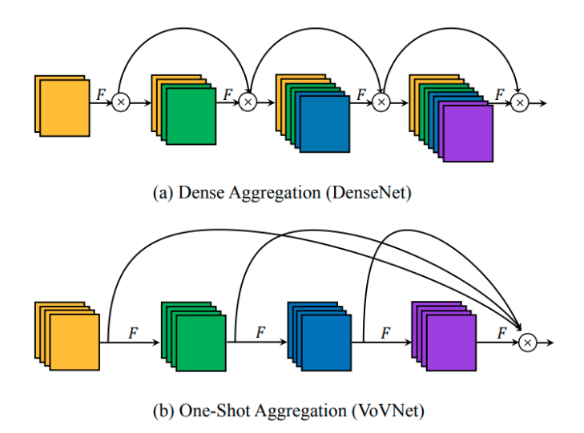

# VoVNet

> An Energy and GPU-Computation Efficient Backbone Network fro Real-Time Object Detection

참고

https://jackyoon5737.tistory.com/252  + 코드

## 01_DenseNet의 문제점의 원인

> 더 많은 자원가 시간을 사용하게 되는 원인은?

**01. ResNet보다 더 많은 자원과 시간이 필요**

- FLOPs와 Model size외에도 다른 부분들이 영향을 주기 때문
- GPU 병렬 연산 측면에서, DenseNet은 bottleneck처리하는데 제한이 존재
- input channel size가 증가 / 그러나 output channel size는 고정이다. 즉 Layer는 channel size에 대한 불균형이 나타난다.
  - 따라서 같은 parameter를 가지고 있어도 높은 MAC이 발생
  - SuffleNet에서 input channel size와  output channel size의 균형이 있을 때  memory cost를 최소화할 수 있다.
  - https://masterzone.tistory.com/46

**02.intermediate layer와 final layer간의 부정적인 연결 **

- `Dense Connection` 은 `intermediate layer`가 더 좋은 feature 만들 수 있게 만든다.
- `former layer` 에서 파생된 feature를 비슷하게 만든다
- 이 경우 final layer는 양쪽의 feature 취합할 필요가 없다. 이미 풍부한 특징 정보를 갖고 있기 때문이다. (redundant information)

## 02_Factors of Efficient Network Design

- `depthwise convolution`과 `1 x 1 convolution bottleneck` 사용하여 FLOPs와 모델 Size에 초점을 두는 경향이 있다. 하지만 이는 **항상 GPU에서 Inference 시간을 보장하진 않는다.**
  - `depthwise convolution`과 `1 x 1 convolution bottleneck`가 GPU에서 Inference 시간을 보장하지 않는 이유???????????????????????????/

- FLOPs와 Parameter 넘어 실용적이고 유효한 Metric(energy per image & FPS) 고려하여 설계해야 한다.

#### Memory Access Cost

> 메모리 접근 비용 : 메모리를 몇번 반복해서 들어가는지

- DRAM에 접근할 경우, 접근하는 명령이 그 자체를 사용하는 것 보다 더 많은 연산을 필요로 한다?
  - 이는 모델 구조가 같은 computation과 parameter를 갖고 있더라도 자원을 소비하는 방식이 다를 수 있다는 것을 의미
- 

$$
MAC = hw(C_i + C_o) + k^2_{c_ic_{o}}$
$$

- 입력 채널 C1, 출력 채널C2, 1x1 conv의 FLOPs : hwc1c2

#### GPU-Computation Efficiency

> GPU연산 효율

- 모든 Network구조는 Floating point operation이 모든 device에서 처리속도가 같다고 생각하고 FLOPs를 줄인다. 하지만 GPU는 병렬처리방식을 사용하기 때문에 다르다
- GPU 병렬 처리는 Tensor가 클 수록 효과가 나온다. 따라서 Conv에서 여러 작은 단계로 분할 하여 처리하는 것을 비효율 적이다. 

## 03_Method

#### 01_One-Shot Aggregation

- 마지막에 한번만 feature를 결합하는 방식

- `OSA module`의 `transition layer` weight는 shallow depth 파생된 feature는 `trainsition layer`에서 더 잘 결합된다. ??? 이유는??

  

#### 02_Configuration of VoVNet

- output stride = 32
- 3개의 convolution layer 구성된 stem block
- OSA module 사용하는 4개의 stage 구성

## Conclusion

- real-time object detection

