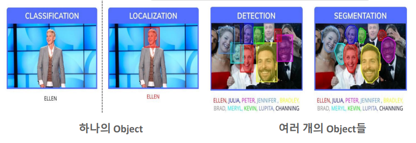
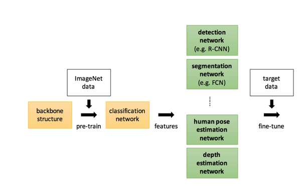
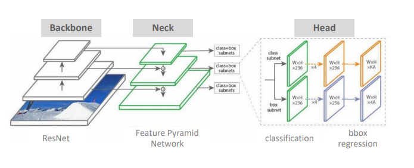
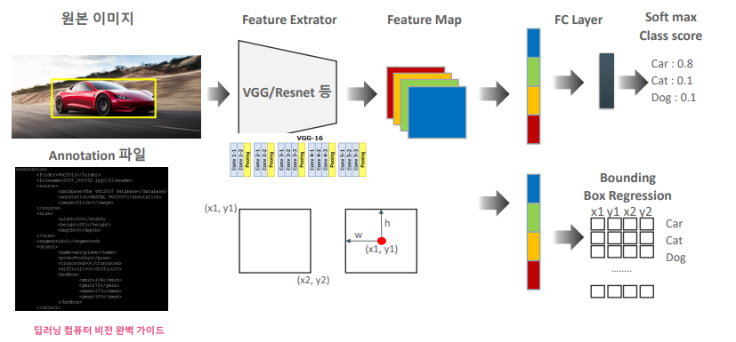
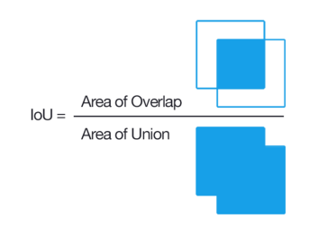
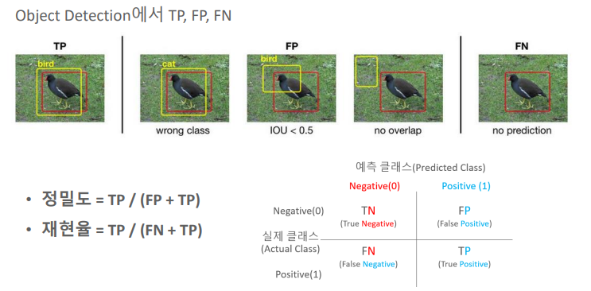
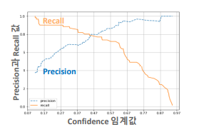

# 01_object_detection

## Localization / object_detection / segmentation



#### Localization

- 하나의 이미지 안에서 딱 하나의 Object만 detection하는 경우

- bounding box로 지정하여 찾음

- ##### 순서
  
  - Object위치를 bounding box로 먼저 찾음
  - bounding box내의 Object를 판별

- ##### 특징
  
  - bounding box regression(연속된 값)
  - 즉 ( box의 좌표값을 예측하는 것 )
  - 그리고 classification을 하는 것

#### object_detection

- Image = 1 ,  Object = n (n>1)

- bounding box로 detect 하는 것

- ##### 순서
  
  - Object위치를 bounding box로 먼저 찾음
  - bounding box내의 Object를 판별

- ##### 특징
  
  - bounding box regression(연속된 값)
    - 즉 ( box의 좌표값을 예측하는 것 )
    - Regression
      - 하나의 독립적인 변수와 다른 여러 시리즈의 변수의 관계에서 특징을 뽑아오는 것이다
    - bounding box regression 엥커 박스 또는 리전 프로포졸로 특징을 뽑아오는 것이다
  - 그리고 classification을 하는 것
  - Localization과 달리 여러개의 object를 찾아야함 ==> 어려움이 있음

#### segmentation

- bounding box로 detect (X)  ==> 픽셀단위로 detection 함

## Stage

#### one - stage

- 한번에 detection함

- 특징
  
  - 속도가 빠름
  - 정확도도 높아지게 됨

- ex)
  
  - YOLO계열, SSD, Retina-Net

#### Two-stage

- 있음직한 곳을 먼저 찾고 분류 시작

- 특징
  
  - 정확성 높음
  
  - 느림
    
    - 먼저 있음직한 부분을 찾고 => 그것을 또 분류해야함

- ex)
  
  - RCNN 계열

## Object Detection

### 구성 요소

#### 1. Region Proposal

- object가 있음직한 곳을 찾는 것 ==> 힌트
- 그리고 나서 bounding box를 친다

#### 2. Detection을 위한 deep learning network 구성





- ##### Feature Extraction(backborn)
  
  - 이미지에서 중요한 부분들을 뽑아 낸다라는 의미
  
  - Feature map을 만든다(크기 감소, 채널수 증가)
  
    

- ##### FPN(Feature Pyramid Network) (neck)
  
  - **FPN(Feature Pyramid Network)**을 통해 컴퓨팅 자원을 적게 차지하면서 다양한 크기의 객체를 인식하는 방법을 제시합니다. ==> 작은거 큰거 등등을 구별하기 위함?

- bottom-up pathway : 
  conv에 인풋  => 2배씩 작아지는 stage마다 feature map 추출(같은크기 = 같은 stage)

- top-down pathway : 
  2배씩 upsampling (크기를 키운다는 소리) => 각각 1x1 conv사용해서 채널 256으로 맞춤

- lateral connection:
  이후 각각 3x3 conv 적용 해서 뽑애낸다

- 작은 object들을 정리한다? 

- ##### Network Prediction(head)
  
  - classification
  
  - bbox regression

#### 3. Detection을 구성하는 기타 요소

- IOU
- NMS
- mAP
- Anchor box

### Object Detection이 어려운 이유

- ##### Classification  + Regression을 동시에 가능해야 함
  
  - Loss가 두개 다 좋아야함
  - 둘다 최적화가 다 좋아야함
  - 따라서 복잡해진다

- ##### 다양한 크기와 유형의 object가 섞여 있음
  
  -  box의 모양이 각각의 다르다
    - ex) 자동차 가로로 긴 박스 , 사람 세로로 긴 박스

- ##### Detect가 빨리 되어야한다
  
  - 정확성 높음? ==> 복잡 ==> 시간 오래걸림
  - 시간 줄임 ==> 단순? ==> 정확성 떨어짐

- ##### 명확하지 않은 이미지
  
  - 이미지 내에 background가 차지하는 경우가 높음
    - 그럼 background는 넘어가주어야하는데 안 그런경우가 많음

- ##### 훈련가능한 데이터 세트 부족
  
  - 왜??
    - annotation을 만들어야 한다.
    - annotation?
      - 정답을 만들어 주는 것
      - 라벨링 => 네모 겁나 쳐야함 => 수작업 => 귀찮 => 데이터 부족

## Object Localization개요




annotation 파일에 Bounding box에 대한 좌표값을 가지고 있음

- (x,y) * 2
- feature map에서 Bounding box Regression layer가 따로 나옴
  - Bounding box Regression => 있음직한 곳을 찾는 것 
- 어차피 물체 하나 ==> 그래서 그때 그때마다 regression해주면 된다.

## Object Detection

- 여러개의 object가 있음
- feature map에 여러가지 object가 있다는 뜻

#### 있음직한 곳을 왜 먼저 찾는 것일까??

- 안할 경우 => 예측을 엉뚱한 곳에 하게 됨

- 일단 이미지가 굉장히 많음

- 이런 feature일 때는 이렇게 detect하면 되겠구나 라고 함

- 근데 사람이 많음 ==> 사람이 다 똑같아 보임

- 그럼? ==> 1번 째 이미지일땐 오른쪽 ==> 2번 째 이미지일떈 왼쪽??

- 아니 내가 보기엔 둘다 똑같길래 ==> 그냥 아무곳에다가 박스침

- 그래서 있을만한 곳을 먼저 찾아주는 것임
  
  - ##### 비유:
    
    - 이탈리아를 감
    - 사람이 다 똑같이 생김
    - 알렉스(수염 + 안경)를 찾아야하는데 이사람도 알렉스 저 사람도 알렉스인거 같음
    - 자! 오키 ==> ㄱㄷ ==> 알렉스 내가 보기에 오른쪽 건물 안에 있는 거 같음 거기서 찾아보셈
    - 보니깐 어? 알렉스랑 맞는 거 같음

## Region Proposal(영역 추정) 방식

- ##### object가 있을만한 후보 영역을 찾는 것!

### 슬라이딩 원도우(이전 방식)


- 이미지의 어느위치에서 object를 찾아야 하는가?? = 슬라이딩 원도우

- #### 방법
  
  - 슬라이딩을 하면서 윈도우 내에서만 object를 찾는다
  
  - 이렇게 슬라이딩을 통해 얻은 object들을 학습된 feature map과 mapping을 하게 된다. 
    ==> 그리고 여기서 bounding box를 끄집어 낸다
  
  - op1
    
    - 윈도우의 형태를 다양하게 만든다
  
  - op2
    
    - 이미지 자체를 여러 모양으로 만들고 슬라이딩을 시킴
    - 사진이 많이 줄임 ==> 한 슬라이드 안에 많은 object들이 존재 할 수 있음

- #### 문제
  
  - 이렇게 하다보니 시간이 오래걸리게 된다.
    - 그냥 무작정 왼쪽 위에부터 찾게 되는 것이기 때문
    - 약간 알고리즘에서 브루트포스같은 느낌
  - object가 없는 영역도 무조건 슬라이딩하여야 한다.

### SS (selective search)


- #### 개념
  
  - 이게 막 사람하고 벽이 있음 ==> 사진에서 사람과 벽의 경계의 밝기, 무늬, 질감 등등 다름
  
  - 그럼 이런 특성을 이용해서 찾아보자
  
  - 각각의 픽셀마다 다른 값을 준다 ==> 컬러, 무늬 크기, 형태에 따라 유사한 Region 그룹핑한다.
    
    - 처음에는 over하게 segmentation함
    - 그다음에 비슷한거 같은거 합침 

- #### 특징
  
  - 빠른 Detection과 높은 Recall 예측 성능을 동시에 만족
  
  - 하지만 독립적인 알고리즘이다
    
    - 즉 SS 알고리즘 돌려서 있음 직한 곳 찾음 ==> 분류 ==> RCNN

- #### 프로세스


1. 개별 segment된 모든 부분들을 Bounding box로 만듦 => Region Proposal 리스트로 추가
2. 컬러, 무늬 크기, 형태에 따라 유사한 Region 그룹핑한다.
   - 처음에는 over하게 segmentation함
   - 그다음에 비슷한거 같은거 합침 
3. 반복

### 코드

```python
import selectivesearch

# img_rgb : 아까 저장했던 사진 변수 이름
# scale : 스케일을 크게하면 큰 object위주로 알고리즘이 돌아라 라는 뜻
# min_size : 적어도 사이즈 2000이상 object만 추천 해줘라
_, regions = selectivesearch.selective_search(img_rgb, scale=100, min_size=2000)

[{'labels': [0.0], 'rect': (0, 0, 107, 167), 'size': 11166},
 {'labels': [7.0, 11.0], 'rect': (0, 91, 183, 175), 'size': 12312},

 ...

 {'labels': [17.0,18.0,14.0,16.0,7.0,
   11.0,9.0,
   12.0,2.0,6.0,10.0,15.0,19.0,8.0,13.0],'rect': (0, 0, 374, 449),
  'size': 127680},
...

 # 이런식으로 라벨들이 점점 합쳐지게 되는 것을 볼 수 있다
 # 즉 비슷한 것들 끼리 묶는 것이다.
```

### IoU(Intersection over Union)



##### IoU = 교집합 / 합집합

- 모델이 예측한 결과와 실제 측정 box가 얼마나 겹치는가에  대한 지표
  
  - 실측: Ground Truth
  - 예측: Predicted

##### 수치

- 완벽하게 detect ?? ==> 1에 가까운 수치
- 완전 예측 못함??  ==> 0
  - IoU <= 0.5  ==> poor이라고 판단
  - IoU >= 0.7  ==> good
  - IoU >= 0.9  ===> excellent

### NMS(Non Max Suppression)


#### 개념

- 비슷한 위치에 있는 box를 제거하고 가장 적합한 box를 선택하는 기법
- => max가 아닌것을 눌러준다

#### 왜 여러개의 박스들이 겹칠까?

- object가 있을 법한 곳을 계속 추천을 해주기 때문에

#### 수행로직

confidence score 높은 순으로 정렬 ==> 겹치는 애 찾음 ==> 많이 겹쳐? ==> 제거

1. detected된 bounding box별로 특정 confidence threshold(기준)이하 bounding box는 먼저 제거
2. 가장 높은 confidence score순으로 정렬
   높은 confidence score를 가진 box와 겹치는 다른 box를 모두 조사
   IOU(점수 큰애랑 작은 애들)가 특정 threshold이상인 box 모두 제거
3. 반복( 0.9 봤으니 ==> 0.8봄 ==> 순차적으로)
- confidence score가 높을수록, IOU Threshold가 낮을 수록 많은 Box가 제거됨 (?????)


## Object Detection 성능 평가

### mAP (mean Average precision)

##### 정의

- 재현율의 변화에 따른 정밀도의 값을 평균한 성능 수치

inference time이 작을 수록 좋음 (빨리 detect했다는 뜻)

높은 AP일수록 좋음(정확도가 좋음)


#### 정밀도(Precision)과 재현율(Recall)

정밀도(Precision)과 재현율(Recall)은 주로 이진 분류에서 사용되는 성능 지표



- ##### 정밀도
  
  - 예측한 결과가 실제 Object들과 얼마나 일치하는지 나타내는 지표
    
    - 검출을 정확히 Bird로 함
  
  - TP / (TP + FP)   ==> 물체가 있다고 **판단 한 것들 중** => 정답을 맞춘 비율
  
  - 정밀도가 좋아지기 위해서 FP(분모)가 작아야 함

- ##### 재현율
  
  - 실제 object들을 빠뜨리지 않고 얼마나 정확히 검출 예측하는지를 나타내는 지표
    
    - 새가 두마리 있는데 한마리만 예측함 ==> 50%
  
  - TP / (TP + FN)  ==>  물체가 **실제로** 있는 것들 중 => 정답을 맞춘 비율
  
  - 재헌율이 좋지 위해선 FN(분모)가 작아야함

- 예시)
  
  - ex) 강아지 20마리 // 모델이 10마리의 강아지를 검출 // 5마리를 맞춤
  
  ​       정확도 :  5/10마리 ==> 50%      재현율:  5마리/20마리  ==> 25%
  
  - ex) 강아지 10마리 // 모델이 20마리의 강아지를 검출 // 7마리를 맞춤 (더 많은 강아지 검출)
  
  ​      정확도 :  7/20마리 ==> 35%      재현율:  7마리/10마리  ==> 70%

둘다 좋은 높은 값을 가지고 있어야함

의미: 

- 막무가내로 모든 곳에 강아지가 있다고 판단 ==> 재현율 높음// 정확도 떨어짐
- 매우 확실할때만 강아지가 있다고 판다 ==> 재현율 떨어짐// 정확도 높아짐

#### 오차행렬


TP : 사물이 존재 + 정답을 맞춤

FN: 사물 없다고 판단 ==> 있는데  ㅠㅠ

FP : 오답 or IOU작음 or 사물 없음

TN: 사물이 없음 + 정답을 맞춤

#### Confidence 임계값에 따른 정밀도- 재현율 변화



Confidence 임계값 작게 설정

- 정밀도는 작아지고 재현율이 높아짐

- 그냥 난사한다는 소리

  

Confidence 임계값 높게 설정

- 정밀도 높아짐 재현율 낮아짐
- 정확한 것만 할꺼

==> 즉 재현율과 정밀도는 서로 반비례 관계이다


##### AP(Average Precision)

- x축 recall 값

- y축  Precision값

- 그리고 그에 따른 면적이 Average Precision값

### AP 계산하기


#### mean AP?

- 여러 object들의 AP 평균한 값
- IOU >= 0.5

#### COCO challenge


- IOU를 다양한 범위로 설정
- IOU를 0.5 부터 0.05씩 증가시켜 0.95까지 해당하는 IOU별로 mAP를 계산
- Object가 소, 중, 대로도 나눔 ==> 이것을 보고 어느 model을 사용할지 참고할 수 있음
