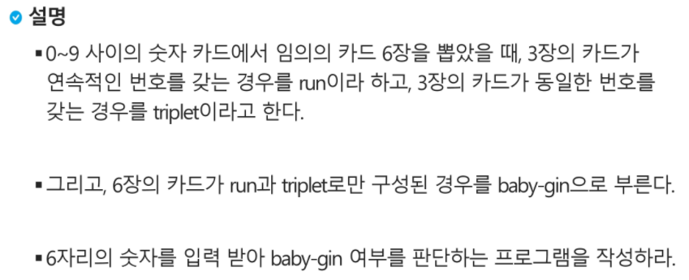
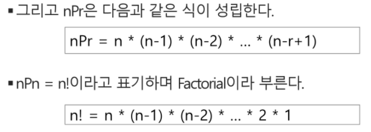

# 배열

- 알고리즘
- 배열
- 버블정렬
- 가운팅 정렬
- 완전검색
- 그리디


## 알고리즘

#### 알고리즘을 하는 이유

- 정확성, 작업량, 메모리, 단순, 최적


#### 시간복잡도

- 실제 걸리는 시간
- bigO표기법으로 보통 사용


- 보통 10억번에 1초정도 걸린다.


## 배열

- 열거되어 있는 자료구조

- 크기가 정해진 배열이 더 빠를때가 있다


## 정렬

- 키: 자료를 정렬하는 기준이 되는 특정 값
- 종류
  - 버블
  - 카운팅
  - 선택
  - 퀵
  - 삽입
  - 병합

### 버블 정렬 (O(n**))

- 인접한 두개의 원소를 비교하며 자리를 계속 교환하는 방식

- ##### 과정

  - 첫번째부터 인접한 원소끼리 계속 자리를 교환하면서 맨마지막 자리까지 이동
  - 한단계가 끝나면 가장 큰 원소가 마지막 자리로 정렬된다

```python
def BubbleSort(a, n): # 정렬할 배열과 배열의 크기 
    for i in range(n-1, 0, -1): # 정렬될 구간의 끝 # 만약 반대면 (0, n-1)
        for j in range(0,i): # 비교할 원소 중 왼쪽 원소릐 인덱스
            if a[j] > a[j+1]: # 왼쪽 원소가 더 크면
                a[j], a[j+1] = a[j+1], a[j] # 오른쪽 원소와 교환
```

```python
def BubbleSort(a, n): # 정렬할 배열과 배열의 크기 
    for i in range(0,n-1): # 정렬될 구간의 끝 # 만약 반대면 (0, n-1)
        for j in range(0,i): # 비교할 원소 중 왼쪽 원소릐 인덱스
            if a[j] < a[j+1]: # 왼쪽 원소가 더 크면
                a[j], a[j+1] = a[j+1], a[j] # 오른쪽 원소와 교환
```


```python
#문제 풀이
T = int(input())
for tc range(1, T+1):  # 보통 개수가 1부터 나오기 때문에 range를 이렇게 써줌
    n = int(input())
    arr = list(map(int, input().split()))
    BubbleSort(arr, n)
    
    

```


### 카운팅 정렬(O(n+k))

- 제한사항

  - 정수나 정수로 표현할 수있는 자료에 대해서만 적용가능(일단은 0이상의 정수)

  - 집합내에 큰 정수를 알아야한다.

- 특징
  - 공간복잡도를 버리고 시간복잡도를 잡는 것


100만개이하를 저장하는 편이 좋다. ==> 그것을 배열 하나로 잡는다.

배열의 크기가 100만개 이상이면 한번에 저장해서 하는 것이 아닌가? 라는 의심을 해주는 것이 좋음


#### 순서

- 1단계
  - Data에서 각 항목들의 발생 회수를 세고, 정수 항목들로 직접 인덱스 되는 카운트 배열에 저장한다 
  - 모든원소에 개수를 센다


- 2단계

  - 위: 0 1 1 1 2 3 4 4 라는 뜻

  - 아래: 누적된 개수 ==> 0까지 몇개, 1까지 몇개, 2까지 몇개 ..........

  - counts[:] += counts[:-1]   ==> 1부터 4


- 3단계
  - counts[1]을 감소시키고Temp에 1을 삽입한다
  - 즉 각각의 위치를 저장시켜서 위치시켜주는 느낌이다 (2단계가 창고의 위치를 저장해준 것)
  - 그리고 누적배열(counts)에서 하나를 빼준다 (창고에서 물건 빼주는 식으로)
  - 3단계 계속 반복


```python
def CountingSort(a, b, k):
    # A 는 (1,k) data 
    # B => 정렬된 배열 temp
    # C => 카운트 배열 counts
    
    c = [0]* (k+1)
    
    for i in range(0, len(a)):
        c[a[i]] += 1
        
    for i in range(1,len(c)):
        c[i] += c[i-1]
    
    for i in range(len(b)-1, -1, -1):
        c[a[i]] -= 1
        b[c[a[i]]] = a[i]
    
    
```


#### baby-gin Game



#### 완전 검색(Exausitive Search)

- 모든 경우의 수를 테스트한 후, 최종 해법 도출
- 일반적으로 경우의 수가 상대적으로 작을 때 유용하다.
- 특징:
  - 수행속도 느림
  - 해답을 찾을 확률 높음

##### 순열: 



구현(3까지)

```python
for i1 in range(1,4):
    for i2 in range(1,4):
        if i2 != i1:
            for i3 in range(1,4):
                if i3 != i1 and i3 != i2:
                    print(i1,i2,i3)
```


### Greedy 알고리즘

- 가장 적은 비용과 횟수
- 동작과정
  - 해선택: 
  - 실행 가능성 검사 (제약조건을 위반하지 않는지를 검사)
  - 해 검사


