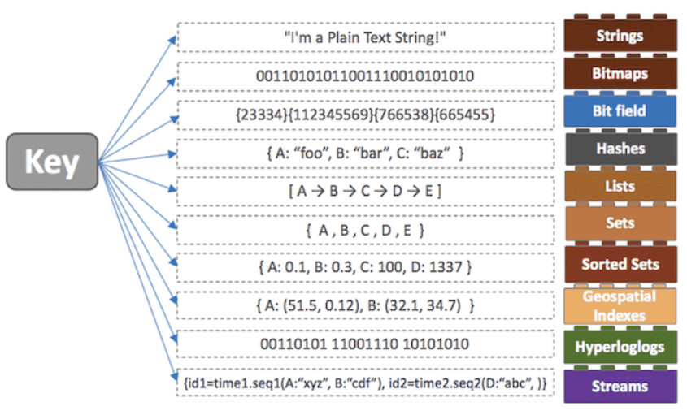

# Redis

> 1. Redis란?
> 1. Redis의 특징
> 1. Redis의 저장방식
> 1. Redis의 컬렉션

## Redis란?

> - Remote Dictionary Server
> - Key-Value쌍의 해시 맵 형태의 서버

- DB, Chache, Message Queue, Shared Memory용도로 사용될 수 있다.

- 디스크에 데이터를 쓰는 구조간 아니다
  - 메모리에서 데이터를 처리하기 때문에 작업 속도가 상당히 빠르다

## Redis의 특징

- 싱글 스레드 방식으로 인해 연산을 원자적으로 수행이 가능함.
- 읽기 성능 증대를 위한 서버 측 리플리케이션을 지원
- 쓰기 성능 증대를 위한 클라이언트 측 샤딩 지원

## Redis의 저장방식

**RDB(Snapshotting) 방식**

- 메모리에 있는 내용 전체를 디스크에 옮겨 담는 방식

**AOF(Append On File)**

- Redis의 모든 write/update연산 자체를 모두 log파일에 기록하는 형태

## Redis의 컬렉션

- Key가 될 수 있는 데이터 구조체가 다양하다.
  - String`, `Set`, `Sorted Set`, `Hash`, `List

- **String :** 
  - Key-Value형태로 저장하는 방식
- **Set :**
  -  중복된 데이터를 담지 않기 위해 사용함 => 모든 데이터를 전부 다 갖고 올 수 있는 명령이 있으므로 주의해서 사용해야한다.
- **List**
  - Array형식의 데이터 구조
  - 처음과 끝에 데이터를 넣고 빼는 건 빠르다 하지만 중간 데이터를 삽입하거나 삭제하는 건 어려움
- **Stored Set**
  - 유저 랭킹 보드서버 같은 구현에서 사용할 수 있다.

**컬랙션을 사용할 떄 주의점**

- 하나의 컬렉션에 너무 많은 아이템을 담지 않아야 한다.
  - 10000개 이하, 몇천개 수준의 데이터 셋을 유지하는게 Redis 성능에 영햐으을 주지 않음
- Expire은 전체 Collection에 대해서 걸린다
  - 메모리 파편화를 좀 완화시키고 싶다면,
    - 
  - 즉 Expire 10000개 데이터를 가지고 있는 컬랙션에 사용 => 10000개 다 날아감

## 싱글 스레드 사용

- Single Thread를 사용하기 때문에 Race Condition이 거의 발생하지 않는다.

**주의**

- O(n) 명령어 지향
  - 싱글 스레드 기반 => 처리시간이 긴 명령어가 들어오면 대기
- 메모리 관리
  - 메모리 파편화
    - 메모리를 할당하고 해체하는 과정에서 빈공간이 생김
    - 빈 공간보다 더 큰 메모리를 할당하게 되면 빈공간은 채워지지 않게 되고 메모리 낭비 발생
  - 쓰기 연산이 copy on write방식으로 동작하기 때문에 최대 메모리를 2배 이상까지 사용

Redis를 조금더 잘 알고 난 뒤에 살펴볼 것

https://velog.io/@hyeondev/Redis-%EB%9E%80-%EB%AC%B4%EC%97%87%EC%9D%BC%EA%B9%8C

