# cpu작동 원리 

출처: https://www.youtube.com/watch?v=Fg00LN30Ezg&list=WL&index=1&t=4s

by bRd 3D

## 트렌지스터

- cpu는 트렌지스터로 만들어져 있다
- 반도체의 원리
  - 실리콘으로 제작
  - 실리콘의 전자는 4개로 이루어져 있음
  - 따라서 이것이 하나씩 상하좌우로 결합시 전자 8개로 구성됨 = 가장 안정적인 구조
  - 이떄 단단하게 결합이 되어 있어 전류가 흐르지 않음
  - 그래서 여기서 전자가 하나 많거나 적은 원소를 추가하여 전류가 흐르게끔 만들어준다
  - 전자가 하나 적을때 = P형반도체
    - 전자가 왼쪽으로 이동, 그럼 빈공간은 오른쪽으로 이동 ==> 즉 전류가 오른쪽으로 이동한다는 뜻이다 = 양전하처럼 움직임 = 이것을 **양공**이라고 부름
  - 전자가 하나 많을때 = N형반도체
    - 자유전자가 생김

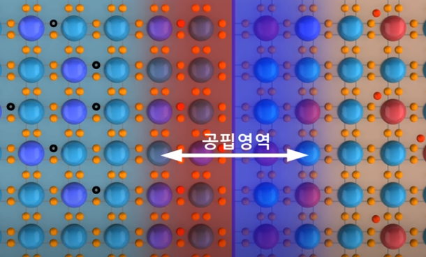

- 공핍영역
  1. P형 반도체와 N형 반도체가 붙혀놓는다
  2.  N형 반도체에 있던 자유전자가 P형반도체의 양공부분에 전자가 들어오게 된다
  3.  중성이었던 P형반도체는 전자가 들어오게 되어 -전하를 띄게 된다
  4.  중성이었다 N형반도체는 전자를 보내게 되어 + 전하를 띄게 된다.
  5.  그럼 왼쪽 부분은 음전하를 띄고 오른쪽은 양전하를 띄게 된다.
  6.  그럼 공핍영역이라는 것이 생기는데 이것은 서로 전자가 넘어가지 못하게 하는 영역을 말한다.
  7.  이때 \+ ==> \- 쪽으로 전기장이 생기게 된다.

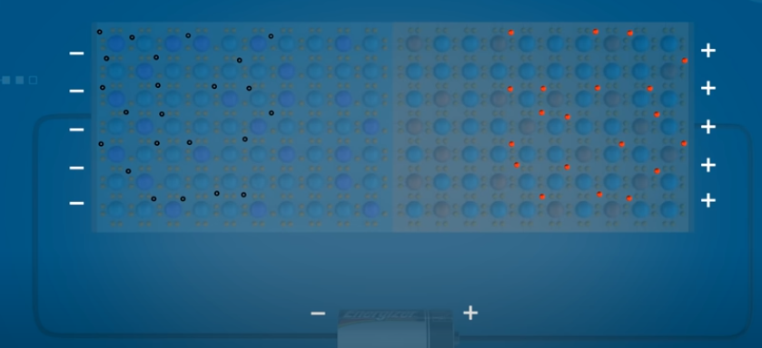

- 여기서 전압을 가한다. = (역방향)
  1.   양공들이 마이너스 방향쪽으로 쏠리게 된다
  2. 자유전자들은 플러스 방향쪽으로 쏠리게 된다
  3.  이때 공핍영역은 더욱 늘어나게 된다.
  4.  더이상 전하의 이동이 없어지게 된다.

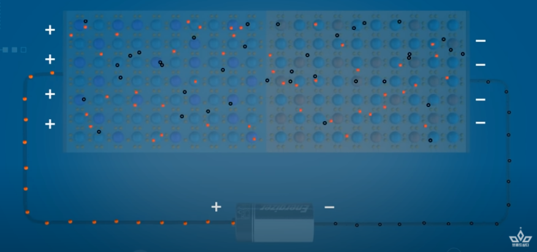

- 여기서 전압의 방향을 바꾼다 = (순방향)
  1.  양공은 같은 극에 대한 반발력으로 마이너스쪽으로 이동
  2.  전자부분도 똑같음
  3.  전에 생겼던 공핍영역에 걸리긴하지만 걸어주는 전압이 굉장히 강함
  4.  따라서 무시하고 그냥 넘어가게 된다.
  5.  전류 흐름

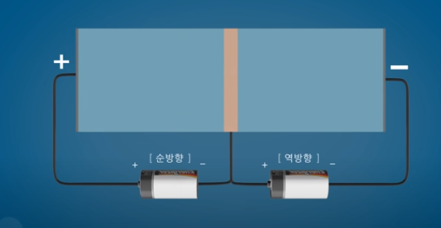

- 파랑색 = P형 반도체 (양공이 있는 것)
- 빨강색 = N형 반도체 (전자가 하나 더 많은 것)

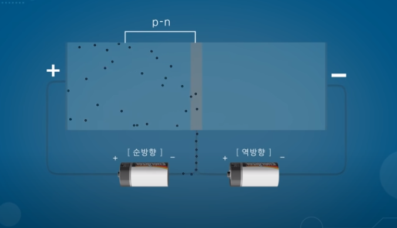

- 순방향에 전류가 흐르게 된다
- 역방향에는 전류가 흐르지 않음

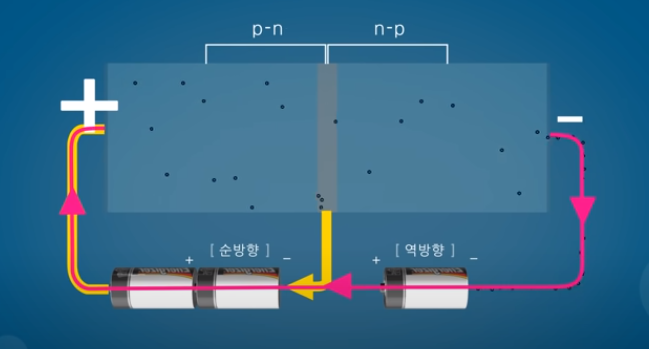

- 순방향에 전압에 세기를 높혀준다
- 전압이 세기 때문에 전자가 공핍영역을 넘어가게 되고 결국 N형 반도체를 넘어가게 된다
- 이때 역방향 끝에는 -전하가 띄기 때문에 전자가 흘려들어간다
- 따라서 결국 전류가 흐르게 된다.
- 즉 전압에 크기를 조절해서 전류를 흐르게 만들 수도 있고 흐르지 않게 만들 수도 있다.
- 이렇게 트렌지스터는 PNP 또는 NPN의 종류가 있다. 

#### 트렌지스터의 논리회로

- 트랜지스터를 2개를 붙힌다.
- A와 B를 둘다 전압이 걸려 있을때 전류가 흐르게 된다.

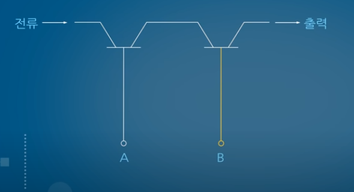

- 하나라도 꺼져있으면 전류가 흐르지 않게 된다.

- 컴퓨터는 1과 0으로 이루어진 디지텅 신호를 인식
- 전류 통함 = 1
- 전류 안통함 = 0
- 이런식으로 이뤄지게 된다. 

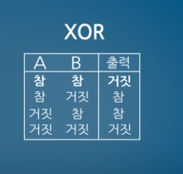

#### And 게이트

- 두개 다 참일때 참이되는 논리회로

#### Or 게이트

- 둘다 거짓일때 거짓이 되는 논리회로

#### Not 게이트

- 입력 참 ==> 출력 거짓
- 입력 거짓 ==> 출력 참

### 논리회로와 연산과의 관계

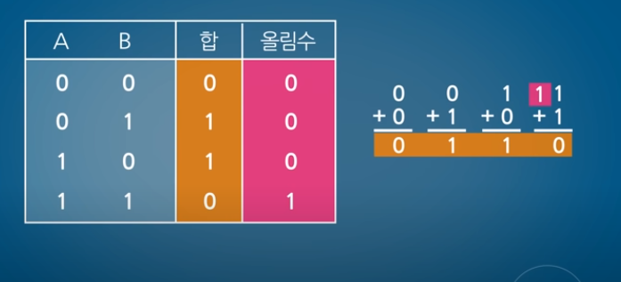

- 컴퓨터는 이진수이기 때문에 0과 1로만 계산이 된다.
- 합 ==> xor과 똑같은 논리를 띄게 된다
- 올림수 ==> and와 똑같은 논리를 띄게 된다. 

#### 산술 논리 장치(Arithmetic Logic Unit)

- 산술을 처리하는 능력과
- 논리를 처리하는 능력을 가지고 있는 장치이다

## CPU

- CPU에는 수십 억 개의 트렌지스터를 넣고 있다
- 수십 억개를 넣으려면 트랜지스터는 굉장히 작아야한다. ==> mosfet

#### Mosfet

- 크기: 미세먼지보다도 작음 0.1나노 미터
- 이 트랜지스터는 NPN으로 되어있다.
- 위(회색부분): 전류가 통하는 금속
- 몸체 : 반도체로 이루어져 있음
- N형과 P형이 만나는 지점은 공핍영역이 생기게 된다. (빨강색 부분)
- 역방향에 의해서 전류가 흐르지 않음
   (N형 자유전자가 +쪽으로 가서 P형과 만나는 부분에 공핍이 생김)

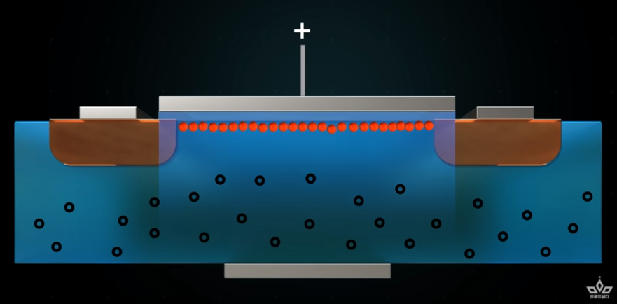

- 이때 금속 가운데에 전압을 걸어준다.
- 그럼 전자들이 P형에 있는 전자들이 위쪽으로 가고 양공들은 아래로 내려가게 된다.
- 이렇게 되면 N형 반도체 사이에 전자 다리같은 것들이 만들어지게 된다
- 그럼 전류가 흐르게 된다.
- 전압 준다 : 전류 흐름
- 안준다      : 전류 멈춤 

### CPU의 구성

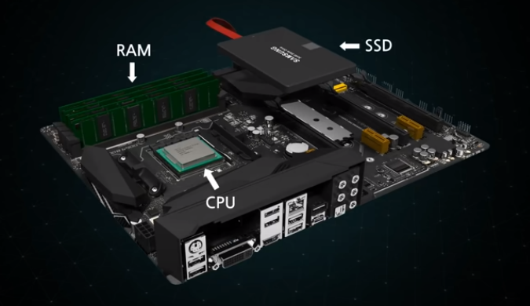

- cpu 근처에는 RAM과 SSD가 있다
- 하지만 SSD는 CPU와 비교했을때 처리하는 속도가 너무 느리기 때문에 CPU와는 소통하지 않는다.
- 따라서 CPU는 RAM과 소통한다.
- 작동순서
  1. 프로그램 실행 (SSD에서)
  2. 그 데이터는 RAM으로 이동
  3. CPU는 그 데이터를 가져오게 된다.

- 하지만 RAM도 CPU에 비해서 많이 느리게 된다
- 따라서 필요한 것이 CPU내부에서 빠르게 기억시켜주는 장치 =  캐시(용량이 작음)

##### 잠깐의 용어 설명

- SSD
  - SSD에는 프로그램들이 설치가 되어 있다 . 
  - SSD는 하드디스크를 대체하는 고속 보조 기억장치이다
  - 반도체를 이용하여 데이터를 저장한다.
  - 따라서 작동 소음이 적고 전력소모도 적다
  - 일반적으로 플래시 메모리를 사용한다.
    - 속도면에서는 RAM을 합친 SSD보다는 느리다
    - 그러나 전원이 꺼지더라고 기록된 데이터가 보존된다.
  - RAM의 용량이 작기 때문에 필요한 것 ==> SSD와 HDD
  - 
- RAM ==> DRAM(더 많은 숫자를 기억할 수 있게 되었음, 현재 사용 하지만 느림)
  - 전원이 꺼지면 저장 데이터가 모두 사라진다.
  - 0과 1을 기억하는 장치가 필요
  - 따라서 지금 옛날에 사용하던 RAM은 캐시메모리라고 하여 CPU안에 들어 있음
  - 

#### 캐시

- RAM에 비해서 용량이 작음

- 중요하다고 판단되는 것만 저장하게 된다.

- 캐시의 레벨

- 속도가 빠를수록 용량이 작음
- CPU는 L1에 데이터를 먼저 요청하게 된다.
- 여기에 없으면 L2에 요청 ==> 없으면 L3에 요청하게 된다.

- 만약 캐시에 데이터가 없다고 판단하게 되면 ==> RAM에 데이터를 요청하게 된다.

#### 컴퓨터의 기억장치

- 하드
- RAM
- 캐시
- 레지스터 :
  -  CPU내부에서 데이터를 일시적으로 저장하는 장치
  - 속도가 가장 빠름

- 위에 모든것은 아래로 갈수록 용량 작아짐, 그리고 가격도 비싸진다.

### 레지스터

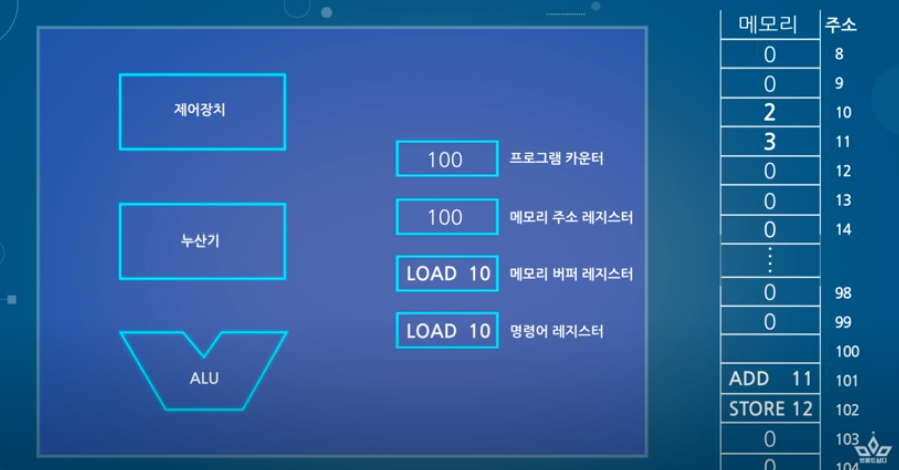

##### 용어 설명

- 레지스터 종류
  - Program counter (계획)
    - 다음번에 수행할 메모리가 저장되어 있다
  - Memory address register (운반)
    - 프로그램 카운터에서 수행한 주소를 넘겨받은 다음에 그 주소를 메모리에서 찾아가서 데이터를 가져오는 역할을 하게 된다. 
  - Memory buffer register (분류)
    - 메모리 주소가 가져온 데이터를 일시적으로 저장하게 된다.
    - 명령 => 명령어 레지스터(Order Register)
    - 연산 => 누산기
    - 이런식으로 분류를 해준다
  - Order register
    - 명령에 관한 데이터가 저장된다.

- 장치

  - ALU: 
    - 산술논리처리장치

  - 누산기
    - 연산의 결과 값이나 중간 값을 일시적으로 저장한다.
    - 최종 결과 ==> 메모리 버퍼 레지스터로 이동시킨다.
    - 그리고 그 데이터를 메모리로 전송시킨다.

  - 제어장치
    - 명령어 레지스터에 있는 명령을 받아 해석함
    - 해석된 명령을 실행할 각 시스템에게 지시를 보내준다.

##### 원리

- 고급언어: 우리가 사용하는 언어 ex) C, python 등등

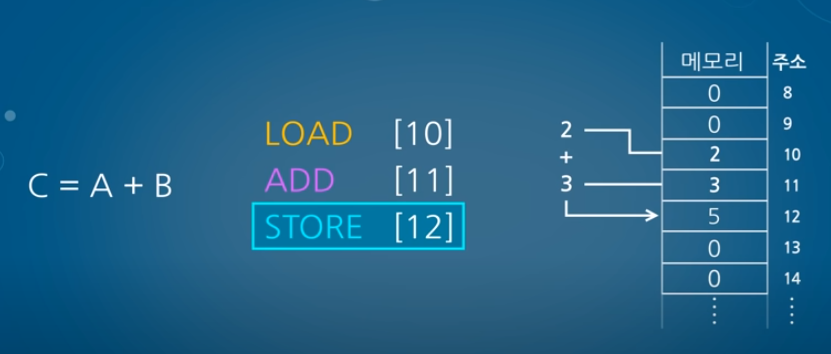

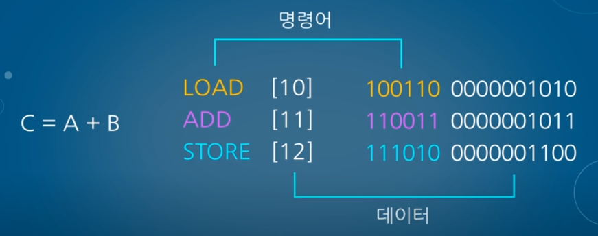

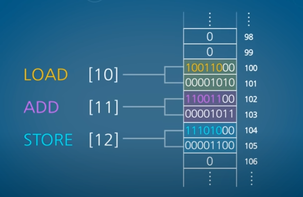

- 순서
  1. 코딩함
  2. 코딩한 언어 ==> 컴파일러
  3. 컴파일러는 CPU가 실행할 수 있는 어셈블리 언어로 바꿈 ()
  4. 이 언어는 어셈블리를 통해 기계어로 바꿈
  5. 이러한 기계어는 램에 저장된다.

- 특징

  - 명령어(오른쪽에 색칠된 숫자)
    - 1과 0의 개수가 6개인 6비트로 이루어져 있음
  - 데이터 (명령어 뒤에 있는 숫자)
    - 10비트로 이루어져 있음

  - 따라서 한줄이 16비트로 이루어진 언어로 되어있음
    - 프로세서가 한번에 처리할수 있는 16비트가 된다.

  - RAM
    - 램은 8비트씩 저장함
    - 따라서 두줄로 저장하게 된다.
    - 따라서 그 두 줄이 프로세서가 한번에 처리하는 하나의 언어이다
    - 32비트는 4줄
    - 64비트는 8줄이된다.

### CPU에서 어떻게 처리되는지?

#### 클럭 (이 과정을 클럭이라고 한다.) 

#### clock 이과정의 한사이클 ==> 이게 너무 심함 ==> 오버클럭 ==> 발열

#### 그래서 코어를 하나 더 가져옴 ==> 듀얼 코어

1. 인출
2. 해석
3. 실행
4. 저장

#### - 인출 : 정보를 CPU에 가져오는 행위

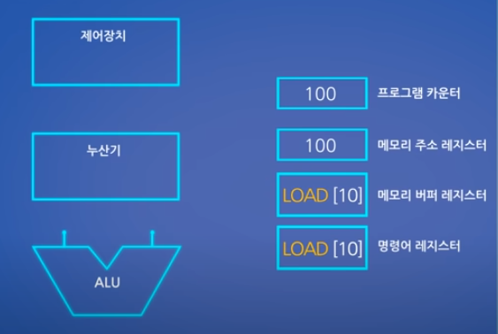

1.  프로그램 카운터에 메모리 주소가 있음
2.  메모리 주소 레지스터에 전달시켜준다.
3.  메모리 주소 레지스터는 메모리에 그 주소를 따라 찾아간다
4.  그 주소의 값을 가져와서 메모리 버퍼 레지스터로 보내준다 (운반)
5.  그 값이 명령어 ==> 명령어 레지스터로 보냄
6.  프로그램 카운터에 2가 더해진다
   - 이유: 
     - 지금 메모리의 비트가 16비트이기 때문에 다음 정보다 2칸 아래에 있다
     - 따라서 다음 정보를 가져오기 위해서 2를 더해주는 것이다
     - 32 비트 4더해짐

#### - 해석

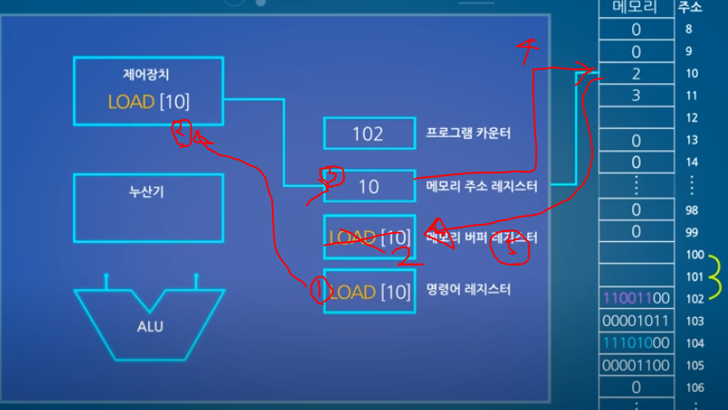

1. 명령이 현재 명령어 레지스터에 저장되어 있음
2. 제어장치에 보냄

3. 제어장치는 다시 메모리 주소 레지스터에 10이 저장되게 된다.
4.  메모리 주소 레지스터(운반)는 메모리 10번지에 데이터를 가져오게 된다
5.  그리고 메모리 버퍼레지스터에 보내준다
6.  다른점
   - 숫자 2는 명령어가 아니다 따라서 명령어 레지스터에 보내지 않음
   - 그리서 숫자 2는 누산기에 들어가게 된다
7. 이제 LOAD[10]을 완료함

#### - 실행 : 계산하는 단계

1.  프로그램 카운터에 있던 값(아까전에 +2(102)를 했던 값)을 메모리 주소레지스터(운반하는 애) 에 보냄 
2.  메모리 주소레지스터는 메모리에서 정보를 가져와 메모리 버퍼 레지스터에 보냄
3.  [11]번지 주소를 더하라는 명령
4.  명령어 레지스터에 보냄
5.  제어장치로 보냄 (여기까지 위에 과정과 동일)
6.  누산기에 있던 2를 ALU에 보냄
7.  제어장치가 메모리 주소 레지스터에 값을 불러오라고 시킴
8.  3이라는 숫자를 가져옴 ==> 메모리 버퍼(분류하는 애)에 보냄
9.  3은 숫자 ==> 누산기에 보냄
10. 누산기에 있던 3 ==> ALU에보냄
11.  이때 제어장치에 저장되어 있던 더하기라는 값이 ALU로 보냄
12.  2 add 3 이라는 퍼즐이 ALU에서 맞춰짐
13.  결과값이 나옴 (ALU는 그냥 계산만 함)
14. 다시 누산기(그냥 숫자만 저장함)에 보냄

#### - 저장

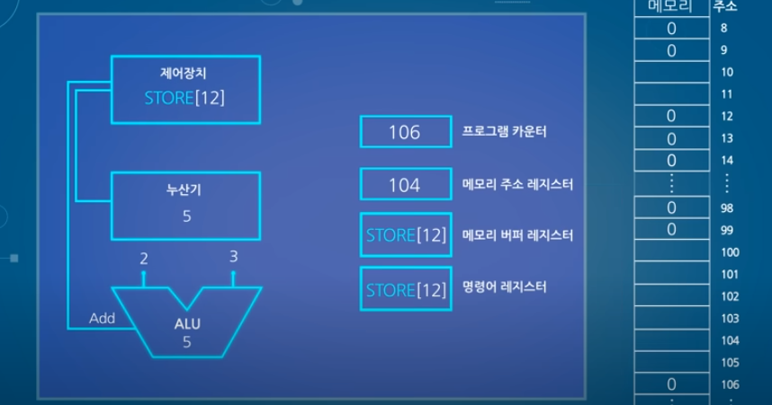

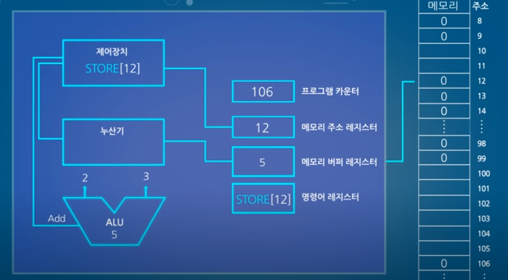

1.  프로그램 카운터 => 메모리 주소
2. 메모리주조 => 메모리 => 메모리 버퍼에 정보 보냄
3.  메모리 버퍼 => 저장하라는 명령 ==> 명령어로 보냄
4.  프로그램 카운터에 2가 더해짐
5.  저장명령 => 제어장치로 이동
6.  제어장치가 메모리 주소에 주소 12를 저장시킴 
   ( 메모리 버퍼레지스터에 12에 넣으라고 안내?하는 느낌?) 
7.   누산기에 저장된 5(아까 2+3의 결과값)가 메모리 버퍼 레지스터에 저장
8.  이 결과값을 메모리 버퍼레지스터가 5를 저장하게 된다. 

### 스레드

- CPU는 이러한 단계를 세분화한다.
- 이렇게 분리된 프로세스들을 스레드라고 한다.

### 코어

- 코어하나에 여러 개의 쓰레드가 실행되면 속도가 빨라짐
- 코어가 많아지면 더 빨라지게 된다.

### 아키텍쳐

- 프로세서(CPU같은)의 구조를 아키텍처라고 한다.
- 

