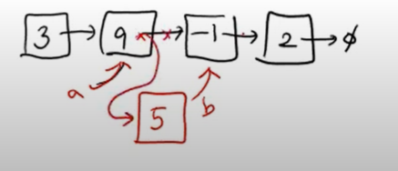
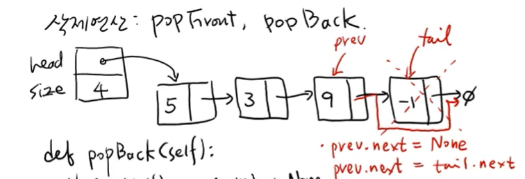
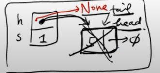
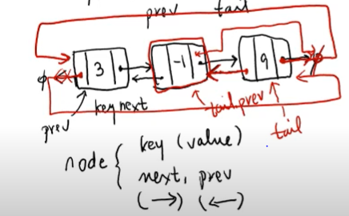
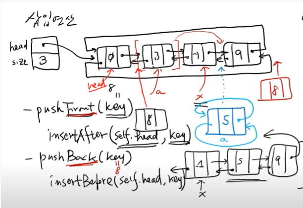
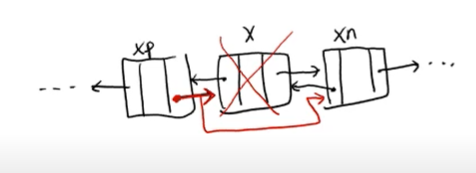

# Linked List

한방향  vs 양방향

#### 배열: 

- 연속된 공간에 메모리를 차지하고 값을 읽고 쓸 수 있는 것

#### 연결리스트:


- 그 다음의 주소가 저장되어 있어서 연결이 되는 느낌

- 다음 주소가 None(Null)이라면 다음이 없구나 2가 마지막 값이구나
- 하나당 2개의 주소를 가지고 있음
  - data(key값)
  - link
  - (key, link) 이 둘을 합친 것 ==> node

- head node = 가장 앞에 있는 노드
- 오로지 할 수 있는 일: head node를 시작으로 따라가야한다.

### 특징

- 장점:

 

- list 에서 insert(2,5)를 하고 싶다면 나머지가 옆으로 한칸씩 이동하고 5를 집어 넣어야한다.
- 만약에 오른쪽에 n개의 값이 있다면 최악의 경우 시간이 n만큼 걸리게 된다
- 하지만 연결리스트의 경우=> 9와 1의 링크를 끊고 5를 9와 연결시키고 -1과 연결시키면 되다
- 그러면 시간이 단축된다



- 단점: 노드 위치에 따라서 시간이 걸린다


## 한방향 연결리스트

- 한쪽으로만 리스트 연결되어 있는 리스트
- key값 하나와 link값 하나 + 알파


```python
 노드 생성
class Node:
    
    def __init__(self, key= None):
        self.key = key
        self.next = None

    def __str__(self):
        return str(self.key)

# a = Node(3)
# b = Node(9)
# c = Node(-1)
# a.next = b
# b.next = c

class SingleLinkedList:

    def __init__(self):
        self.head = None
        self.size = 0

    def pushFront(self, key):
        new_node = Node(key)
        new_node.next = self.head
        self.head = new_node
        self.size += 1

    def pushBack(self, key):
        new = Node(key)

        if self.size == 0:
            self.head = new

        else: 
            # 새로운 노드가 tail로 가주어야 함/ 
            # tail을 찾아야하고/ 그전에 초기화 해줘야함
            tail = self.head
            while tail.next != None:
                tail = tail.next
            
            tail.next = new
            self.size += 1

    def popFront(self): # 맨 앞에 값 삭제
        if self.size == 0:
            return None

        else:
            de = self.head
            de_key = de.key
            self.head = de.next
            del de
            self.size -= 1

            return de_key

    def popBack(self):
        if self.size == 0:
            return None

        elif self.size == 1:
            self.head = None
            self.size -= 1
            return self.head

        else:
            # prev값과 tail값을 동시에 저장하면서 가주어야 한다.
            # tail = 삭제, prev값 = tail
            # 초기화
            prev, tail = None, self.head
            while tail.next != None:
                prev = tail
                tail = tail.next

            prev.next = None
            key = tail.key
            del tail
            return key

    def search(self, key):
        var = self.head
        # print(type(var)) 
        # 타입이 __main__.Node이다 따라서 int 값이 아니기 때문에 
        # key와 비교를 해주어야함
        # print(type(var.key)) # 타입이 int값이다

        location = 0
        while var != None:
            if var.key == key:#주의할점은 var의 키값과 비교를 해주어야 한다. 
                print('location' , location)
                return var
            var = var.next
            location += 1
        # 못찾음
        return None

    def get_node(self, index):
        cnt = 0
        lst = self.__iterator__()
        for i in lst:
            if cnt == index:
                return i
            cnt += 1
            
    def insert(self, index, node):
        new = Node(node) # 새로운 값
        prev = self.get_node(index-1) # 지정한 곳의 전 값
        new.next = prev.next
        prev.next = new
        
    def __iterator__(self):
        var = self.head
        while var != None:
            yield var
            var = var.next
        return
```


- popFront


- popBack



- popBack에서 길이가 1일때
  - 이때는 값은 head이면서 tail ==> 즉 이전 값도 없기때문에




#### 한방향 연결 리스트 추가 연산: 탐색(search) + 제너레이터(generator)


- search

```python
# search를 하고 싶음

def search(self,key):
    # key값의 노드를 리턴 없으면 None을 return
    v = self.head
    while v != None:
        if v.key == key:  # 내가 찾고 싶은거 찾음
            return v
        v = v.next  #못찾음 => 다음걸로 넘어감
    return None

# 제너레이터
def __iterator__(self):
    v = self.head
    while v != None:
        yield v  #?? generator  ==> 거의 return이랑 똑같음  반환
        v = v.next  # 그리고 다음노드 선택 ==> 그리고 반환 계속
    return     
```

```python
for x in L:   # 여기서 x 는 v /// L은 한방향 리스트
    print(x)  # for문은 stopinterator Error를 보면 자동으로 멈춘다.
```


## 양방향 연결리스트


- key(벨류)값 하나와 link값 2개를 가지고 있음 + 알파
- key
- next(오른쪽방향), prev(왼쪽 방향)
- 단점: 각 노드마다 관리해야할 값들이 많아진다


### Circularly Doubly List

다른방식으로 사용 할 것 ==> 원형 양방향 리스트



- tail node의 next를 head node에 두도록 할 것이다.
- head node의 prev를 tail node가 되도록 할 것임
- 훨씬 simple하고 우아해진다


원형연결리스트: 빈리스트(dummyNode)


- 시작이 어느 노드인지 파악하기 위해서 사용하기로 함
- 값 = None

- 시작이기 때문에 head node라고도 불림


```python
class Node:
    
    def __init__(self, key=None):
        self.key = key
        self.next = self
        self.prev = self  # 이유: 처음은 자기 자신이기 때문에
        
class DoublyLinkedList:
    def __init__(self):
        self.head = Node()
        self.size = 0

    def __iterate__():
        pass
    def __str__(self):
        pass
        
    def __len__():
        pass
```


### splice 연산


- a와 b사이에 있는 부분을 컷해서 ==>  x 와 x다음 사이에 넣는다
- 6개의 노드만 바꾼다면 위에 문장을 해결할 수 있음
- a 부터 b까지 컷 => 따라서 ap와 bn을 서로 연결시켜줘야한다.
- x와 a를 그리고 xn과 b를 연결시켜줘야한다


- 조건

  - 조건1 : a를 따라가다보면 b가 나옴 

  - 조건2 : a와 b사이에 head(더미)노드가 없어야 한다.

```python
def splice(self,a,b,x):
    ap = a.prev
    bn = n.next
    xn=x.next
    
    # 컷하고 연결
    ap.next = bn #1
    bn.prev= ap #2
    x.next = a #3
    a.prev = x #4
    b.next = xn #5
    xn.prev = b #6
    
    
```


### 양방향 이동, 삽입 연산



```python
# 이동연산

def moveAfter(self, b, x):# 노드a를 노드 x다음으로 이동시킨다.
    splice(a,a,x) # a에서 a까지 떼어서 x다음으로 집어넣어라

def mvoeBefore(self, a, x):
    splice(a,a,x.prev)  # x의 전노드 다음이기 때문에 x전 임

# 삽입연산 4개
def insertAfter(self, x, key): #새로운 노드를 만들어서 집어넣는것
    moveAfter(Node(key),x)
   
def insertBefore(self, x, key):
    moveBefore(Node(key),x)
    
def pushFront(self, key): # 그냥 맨 앞에다가 넣는 것(head노드 다음)
    insertAfter(self.head, key)

def pushBack(self, key): # head노드 전에 집어 넣어라
    insertBefore(self.head, key)
```


### 양방향 탐색, 삭제연산

- 삭제



```python

def search(self, key):
    v = self.head  # dummy node
    while v.nex != self.head:
        if v.key == key:
            return v
        v = v.next

	return None

def remove(x):
    if x == None or x == self.head: #삭제하는게 없거너, head(더미)이면 이상함
        return    #아무것도 하면 안됨
    xp.next = x.next
    xn.prev = x.prev
    del x
   
```

- 시간 복잡도
  - search => O(n)
  - splice => O(1) (move, insert,push)
  - remove => O(1)
  - popFront(1)


- 비교

|     0     | Array | single | Double |
| :-------: | ----- | ------ | ------ |
|  search   |       |        |        |
| pushFront |       |        |        |
| pushBack  |       |        |        |
| popFront  |       |        |        |
|  popBack  |       |        |        |
|  insert   |       |        |        |
|  remove   |       |        |        |


