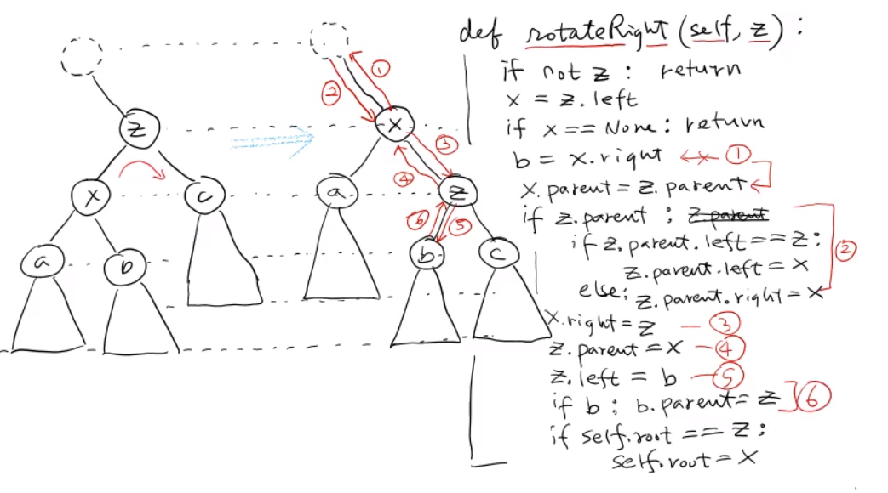
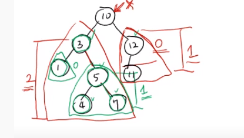
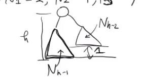
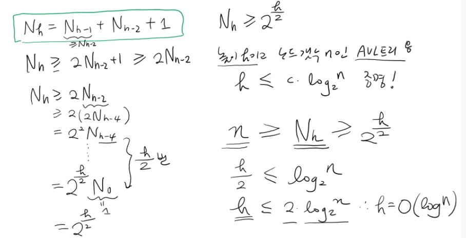
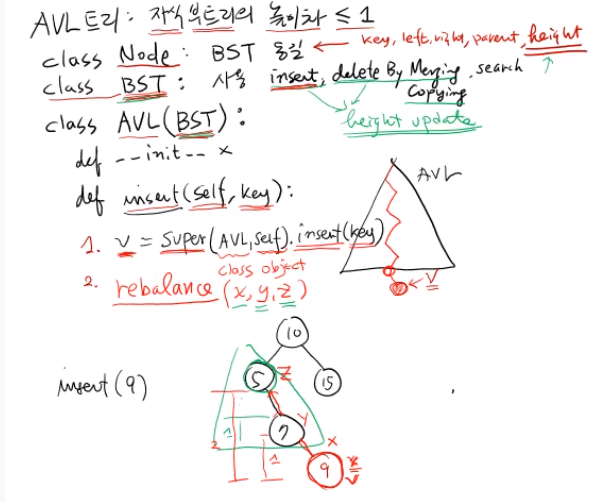
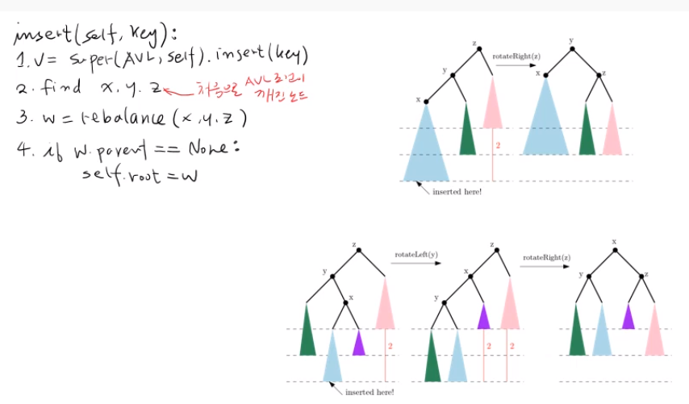
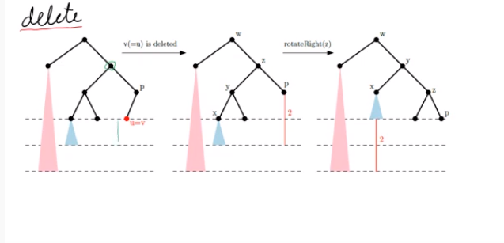
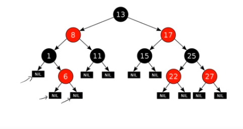

# Balanced BST

- 균형이 생겨진 이유는 이진트리의 h를 줄이기 위함이다

- 이진트리가 굉장히 비효율적일수 있기 때문이다

- O(logN)을 최대한 맞춰주는 즉 h를 logN으로 맞춰주려고 노력해야한다


- 종류
  -  AVL트리
  - Red-Black Tree
  - (2,3,4) Tree
  - Splay Tree


트리의 일부를 회전시켜서 h값을 줄이는 방법


- 오른쪽으로 회전?
  - z를 기준으로 오른쪽으로 회전한다
  - x가 z로 간다
  - A <= x < B <= z < c 
    - (이 표가 필요한 이유는 회전시에 편하게 하기 위해서)
    - 따라서 이 부호를 먼저 그려놓고 하자
  - 원래 z의 부모는 x의 부모가 되어야하고
  - 왼쪽에 있는 서브 트리가 한단계 올라가고
  - 오른쪽은 한단계 내려간다
  - 즉 균형을 맞춰준다 
  - ==> 한 level 줄어들게 된다.

- 약간 약간 한쪽으로 치우쳐져있는 추를 당겨서 균형을 맞춰주는 느낌이다

- A <= x < B <= z < c 
  - 중심이 되는거 기준으로 두칸씩 떨어져서 각각의 부모를 맡으면 트리가 완성된다.
  - 즉 오른쪽 rot을 하면 두칸 띄어져있는 원소가 root를 맡으면 된다.



```python
def rotateRight(self, z):

    if z == None:
        return
    x = z.left
    if x == None:
        return
    
    b = x.right
    
    # 1
    x.parent = z.parent
    
    #2
    if z.parent != None:
        if z.parent.left == z:
            z.parent.left = x
        else:
            z.parent.right = x
    #3
    x.right = z
    #4
    z.parent = x
    z.left = b
    if b != None:
        b.parent = z

    if self.root == z:
        self.root = x
```


## AVL트리 (Adelson-velsky, Landis)

- 1964년도 꺼, 가장 오래된 트리
- 높이가 2logN을 넘지 않는다는 것을 증명할 것이다. 



- 정의
  - 모든 노드에 대해서 노드의 왼쪽 부트리와 오른쪽 부트리의 높이차가 1이하인 BST 

- h = 0


- h = 1인 AVL트리


- h = 2인 AVL트리


- Nh = 높이가 h이고 AVL 트리중에서 최소 노드 갯수
  - N0 = 1 
  - N1 = 2  
  - N2 = 4   
  - N3 = 7
  - Nh = Nh-1 + Nh-2 + 1
    - 왼쪽: Nh-1 루트노드를 뺐기때문에 높이가 1준다
    - 오른쪽: 루트노드 하나 뺴고, 왼쪽보다 1만큼  높이가 낮아야하기 때문에 h-2가 된다 
    - 그리고 +1을 하는 이유는 본인 루트노드를 더해주면 되기 때문에 +1하는것
    - 이렇게 최소의 노드갯수를 계산할 수 있다.





- (최소노드) Nh = Nh-1 + Nh-2 + 1
- Nh >=  2\*Nh-2 + 1 >=2*Nh-2
  - 이유
    - Nh-1은 Nh-2보다 항상 크거나 같기 때문이다.  따라서 2배로 곱해준것
    - 즉 Nh-1을  Nh-2로 치환시키고 부등호를 준것이다
- Nh >=2*Nh-2 이것을 반복하다보면
- Nh >=2*( 2 Nh-4)  .. .. . . .. . .
- 즉  Nh >= 2 **(h/2) 
  - 최소 이만큼의 노드개수를 가지고 있어야 한다
- 높이가 h이고 노드갯수 n인 AVL트리
  - h <= c logN 증명!
  - n > Nh >=   2 **(h/2) 
- 즉 h를 O(logN)만큼의 시간복잡도를 유지할 수 있다는 뜻이다

- h는 최악의 경우 2logN만큼의 높이를 갖는다는 뜻이다
- 즉 시간 복잡도로 표현할 경우 O(logN)를 갖는다는 뜻이다
  - 왜냐하면 이진트리의 시간복잡도는 O(h)를 가지고 있기 때문이라고 할 수 있다. 


#### AVL 삽입 연산





- AVL트리의 장점
  - rotation 1~2회로 전체의 균형을 항상 잡을 수 있다.
- 복잡도
  - insert => O(h) = O(logN)
  - find     =>  O(h)
  - w => O(1)
  - parent root O(1)
    - 총수행시간 O(logN)

```python
class AVL(BST):
    # 상속을 받아온다
    # 노드에는 각각의 left right parant등등이 있었다
    # 하지만 AVL트리에서는 hieght라는 정보가 필요하다
    # 왜냐하면 정의자체가 왼쪽 부트리와 오른쪽 부트리의 h의 차가 1이하인 트리이기 떄문
    # 즉 서로의 높이차가 1이하인지 따져줘야한다.

    # insert, delete등등은 높이가 달라지게 된다
    # 따라서 height의 정보가 업데이트를 해줘야한다. 

    def insert(self, key):
        '''
        순서:
        # xyz가 일자인 경우 ==> 그림 1과같이 진행 ==> rotation1회로 가능
        # xyz가 지그재그인 경우 ==> 그림 2와같이 진행 ==> rotation 2회를 해주어야 한다.
        # 두가지 경우를 따져줘야한다

        1. v = super(AVL,self).insert(key)
        2. find xyz 
            (위에서부터 z는 처음으로 AVL조겅이 꺠진 노드)
            (y는 z의 자식노드)
            (x는 y의 자식노드 사진 참조)
        3. w = rebalence (x,y,z)
        4. if w.parent == None:
            self.root = w
        '''
        # 1
        v = super(AVL,self).insert(key) # 현재 클래스의 이름과 객체를 말해주면 된다.

        # 2. 
        # rebalance를 해주어한다.
        # z를 찾아줘야한다 (균형이 맞지 않는 부모노드)
        # z가 존재할때와 아닐때를 나눠줘야한다

```


#### AVL 삭제연산



- x, y, z를 찾는 것이 insert와는 조금 다른다

  - insert같은 경우에는 삽입될 곳에서 올라가면서 찾게 된다

  - 하지만 delete 경우 더 무거운 쪽에서 x, y, z를 찾아야한다
  - 즉 없어진 곳은 p부분이지만 왼쪽 부트리 부분이 더 무겁기 때문에 그쪽에서 x,yz를 찾아주게 되는 것이다.
    - (무거운 쪽 ): 그림에서 파랑색 부분
    - 이유는 무거운 쪽에서 가벼운 쪽으로 rotation을 잡아줄 것이기 떄문이고
    - 가지를 뻈다가 붙일 일이 있는 곳이 무거운 쪽이기 때문이다
    - 가벼운 쪽은 그냥 단지 가만히 내려가기만 하면 된다.


- 여기만 맞춰줬다고 해서 균형이 맞는 것이 아니다
  - 즉 분홍색부분과 파랑색 부분이 h가 2차이가 난다
  - 따라서 계속 깨져있는지 봐야하는건가??
  - 그렇다 계속 올라가면서 균형이 맞는지를 계속 확인을 해줘야한다
  - rotation이 여러번 일어날 수 있다 (최악의 경우)
    - O(logN)번 rotation이 일어날 수 있다


```python
    def delete(self, u):
        v = super(AVL, self).deleteByMerging(u)
        # v는 u라는 노드를 지워서 균형이 깨질수 있는 가장 깊은 노드를 반환해주게 된다
        # 즉 그림에서는 p가 된다
        # 따라서 return해줘야하는 값이 parent라고 delete함수에서 정의해준것이다.
        while v != None:
            if v is not balanced: # 수도 코드임
                z = v
                if z.left.height >= z.tight.height:
                    y = z.left
                else:
                    y = z.right

                if y.left.height >= y.right.height:
                    x = y.left

                else:
                    x = y.right
            v = rebalence(x,y,z)

            w = v
            v = v.parent
        # while문에서 빠져나왔을 떄는 v == None상태가 된다
        # v가 None이라는 뜻은 root노드의 부모가 되었다는 뜻이고
        # w가 root가 되었다는 뜻이다
        # 즉 끝까지 올라갔다는 뜻이 된다.
        # rotation은 돌리지 않더라도 부모노드에서 균형이 맞는지 아닌지를
        # 계속해서 봐줘야하기 때문에 그렇게 되는 것이다.
        # w == root가 된다
        self.root = w
```

- 정리
  - 높이: <= 2logN
  - insert
    - rebalence 1회/2회 회전
  - delete
    - rebalence 매 level에서 회전


## Red-Blck Tree

- 가장 유명하고 많이 사용되는 균형이진 탐색 트리



- 여기서는 None노드를 독립된 노드로 둘 것
- 그리고 None이 leaf노드로 볼 것이다
- 그리고 나머지를 내부 노드라고 불린다.

- 규칙

  - 노드 ==> red/balck
  - root ==> black
  - leaf(None) ==> black
  - red node ==> child node모두 색이 블랙이어야 한다. 
  - 각 노드에서 leaf nodes로가는데 이때 거치는 black node의 수가 항상 같아야한다.

  - 모든 노드가 이런 조건을 맞아야한다.

- 이진탐색트리이기 떄문에 O(logN)을 만족해야한다.

- bh(v) :  v에서 leaf node에서 블랙은 같아야한다
  - 이때 v를 제외한 black node 개수를 의미한다.


- 사실1

  - ##### v의 서브트리의 내부노드의 개수는 최소한 >= 2**bh(v)   -   1

- 사실 2

  - ##### black 노드의 수 >= h/2이다

  - ##### 즉 bh(root) >= h/2

    - 이유: 
      레드의 자식은 항상 블랙이어야 하지만 블랙노드의 자식은 레드블랙 상관없기 떄문이다

  - ##### red-black tree의 노드의 갯수 >=  2**bh(v)   -   1

  - ##### red-black tree의 노드의 갯수 >=  2**h/2 -   1

  - ##### h <= 2log(n+1) 아무리 커봐야 이것이다

  - 따라서 h= O(logN)이 된다.


