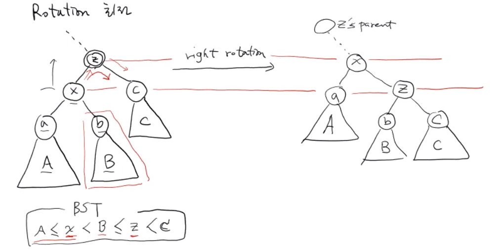

# Balanced BST

- 균형이 생겨진 이유는 이진트리의 h를 줄이기 위함이다

- 이진트리가 굉장히 비효율적일수 있기 때문이다

- O(logN)을 최대한 맞춰주는 즉 h를 logN으로 맞춰주려고 노력해야한다


- 종류
  -  AVL트리
  - Red-Black Tree
  - (2,3,4) Tree
  - Splay Tree


트리의 일부를 회전시켜서 h값을 줄이는 방법



- 오른쪽으로 회전?
  - z를 기준으로 오른쪽으로 회전한다
  - x가 z로 간다
  - A <= x < B <= z < c 
    - (이 표가 필요한 이유는 회전시에 편하게 하기 위해서)
    - 따라서 이 부호를 먼저 그려놓고 하자
  - 원래 z의 부모는 x의 부모가 되어야하고
  - 왼쪽에 있는 서브 트리가 한단계 올라가고
  - 오른쪽은 한단계 내려간다
  - 즉 균형을 맞춰준다 
  - ==> 한 level 줄어들게 된다.

- 약간 약간 한쪽으로 치우쳐져있는 추를 당겨서 균형을 맞춰주는 느낌이다

- A <= x < B <= z < c 
  - 중심이 되는거 기준으로 두칸씩 떨어져서 각각의 부모를 맡으면 트리가 완성된다.
  - 즉 오른쪽 rot을 하면 두칸 띄어져있는 원소가 root를 맡으면 된다.


```python
def rotateRight(self, z):

    if z == None:
        return
    x = z.left
    if x == None:
        return
    b = x.right # 이부분을 조금더 이해할 필요가 있음  # 1

    #2
    x.parent = z.parent
    if z.parent != None:
        if z.parent.left == z:
            z.parent.left = x
        else:
            z.parent.right = x
    #3
    x.right = z
    #4
    z.parent = x
    z.left = b
    if b != None:
        b.parent = z

    if self.root == z:
        self.root = x
```


