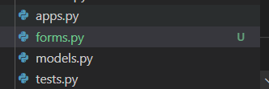
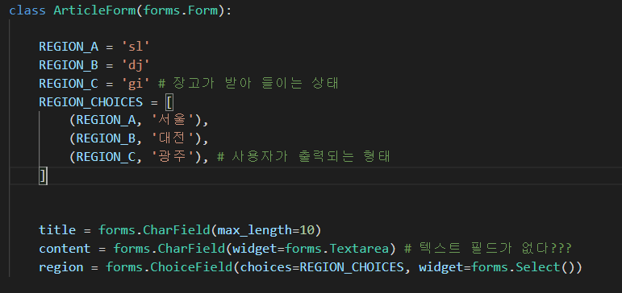
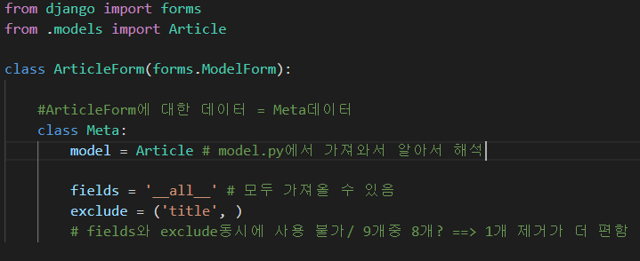
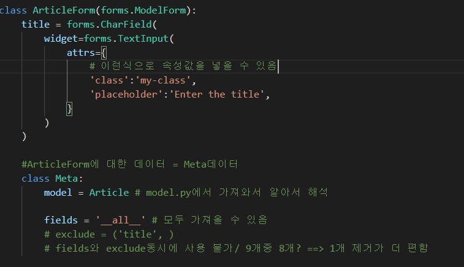
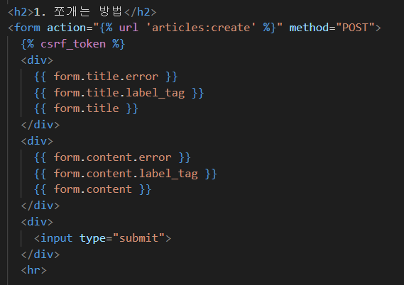
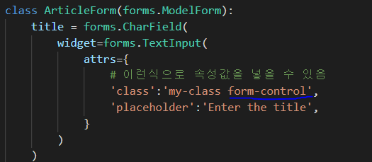
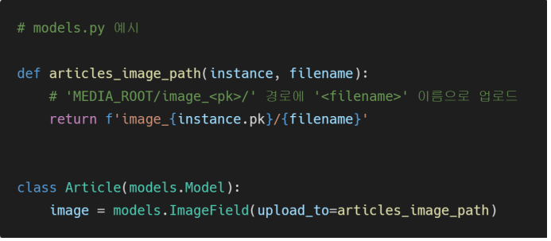
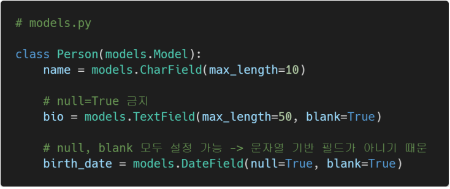

# 04Form

- 유효성 검증을 대신해주는 것

- 외부의 악의적 공격 및 데이터 손상에 대한 중요한 방어 수단
- form내 field, field배치, 디스플레이 widget, label, 초기값 유효하지 않는 firld에 관련된 에러 메세지를 결정

## 1. Form

#### 작업

1. 렌더링을 위한 데이터 준비 및 재구성
2. 데이터에 대한 HTML forms 생성
3. 클라이언트로부터 받은 데이터 수신 및 처리

- 새로운 forms.py와 그안에 class를 정의해준다

- views.py로 가서 함수 설정
- html로 가서 form.as_p사용

### widgets

- 웹 페이지의 HTML input 요소 렌더링

- GET/POST 딕셔너리에서 데이터 추출

- widgets은 반드시 Form firlds에 할당 됨

  - 즉 단독적으로 사용할 수 없다
  - 즉 forms에서는 testField를 지원하지 않음
  - 그래서 widgets을 사용하는 것이다

  - widget=forms.PasswordInput 라고 하면 ==> password로 바뀐다
  - 궁금하면 이제 문서확인

- 주의사항
  - form fields와 혼동되면 안된다.
  - form fields는 input 유효성 검사를 처리
  - widgets은 웹페이지에서 input element의 단순 raw한 렌더링 처리

#### select

- 서울대전 ==> 사용자가 보이는 형태 
- sl ==> value값

## 2. ModelForm

- model을 통해 Form Class를 만들 수 있는 helper
- 

### meta class

- model의 정보를 작성하는 곳

- inner Class
  - 내부 클래스에는 외부 클래스가 접근 할 수 없다 ==> 복잡성을 줄일 수 있다

- meta 데이터
  - 데이터에 대한 데이터
  - ex) 사진 촬영 => 사진 데이터 => 사진의 메타데이터 (촬영 시각, 렌즈, 조리개 등등)

#### 그럼 forms는 필요 없는 것인가?

아니다 => 사용용도가 다를 뿐이다

form 을 사용하는 이유 : 데이터를 보내기 위해서 => 그럼 어디에??? 사용하는가?? 

차이점

##### \- 데이터 베이스와 동일하게 저장되는 것인가?  ==> ModelForm

  ==> Model이랑 비슷하네??

  ==> 그러니 귀찮으니깐 그거 가져다가 쓰자!

  ==> 그래서 DB와 동일하게 저장하고 싶으면 ModelForm을 쓰는 것이 편함

##### \- 아니면 단순히 데이터로써만 사용되는 것인가? ==> Form

  ==> 검색창 같은 곳은 굳이 DB에 연결이 되지 않는다

  ==> 그래서 굳이 가져다가 쓸 수 있는 것이 없음

### method

#### is_valid( ) method

- 유효성 검사를 실행하고,, 데이터가 유효한지 여부를 boolean으로 반환
- 유효성 검사란?
  - 특정 조건에 충족하는지 확인
  - 올바르지 않은 데이터가 서버로 전송되거나 저장되지 않도록 하는 것

#### The save( ) method

- 

- instance의 유무에 따라서 저장을 할 것인지 update를 할 것인지 판단하게 된다.

#### new와 create를 합치자!

+ ##### \+ html에서 new를 지워주고 urls에서도 new를 지워준다

- 왜??

  - 굳이 두개가 필요하지 않음

  - new ==>  GET 만

    create ==> POST 만 받고 있음

    그럼.... 둘이 합쳐서 if문으로 get이랑 post만 바꿔주면 되는거 아닌가?

    굳이 두개의 함수가 필요하지 않음

- 합칠때 왜 POST가 위에 있을까??

  - POST는 DB와 연관된 부분 ==> 따라서 다른 메서드는 들어오지 못하도록 저렇게 함수가 짜져있다

    

#### +  widgets 추가

이런식으로 attrs를 위젯을 이용하여 일일히 만들어줘야한다.

## 3.Rendering fields manually

- 수동으로 form 작성하기
- 1

- 2

### + bootstrap

- 이렇게 form에 위젯에 class에 넣어준다
- 꾸미는 방법 하지만 이것은 bootstrap을 사용한 것이 아님

- bootstrap을 사용하려면 이렇게 사용해야한다

## Handling HTTP requests

Django에서 HTTP 요청 처리방법

1. 장고 shortcut function
2. view decoration

#### 1. shortcut function

- 종류
  - render
  - redirect
  - get_object_or_404()
  - get_list_or_404()

##### get_object_or_404()

- 단일형태 조회할때 사용한다.
  - detail, delete, update같은 곳에 사용하게 된다.

- 원래 : 해당 객체가 없었을때 => DoesNotExit예외
- 이것을 쓰면? : 404에러를 rasise를 하게 된다.

##### get_list_or_404()

- API요청할때 사용한다. 

- 영화조회를 했는데 영화 목록이 없을때 사용하게 된다. 

#### 2. view decoration

- view함수에 적용할 수 있는 데코레이터를 제공한다.
- @ 사용하여 사용할 수 있음
- 예전에 파이썬에서 배운 ==> 함수를 인자로 사용할 수 있도록 하는 것
- Allowed HTTP methods
  - 요청 매서드에 따라 view함수에 대한 엑서스를 제한
  - 요청을 충족시키지 못함 ==> HttpResoneseNotAllowed 발생 ==> 405에러
  - ex - delete를 하고 get으로 요청==> detail로 감 ==> 사용자 입장에서는 왜 detail로 갔는지 모름 ==> 그래서 405에러를 뜨게 만듦

##### 종류

- require_http_method( [메소드들] ) 
  - 특정한 메소드만
- require_POST(  )
  - POST method만 ==> delete같은 것들
- require_safe(  ) 
  - GET( index, detail ) 및 HEAD 메소드만 허용

## Media files

- imageFeild( )
  - 최대길이가 100자인 문자열로 DB에 생성되며, max_length 인자를 사용
- FileField(  )
  1.  upload_to
  2. storage

- ##### 작성

  -  upload_to = 'images/'
    - 실제 이미지가 저장되는 경로를 지전
  - blank=True (디폴트(기본값) ==> False로 되어 있다)
    - 파일을 안올려도 허용되도록 해준다
    - 이것을 False로 한다면 ==> 무조건 파일을 올려야한다.

- upload_to 방법

  1. 문자열 경로 지정방식

  

  		2.  함수형

  

- Model field option
  - null
  - charFeild, TextField와 같은 문자열 기반 필드에는 사용하는 것을 피해야한다.
  - 문자열 기반 필드에 True로 설정시 데이터 없음에 NULL과 빈 문자열 2가지 가능한 값이 있음을 의미
  - Django는 NULL이 아닌 빈문자열을 사용하는 것이 규칙이다

##### blank and null 비교

- blank
  - 빈값을 허용
- null
  - DB에만 영향을 끼침

#### ImageField 를 사용하기 위한 3가지 단계

1. settings.py에 MEDIA_ROOT, MEDIA_URL 설정
2. upload_to 속성을 정의하여 업로드 된 파일에 사용 할 MEDIA_ROOT의 하위 경로를 지정
3. 업로드 된 파일의 경로는 django가 제공하는 ‘url’ 속성을 통해 얻을 수 있음

#### MEDIA_ROOT

- 사용자가 업로드 한 파일(미디어 파일)들을 보관할 디렉토리의 절대 경로

- [주의] MEDIA_ROOT는 STATIC_ROOT와 반드시 다른 경로로 지정해야 함
- django는 성능을 위해 업로드 파일은 데이터베이스에 저장하지 않음

#### MEDIA_URL

MEDIA_ROOT에서 제공되는 미디어를 처리하는 URL 

• 업로드 된 파일의 주소(URL)를 만들어 주는 역할 

• 웹 서버 사용자가 사용하는 public URL 

• 비어 있지 않은 값으로 설정 한다면 반드시 slash(/)로 끝나야 함

• [주의] MEDIA_URL은 STATIC_URL과 반드시 다른 경로로 지정해야 

## 이미지 업로드

### form 태그 - enctype(인코딩) 속성

\1. multipart/form-data • 파일/이미지 업로드 시에 반드시 사용해야 함 (전송되는 데이터의 형식을 지정) • 을 사용할 경우에 사용 

2. application/x-www-form-urlencoded • (기본값) 모든 문자 인코딩 

3. text/plain  • 인코딩을 하지 않은 문자 상태로 전송 • 공백은 '+' 기호로 변환하지만, 특수 문자는 인코딩 하지 않음

##### views 수정

##### 불러오기(detail page에)

## 이미지 수정하기

- 이미지 하나를 수정하는 것은 불가능 하다 ==> 하나의 덩어리기 때문에
- 그렇기 때문에 덮어씌우는 방식을 사용
- 업데이트 부분에 똑같이 진행해주면 된다

- 이미지를 안올린 경우 에러가 뜨기 때문에 수정해준다

- 

