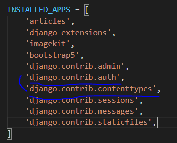
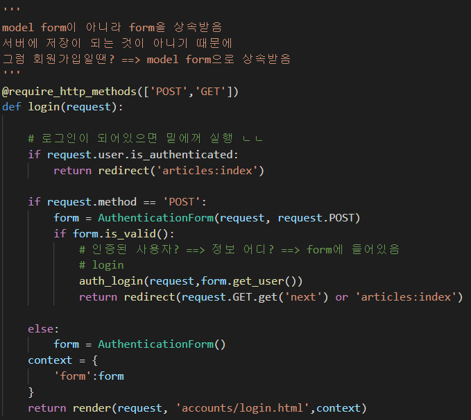
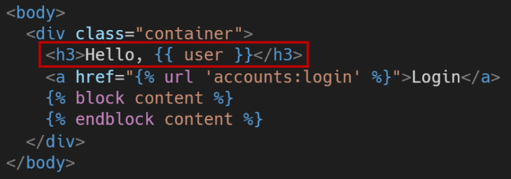
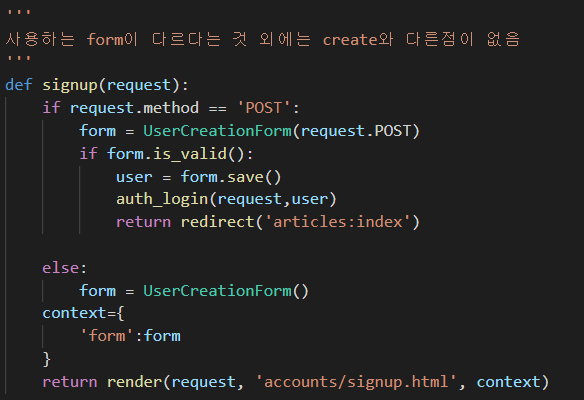
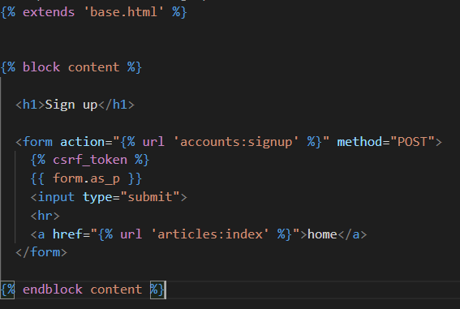
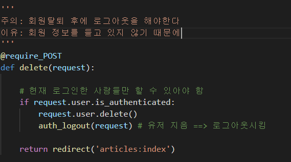
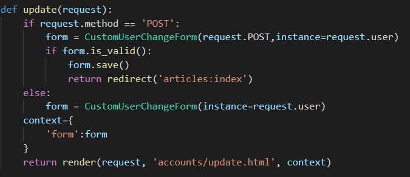
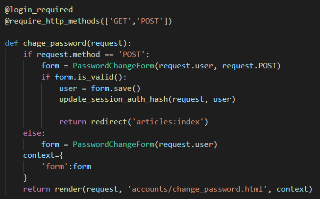
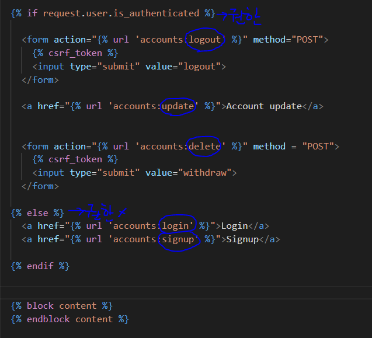

# 05Authentication

HTTP vs HTTPS

HTTPS ==> + security 가 추가된 느낌으로 알고 있자

HTTP특징

- 비연결지향( 서버와 클라이언트는 연결되어 있는 것이 아니다 )
- 무상태
  - ( 정보가 유지 되지 않음 )
  - 즉 클라이언트와 서버가 주고 받는 메시지들은 서로 완전히 독립
- 즉! 지속적인 관계를 유지하기 위해 쿠키와 세션이 존재한다.

### 쿠키 개념

- 서버가 브라우저에 전송 ==> 작은 데이터 조각

#### 역할

- 클라이언트가 매 요청마다 쿠키를 보냄
- 즉 나 로그인 되어 있는 사람이야!! 라고 쿠키와 함께 요청을 보내는 것
- 왜? ==> 연결되어있지 않기 때문에

#### 개념

- HTTP 쿠키는 상태가 있는 세션을 만들어 준다
- 쿠키는 두 요청이 동일한 브라우저에서 들어왔는지 아닌지를 판단할 때 주로 사용한다.
  - 로그인 상태 유지 가능
  - 상태 전보를 기억 시켜준다
- 순서
  - 웹 페이지에 들어감
  - 쿠키 받음, 저장
  - 클라이언트가 같은 서버에 재요청시 쿠키를 같이 보냄

#### 목적

- 세션관리
  - 로그인, 아이디 자동완성, 팝업 체크, 장바구니 등등
- 개인화
  - 사용자 선호, 테마 등의 설정
- 트래킹
  - 사용자 행동을 기록 및 분석

##### ex) 장바구니

- ##### 장바구니에 물품을 넣게 되면 쿠키에 정보가 담겨 간다

  - 물품을 추천해줄 때 이것을 이용함

- ##### 그럼 장바구니에 물품을 지운다?

  - 쿠키를 지우는 것
  - 물품을 추천해주지 않음

### 세션(Session)

#### 순서

- 클라이언트 => 서버 접속 ==> session id를 발급
- session id를 쿠키에 저장
  - 다시 서버 접속 ==> 쿠키안에 session id를 넣음 ==> 서버에 전달
  - ID는 세션을 구별하기 위해 필요하며, 쿠키에는 ID만 저장함

역할

- 사용자가 권한이 있는지를 계속해서 확인할 수 있게 해준다
- 로그 아웃 ==> 세션을 삭제하는 과정이었다
- 즉 세션을 삭제하면 자연스럽게 로그아웃이 된다
  - 왜?? ID를 가지고 있지 않아 서버에서 거절하게 된다

쿠키 lifetime

1. Session cookies

   - 현재 세션이 종료되면 삭제 됨( 세션 주기가 끝나면 )

   - 일부 브라우저는 다시 시작할 때 세션 복원 ==> 오래 지속가능하게 한다

2. Persistent Cookies

   - Expires 속성에 지정된 날짜 혹은 Max-Age 속성에 지정되 기간이 지나면 삭제
   - 즉 창을 꺼도 로그아웃이 되지 않는다
   - 일정시간이 지나면 로그아웃

### Session in Django

- Django에서 세션은 미들웨어를 통해 구현됨

- SessionMidleware
  - 요청 전방에 걸쳐 세션을 관리
- AthenticationMiddleware
  - 세션을 사용하여 사용자를 요청과 연경

## 로그인

- #### form

  - #### AuthenticationForm

- ##### 코드 특이점

  - valid 밑에

  - ##### auth_login(request,form.get_user())

    - 로그인을 하기 위해서 필요함

  - ##### return redirect(request.GET.get('next') or 'articles:index')

    - 어디 갔다가 빠꾸당하고 로그인 함 ==> next  실행
    - 아님 ==> index로 감

## Authentication data in templates

## Logout

##### 인증을 받을 때만 보거나 접근할 수 있게 만들어주는 방법 2가지

1. is_authenticated

2. @login_reqiured

- #### form

  - 없음

- ##### 코드 특징

  - 없음

## 회원가입

- 회원가입

  - #### form

    - #### UserCreationForm

  - ##### 코드 특이점

    - ##### auth_login(request,user)

      - save 밑에 씀
      - 회원가입하고 로그인 된 상태로 만들기 위함

  

## 회원탈퇴

- #### form

  - 없음

- ##### 특이

  - ##### if request.user.is_authenticated:

  - #####  auth_logout(request)

## 회원 수정

- 따로 form을 만들어 주어 필요한 정보만 제공하도록 해야한다.

- #### form

  - ##### UserChangeForm

  - 하지만 필요한 정보만 써야하기 때문에 따로 Form을 만든다

  - 그리고 UserChangeForm에서 상속 받음

  - from django.contrib.auth import **get_user_model**

  - 모델: get_user_model ( )

  - field = (설정)

##### 코드 특징

- ##### form = CustomUserChangeForm(request.POST,instance=request.user)

  - 인스턴스 사용함 (정보를 기본으로 세팅 해놓는 다는 말)

## 비밀번호 변경

- #### Form

  - ##### PasswordChangeForm

- 코드

  - 특징점

    - save 밑에

    - ##### update_session_auth_hash(request, user)

    - 바꾸고 나면 로그아웃되어 있는 상태가 된다, 이를 해결하기 위함

## 정리

#### 데코

@require_safe => 인덱스

##### @login_required :

- 로그인이 되어 있는지를 확인하는 것
- 사용되는 함수
  - create
  - update
  - 사실은 delete도 하지만 성향이 맞지 않음

##### @require_POST

- POST값인지 확인하는 데코
- 사용되는 함수
  - delete
  - logout
  - delete

##### @require_http_methods(['GET','POST'])

- GET하고 POST 두개 받아오는 
- 사용되는 함수
  - create
  - update
  - login
  - signup
  - chage_password

#### html

- 권한이 필요한 것
  - 로그아웃, 수정, 삭제
- 필요없는 것
  - 로그인
  - 회원가입

