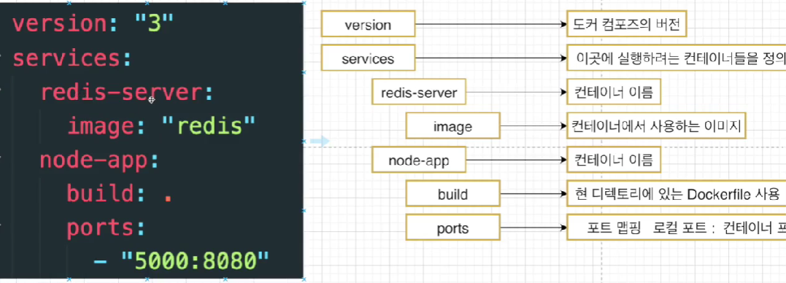

# 05_Docker_compose


## 1) Docker compose 란?

> - 다중 container 도커 어플리케이션을 정의하고 실행하기 위한 도구


## 2) APP을 만들면서 배우기


```javascript
const express = require("express");
const redis = require("redis");

// create redic client 
const client = redis.createClient({
    //도커를 사용할땐 파일에 명시한 컨테이너 이름으로 주면된다.
    //도커를 사용하지 않을땐 https://redis-server.com
    host:"redis-server", 
    port:6379
})

const app = express();

// num=0
client.set("number",0);

app.get('/',(req,res)=>{
    client("number",(err,number)=>{
        client.set("number",parseInt(number)+1)
        res.send("숫자가 1씩 올라갑니다. 숫자:"+number)
    })
})

app.listen(8080);
console.log('server is running');
```

```json
{
  "name": "docker-compose-folder",
  "version": "1.0.0",
  "description": "",
  "main": "server.js",
  "scripts": {
    "start": "node server.js",
    "test": "echo \"Error: no test specified\" && exit 1"
  },
  "dependencies": {
    "express":"4.18.2",
    "redis":"4.6.7"
  },
  "author": "",
  "license": "ISC"
}
```


```dockerfile
FROM node:10

WORKDIR /usr/src/app

COPY ./ ./

RUN npm install

CMD ["node","server.js"]
```


## Container 간에 연결시키기


- docker-compose를 사용하면 된다.
- 




docker compose up : 이미지가 없을때 이미지를 빌드하고 컨테이너를 시작 

docker compose up --build : 이미지가 있든 없든 이미지를 빌드하고 컨테이너를 시작 => 소스를 변경해쓸 때 이미지를 다시 빌드해줘야할때 사용한다.

docker compose down : 중단하기

docker compose -d up : 앱을 백그라운드에서 실행시킨다. 그래서 앱에서 나오는 output을 표출하지 않는다.


