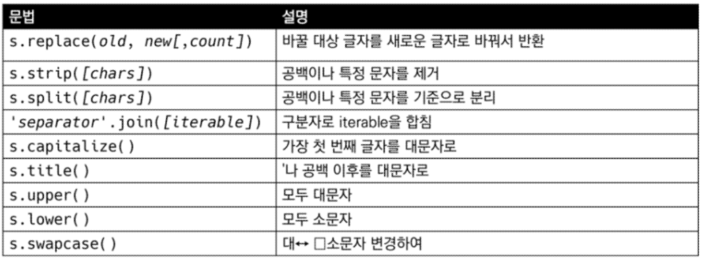
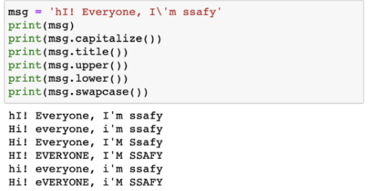
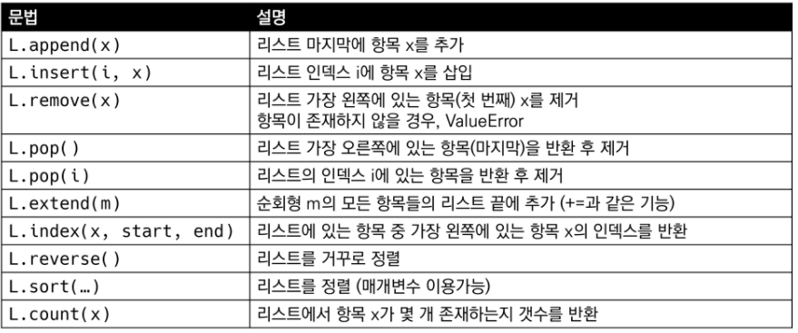
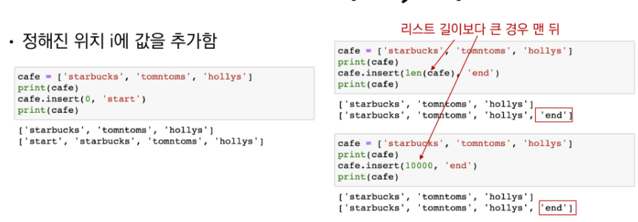
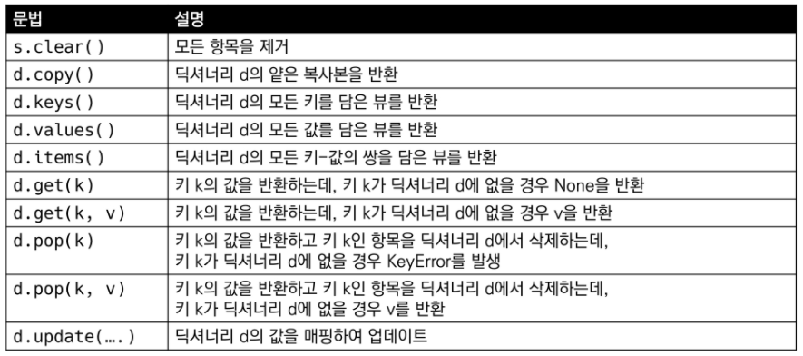
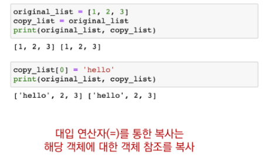
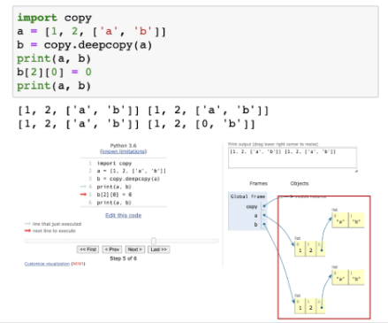

# 05.Data Structure

computer = calculation + remember

method = 어떠한  것이 00을 한다. 

## 문자열(String Type)

- immutable

#### 문자열 조회/탐색 및 검증 메소드


- find( ) : 
  - 없으면 -1을 반환
  - 만약 원하는 모든 위치를 알고 싶을 때 : for문을 사용해야한다.

- index( ) :
  -  없으면 오류 발생

- is가 있다면 여부를 물어보는 것이다. ==> 반환: boolean

- Title : 
  - 공백 뒤에 대문자인 경우를 말한다. 


#### 문자열 변경 메소드



- .replace(대상, 새로운 값[count])
  - 대상을 새로운 값으로 바꾼다
  - count = 2 이면 2개만 바꾼다


- .strip([chars])
  - strip(), lstrip(), rstrip()
  - 문자를 지정하지 않을 경우에 공백을 지우게 된다.


- .split(  [문자]  )
  - 문자열 특정 단위로 나눠 리스트로 반환
  - **리스트로 반환**


- ' ' . join(  [iterable]   )  ==> 스트링의 메소드이다
  - iterable에 문자열이 없으면 Error를 발생한다. 즉! int값 등등 ==> 오류


```python
a = 'hello python!'

# startwith 메서드를 통해 접두문자가 'hello'인지 확인해봅시다.

print(a.startswith('hello'))
print(a.startswith('h'))

True
True
```


```python
# 그럼 어떻게 해야하나
# ex)
numbers = [1,2,3]
print(' '.join(map(str, numbers)))
```


####  문자열 변경



- titime은 어퍼스트로피 뒤에도 title 써주게 된다.


## 리스트(list)

#### 리스트 메소드

- 리스트 요소를 변경 시키는 것들이 있다 : mutable



### 추가

#### append ( x )

- 값을 추가


#### extend ( iterable )


#### insert




### 삭제

#### .remove(x)

- 원하는 값을 삭제해 주는 것


#### .pop(i)

- 인덱스 값을 삭제 해주는 것
- i가 없으면 리스트의 마지막 값을 삭제 후 반환


#### .clear( )

- 값을 다 비워버리는 것


### 탐색 정렬

#### .index(x)

x 의 값을 찾아서 index값을 반환한다


#### .count(x)

- 숫자를 센다

#### .sort( )


```python
a = [100, 10, 1, 5]
b = [100, 10, 1, 5]
#1. 메서드 활용 (.sort)
# 원본 리스트를 정렬시고 , NOne을 return한다. 
print(a)   		   # ==> [100, 10, 1, 5]
print(a.sort())    # ==> None
print(a)           # ==> [1,5 ,10, 100]

# 메서드인 경우에는 
# ~~~ 점 ~~ 인것은 다 메서드이다


# 2. 함수 (sorted)
# 원본 리스트는 변경이 없음, 정렬된 리스트를 return
print(b)		   #==> [100, 10, 1, 5]
print(b.sort())    #==> [1,5 ,10, 100]
print(b)		   #==> [100, 10, 1, 5]


# 정렬하고 뒤집기
a.sort()
a.reverse()
print(a)
```


#### .reverse()

- 원본 자체의 순서를 뒤집는다.


## 튜플(Tuple)

- append 이런 것은 없다 ==> 변경할 수 없기 때문이다. 


# 순서가 없는 데이터 구조


## 셋(set)

- 순서가 없음


### 추가 및 제거

#### .add(elem)

- 랜덤으로 아무곳에 추가를 해준다.


#### update(*others)

- 여러개를 추가 할 때


#### . remove(elem)

- 셋에서 삭제하고 없어도 에러가 발생기킨다


#### .discard(elem)

- 셋에서 삭제하고 없어도 에러가 발생하지 않는다


#### .pop()

- 랜덤으로 아무거나 삭제한다


## 딕셔너리(Dictionary)

- 키와 value의 쌍으로 이뤄져 있다.




### 추가

#### .get( key{, default})

- 키에러가 발생하지 않음 ==> 기본 None


#### .pop( key{, default})

- default값이 없으면 key Error가 뜬다


#### .update(key = '사과')


- key값에 있는 value의 값을 업데이트 해주는 것이다.
- 두개의 딕셔너리를 합칠때 사용할 수있음 (중복은 제외)


#### . setdefault(key[, default])

- 


# 얕은 복사와 깊은 복사

복사방법

- Assignment
- Shallow copy
- Deep copy


## 할당



- copy_list 만 바꾸었는데 original_list도 바뀐다
- 즉 ( = ) 이것을 사용하면 copy_list와 original_list를 서로 공유하고 있다


- 그렇다면 어떻게 해결할 수 있을까??

```python
original = [1,2,3]
copy = original[:] # 이런식으로 저장해준다.

```


shallow copy

```python
a = [1,2,[a,b]]
b = a[:]
print(a,b)
b[2][0] = 0
print(a, b)
```


### deep copy (깊은 복사)

이차원으로 복잡한 구조로 되어있는데 copy를 하고 싶다면??

- 깊은 복사(deep copy) 를 사용해야한다.

