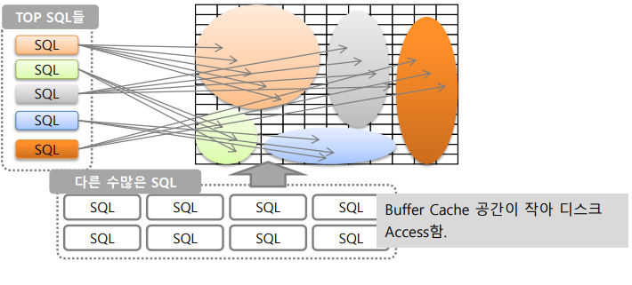
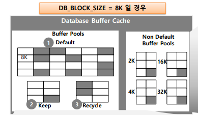
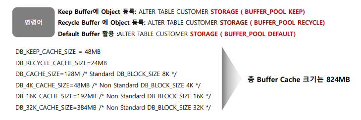
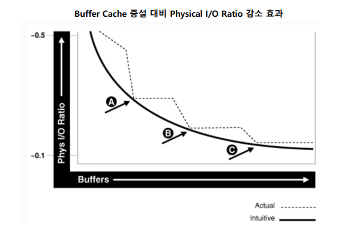
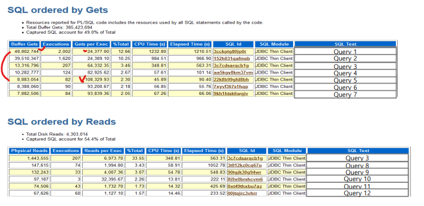
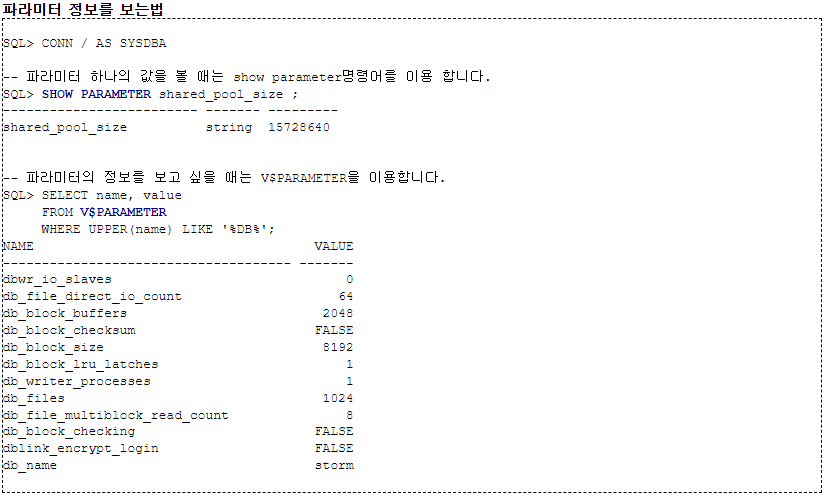
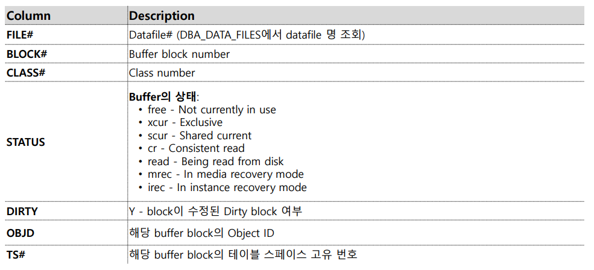
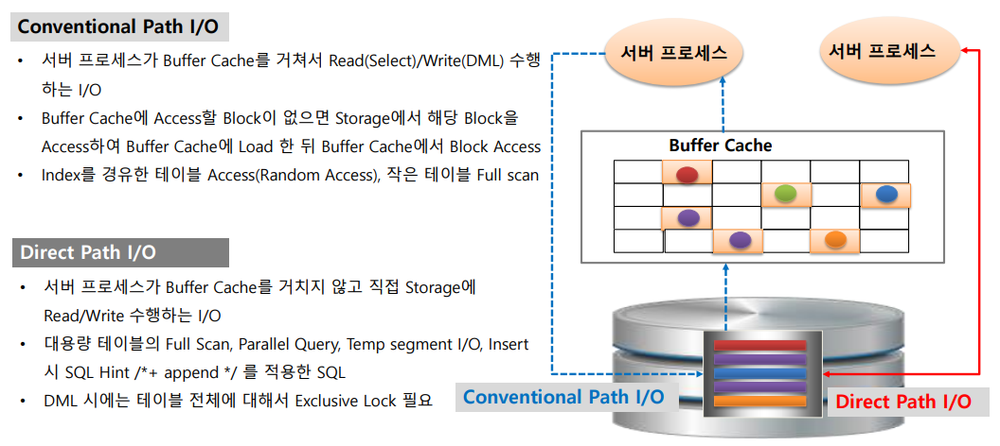
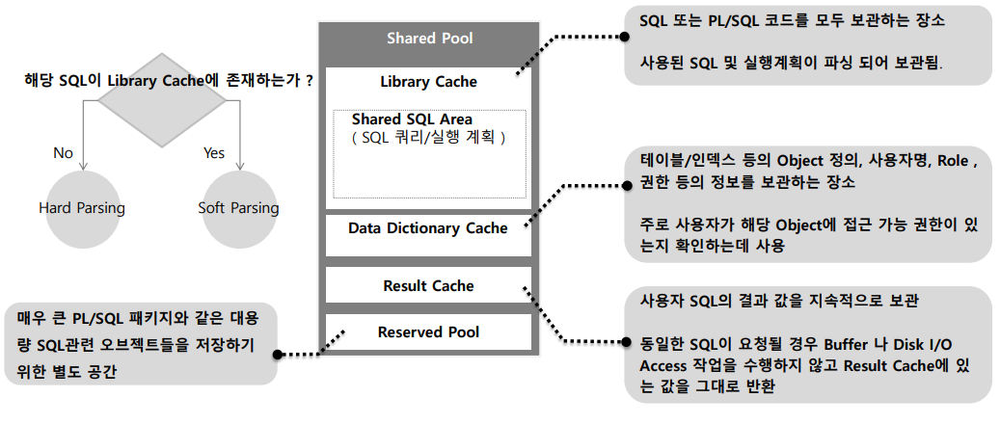
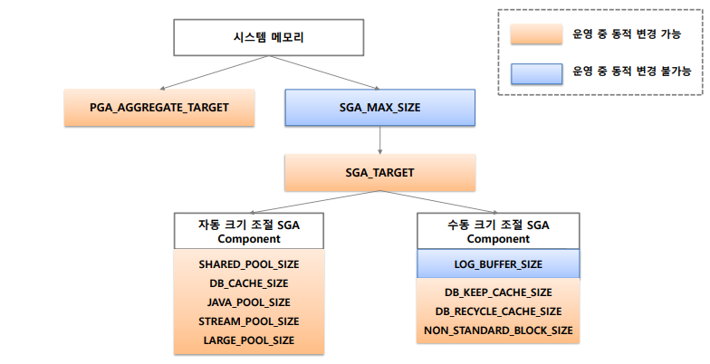

# 03_SGA와 ASMM


## 01_MemoryStructure and SGA

- **Shared Memory**

  - SGA (System Global Area)

  - 공유 메모리이다.

  - 매우 많은 Server Process가 동시에 동시에 접근한다.

  - Disk I/O를 최대한으로 줄이기 위해 Access한 데이터는 저장해 놓는다.

    

- **Non Shared Memory**

  - PGA (Program Global Area)
  - 각 서버 프로세스가 개발 메모리를 할당

- 오라클의 메모리 활용 전략
  - Disk I/O를 최대한으로 줄일 수 있는가?
  - 동시에 많은 프로세스에서 최대한 어떻게 효율적으로 자원할당을 할 것인가?
  - 시스템 안정성을 어떻게 유지할 것인가?


## 02_Oracle SGA 개요


- Database Buffer Cache

  - Disk I/O의 영향도를 줄이기 위해 데이터 파일의 데이터 블록을 메모리로 Copy

  - 사용자 => SQL => 특정 Data를 가져올시 => 다시 Storage로 내려가지 않고 값을 저장

  - 공간을 효율적으로 사용하기 위한 로직이 존재 => 즉 우선순위가 낮아지면 지우게 된다.

    

- Shared  Pool

  - SQL의 실행 계획을 공유하기 위한 메모리 공간

    

- Redo Log Buffer

  - DML을 날릴때 Buffer에 일정 사이즈로 모아서 Storage로 보내게 된다.

  - I/O를 줄이기 위한 방법

  - Redo log file에 Write되기 이전에 Memory에 먼저 Write되는 영역

    

- Large Pool

  - Parallel Qeury 메시징 또는 대용량의 메모리 할당이 필요한 경우 사용된다.

    

- Java Pool

  - Java Object에 대한 메모리 영역

    

- Stream Pool

  - Data 복제 등을 위한 Stream 사용영역


- Instance

  - Background Process와 SGA메모리 영역을 의미

  - Instance를 시작 => SGA영역을 할당, Background Process를 구동시키게 된다.

    

- Database

  - DB를 저장하는 물리적 영역
  - dbf파일, control파일, log파일 등 데이터를 저장되어있는 물리적인 공간이다.
    - 즉 file을 일컫는다.


## Buffer Cache 개요


- Storage I/O Access를 최소화 하기 위해서 한번 Access한 Block은 RAM영역에 저장
  1. Server Process가 데이터 최소 Access시  Strage에 Access
  2. 해당 Block이 Buffer Cache에 로드
  3. 해당 Block Access시 Buffer Cache에서 Access진행
  4. Storage I/O Access량 감소
- Random I/O 성능 영향을 최소화하는 중요한 역할이다.
- OLTP는 공유메모리의 활용을 얼마나 잘하느냐가 중요하다.


### Buffer Cache를 통한 데이터 Access

- OS Memory구조 참고


- Buffer Cache에 어떤 Block이 존재하는지 찾기 위해 **Hash Bucket**과 **LRU**제공
  - Hash Bucket : Hash Table
  - LRU : Least Recently Used (오랫동안 사용안한 애 지우기) - 최근에 사용한 순서
- DBA(data block address) = File#과 Block# ==> 개별 데이터 Block
  - 즉 File 넘버, Block 넘버로 되어있음
- 순서
  1. 처음에 Data Dictionary등의 내부정보를 통해서 테이블에 block의 DBA정보를 알아낸다.
  2. DBA + Class (Data주소 + redo block인지, data block인지 등을 판단하는 class)를 결합 시킨 뒤 Hash 함수를 통과시킨다.
  3. blcok별로 hash bucket을 할당 받는다.
  4. hash bucket은 Linked List구조를 갖는다.
  5. Block안에는 메모리 위치가 저장되어 있다. 따라서 메모리 위치를 기반으로 buffer pools에 메모리에 찾아가게 된다. (ex_ Block 3번)

예시


- 회색 => 최초 storage접근
- 빨강 => 최초 접근 이후 데이터 값 가져오기


### Buffer Cache Hit Ratio

- 시스템이 얼마나 Disk I/O를 줄이고 Buffer Cache를 잘 활용하고 있는지 나타내는 지표

```
Hit Ratio = (1-(Pphysical reads/Logical Reads)) * 100
```

- Logical Reads : Buffer Cache Block 엑세스 수
- Physical Reads : Disk Block 엑세스 수

**일반적으로 90% 이상의 수치 보장이 필요하다.**


### Bugger Cache Hit Ratio 통계의 함정1



- 질문
  - 수백, 수천개의 SQL 중 단 1% SQL들의 호출빈도가 **전체 SQL 호출 빈도에 대부분을 차지하게 된다면?**
    - 즉 강성 SQL (?) 빈도수가 굉장히 높아서 거의 항상 Buffer를 차지하는 애들
  - Application 전체적으로 SQL들이 Block을 많이 Access해야 되는 잘 튜닝되어 있지 않은 SQL이라면?

- 문제점

  - Accss block수는 작지만 (즉 Buffer차지는 적지만) 호출 빈도수가 매우 높은 경우 전체 Logical Reads는 **호출 횟수 x Access block 수**가 되어 크게 증가 

  - 호출 빈도수가 높으면서 Access block 수는 많은 SQL들이 Buffer chache를 지속적으로 점유 ==> Logical Reads는 크게 증가됨

    - 즉 항상  Buffer chache를 점유하는 애들이 생기게 된다

    - 그러면 Logical Reads가 증가하게 되고 결국 Ratio가 높아지게 된다.

      

  - 문제 : 

    - 이렇게 되면 Ratio는 높아서 좋아보이지만 만약 호출빈도수가 높은 것에 비해 적은 SQL의 **절대량이 1천만건이라면?**
    - 즉 **절대량이 중요**
       ==> Buffer Cache Hit Ratio가 99% 일지라도 무조건 좋은건 아닐 수 있음


- 이렇게 CPU는 22.1%를 사용하지만
- 그 위에 두 이벤트가 점유하는 시간이 매우 높게 된다.


- 


### Bugger Cache Hit Ratio 통계의 함정2

상황예시

- Buffer Cache Hit Ratio의 70%로 낮게 나오게 된다.
- 10GB ==> 40GB로 늘려야할까?
- 70%로 낮게 나오는 시간 : 새벽
  - batch 프로그램 큰거 하나가 쓰고 있는 경우다
- 즉, ratio가 떨어지는 것이 당연한 것이다. ==> 어쩔 수 없음
- 다이렉트로 바로 IO 엑세스 하는 것이 더 빠를수 있기 때문에 괜찮음

- 


**결론**

- **Hit Ratio**와 같은 성능 통계 정보는 불균일한 Load가 발생할 경우 **정확한 문제 인식을 못할 가능성이 있음**
- 따라서 절대 일량 수치 (메모리 Access량, 디스크 Access량)을 기중으로 성능 평가가 필요하다.
- Buffer Cache Hit Ratio외에 **Load Profile + Wait Event를 결합한 분석이 필요**하다.


[AWR] Report확인하는 법!! 알기


## Buffer Cache내부의 Block 유형 및 Buffer Pools 유형 


### Buffer Cashe 내 블록 유형


- Free Block
  - Unused(데이터가 아직 할당이 되지 않은 상태) 
    + Clean(Read or Load등의 작업이 끝나거나 시작하지 않은 상태)
- Pinned Block
  - 주로 Load or Read를 할때 사용
  - Select * from cust where val = 10
  - val = 10인 값을 Storage에서 퍼와서 Buffer에 올리게 된다.
  - Process가 Load하고 있거나 읽고 있는데 다른 Process가 재활용하게 되면 안된다.
    - 즉 읽고 있는데 다른 프로세스가 와서 다른 Data삽입하거나 Update시키면 안됨
  - Clean
    - 재활용이 가능한 상태 = 다른 데이터가 들어올 수 있는 상태
    - ex) Read or Load등의 작업이 끝난 상태
- Dirty Block
  - 데이터가 이미 할당된 이후 다시 데이터가 **수정**되었으나 **아직 disk상의 data file에 Write되지 못한** buffer
  - val = 4 => val = 5 로 업데이트 되면 Dirty Block 상태가 된다.
  - 재사용이 불가능하지만 =>Data File로 내려왔으면 다시 재사용 가능한 상태


### Database Buffer Pools의 유형



- Keep buffer pool

- Recycle buffer pool

- **Non Defaulg Buffer Pools**
  - DW성, 이력 통계 데이터와 같은 대용량의 데이터를 Access 해야 할 경우 큰 Block Size가 상대적으로 유리하다.
  - 따라서 Block size에 기술된 size와 다른 block크기를 가진 테이블 스페이스 생성
    - ex_ 2k, 4k, 16k, 32k => 즉 다른 크기의 Block을 생성할 수 있는 Pool이다




- Keep, Recycle을 할당 해줄바에 **그냥 Cache_size = 200M로 잡는게 더 나을 듯?**
- DB_32K_chache_size : Non Default Buffer 또한 이렇게 하지 않고 Direct IO하는게 더 나을 수 있음
  - 버퍼 캐쉬로 올라간다는 거는 Conventional Path I/O하는 경우 사용하는 것
  - DW할때 Conventional 한걸 쓰지 않는다.
  - Conventional Path I/O
    https://jungmina.com/772
    - 버퍼를 사용하는 I/O
    - 데이터가 입력, 조회 될시 항상 메모리를 통해 작업되는 방식이다.
    - 단점 : Direct보다 느리다. redo log, undo data가 많이 발생한다.
  - Direct Path I/O
    - Cache를 거치지 않고 바로 블록에 작업하는 방식
    - 정렬(Temp Segment에 읽고 쓰기), 병렬작업떄 (Parallel, Append옵션 사용), Direct옵션사용시
    - 장점 : 
      - 블록을 대량으로 읽거나 쓸 경우 좋음
      - 롤백을 하더라도 실제 블록은 그대로 두고 딕셔너리 정보만 롤백
    - 단점
      - redo를 사용하지 않아 => 장애 => 다시 입력
      - 다른 트랜잭션이 DML을 일으키지 못함 => 동시작업  불가
      - 사용량이 적은 시간대에 하는 것이 좋음


## Buffer Cache를 증가하는 것은 언제나 성능향상을 시키는가

- 어느 시점 이후로 Buffer Cache를 증가시키더라도 성능향상을 이뤄내지 않는다.



- 특정 시점 이후로 Buffer를 늘려도 Physical 이 줄어들지 않는다.
- - 


- 버퍼 캐시를 Access하는 것 비용이 소모된다.
  - 메모리의 Latch나 Lock(정확히 lock은 아님)
  - 서버 프로세스가 Bucket에서도 잡고, scan할때도 잡는다
  - 즉 내가 사용하고 있다는 것을 알리는 것
  - 블럭을 읽을때도 잡는다.
  - latch잡고 빠지는건 엄청 빠름
    - 평상시에는 문제가 되지 않음
    - 하지만 너무 많이 사용하게 되고 임계점이 되면 전체 SQL 성능을 떨어뜨릴수 있을 뿐만 아니라 시스템 안정성을 위협할 수 있음
    - 즉 악성 Query들이 Latch를 독점하게 될 수 있기 떄문
- 버퍼 캐시를 Access하는 것은 Latch를 많이 쓸 수 있는 것을 의미한다.
- 과 같은 비용이 소모된다.
- 




- 쿼리 튜닝은 시간을 가지고 튜닝 할 애들을 고르는게 아니라 많은 Block을 점유하는 애들을 기준으로 
- SQL ordered by Resds : 
- 버퍼를 늘리더라도 쿼리 튜닝이 안된 Query들이 계속 큰 버퍼를 점유하고 있는 상태가 된다면?
  - 버퍼를 늘려도 악성 Query들이 버퍼를 더 점유하게 되어 비교적 횟수가 적은 Query들이 버퍼에 또 들어가지 못하게 된다.
  - 따라서 성능개선이 되지 않을 수 있다. 


## Biffer Cache 크기 설정


- **ASMM => 보통 권장함**
  - Automatic Shared Memory Management
  - Shared Memory = SGA를 자동으로 설정해준다.
  - 위와 같이 설정하면 각각의 기능을 사용할 수 있다.
  - SGA_TARGET (EX_ 12G)
    - Shared Pool, DB Cache, JavaPool, Large Pool, String Pool을 자동으로 맞춰줌
  - SGA_MAX_SIZE
    - SGA_TARGET 보다 크게 설정하면 된다.
  - DB_CACHE_SIZE를 설정할 수 있음
    - 가령 7G로 설정하면 7G 밑으로 떨어뜨리지 마세요 라고 말하는 것
- AMM
  - Automatic Memory Management
  - SGA + PGA 까지 자동으로 설정해준다.
  - MEMORY_TARGET
    - SGA + PGA까지 최적화로 설정해줌
  - MEMORY_MAX_TARGET
    - MEMOERY_TARGET보다 크게
    - MEMOERY가 최대로 가질수 있는 크기
    - MEMOERY_TARGET을 20G 로 잡고 MAX 25로 잡으면 최대 타겟이 증가할 수 있다 
- 수동으로 크기 설정은 사용하지 말기
  - 수동을 사용하기 위해선 => DB_CACHE_SIZE제외하고 다 0으로 맞춘다.

```SQL
SHOW PARAMETER SGA -- SGA 설정 확인 가능 (EX -> MAX_SIZE)
SELECT * FROM V$SGAINFO; -- 실제 동적으로 SGA가 얼마나 할당이 되었는지 확인할 수 있음
SHOW PARAMETER DB_CACHE_SIZE

!echo $ORACLE_HOME -- 홈 위치 어디있는지 확인 가능
!ls $ORACLE_HOME/dbs -- 파일

-- startup no mount pfile => db instance 복구하는 법
create pfile='위치/dbs/init_ORCL_BKUP_01.ora' from spfile; -- 백업파일 만들기

SHOW PARAMETER SHARED_POOL


-- ASMM 사용해보기
ALTER SET SGA_MAX_SIZE=13G SCOPE=SPFILE; -- 13G로 MAX설정
ALTER SET SGA_TARGET=12G SCOPE=SPFILE; -- TARGET설정
-- DB_CACHE_SIZE를 설정했다면 그 크기 이하로 내려가지 않는다. 


```

- **PFILE(파라미터 파일, initSID.ora)**

  - 

  - 오라클을 시작하는데에 필수적인 파라미터들이 정의 되어있는 기본 설정 파일

  - text파일로 구성, 운영체제 Editer에서 수정할 수 있다.

  - 해당 변경건을 적용하기 위해선 PFILE수정 후 DB를 재시작해야한다.

  - initSID.ora파일로 저장된다.

    

- **SPFILE(Server Parameter File)**

  - 9i버전부터 spfileSID.ora가 새로 추가

  - DB가 운영 중에도 파라미터를 수정할 수 있음, 서버를 재시작 하지 않아도 된다.

    - ATER SYSTEM명령 사용

  - SPFILE으 바이너리파일

  - 저장위치 : PFILE과 동일

  - SPFILE은 vi와 같은 Editor로 변경하면 안된다.

  - ```sql
    ALTER SYSTEM SET large_pool_size=16M SCOPE=BOTH -- 
    ```

    - SCOPE에 대해서
      - memory : 
        - 변경이 현재 상태에만 영향을 미치며, **db가 restartup되면, 변경 이전 값으로 돌아간다.**
      - spfile : 
        - 변경내용을 spfile에만 저장하고 현재 상태에는 영향을 미치지 않게한다.
        - Static Parameter의 경우 이 scope만 지정 가능
        - 즉 spfile을 사용하더라도 **Static Paramter에 대해서는 DB운영중에 바로 값을 변경하여 재시작 없이 반영하는 것은 불가능** 하다.
        - Dynamic Parameter
          - 일부 초기화 변수가 동적
          - 즉 ALTER SESSION, ALTER SYSTEM 구문을 이용하여 인스턴스가 실행되고 있을 떄 수정할 수 있다는 뜻
        - Static Parameters
          - 메모리와는 상관없이 Parameter파일을 변경하는 것
          - 하지만 효과가 즉시 발휘되지 않고 restartup해야 발휘된다.
      - both
        - 변경 내용을 현재 상태에도 바로 반영, spfile에도 반영
        - 이후 rebooting시에도 영향을 미치도록 하는 것


## Buffer Cache 크기 Advice 기능 이해

> - **Buffer Cache의 크기 설정**에 대한 **Advice 정보**를 제공한다.
> - DB_CACHE_ADVICE초기화 파라미터가 ON되어야한다.
> - 버퍼를 키우면 성능이 얼마나 향상이 되는지 또는 줄이면 얼마나 감소하는지 확인 가능


- SIZE_FATOR = 1기준으로 감소했을때, 증가했을때의 성능지표를 알수 있음
- SIZE FATOR의 증감에 따라 **ESTD_PHYSICAL_READS**의 증감을 확인 => 증감을 할지 조언
- ESTD_PHYSICAL_READS_FATOR = 1 이런식으로 더 편하게 볼 수 있음


- buffer를 늘려도 성능이 개선되지 않는다는 것을 뜻함
- 하지만 줄이면 성능이 많이 감소
- 하지만 **보통 AWR의 Buffer Pool Advisory**를 확인한다.


## Buffer Cache에 적재된 Block의 상태 및 Object들의 정보 확인하기

- V$DB는 실시간으로 Buffer Cache에 적재되어 있는 Block들에 대해 Object정보 및 Block 상태 정보 제공 (DBA_OBJECTS)와 조인하여 Object명 조회
-  가끔 Buffer Cache에 어떤 정보들이 저장되어있는지 확인해야할 필요가 있을때가 있다.



- STATUS가 가장 중요하다.
  - free : 사용하지 않는 상태
  - xcur : server process가 exclusive하게 잡아놓음
  - scur : 
  - cr : commit이 아직 안된 상태
  - read : 읽고 있는 상태
  - mrec : buffer가 update되었는데 아직 DataFile에는 접근 하려는? 상태
  - irec : 

- Buffer가 free인지 상태를 확인해야한다.

```sql
-- SGA로 버퍼의 용량 확이 가능
SELECT * FROM V$SGAINFO;

-- Buffer Cache 상태 확인
select * from v$bh;

-- BUFFER CACHE내에 올라가 있는 Object들의 정보와 Block상태 조회
-- status에 따라서 block이 얼마나 올라가 있는지 확인하는 것
-- SGA에 버퍼 얼마나 확이 후에 각각 얼마나 차지하는지 확인
SELECT 
	  O.OBJECT_NAME
	, BH.STATUS
	, COUNT(*) NUMBER_OF_BLOCKS
	, COUNT(*)*8000/1024168 SIZE_MB -- Block하나당 8k이기 때문에 count(*)*8000진행
FROM
	DBA_OBJECTS O, V$BH BH -- 조인
WHERE O.DATA_OBJECT_ID = BH.OBJED -- 이걸로
	AND O.OWNER != 'SYS' -- SYS인건 제외 
GROUP BY O.OBJEC_NAME, BH.STATUS
ORDER BY 3 DESC;

-- BUFFER CACHE다 내림 -> FREE상태
ALTER SYSTEM FLUSH BUFFER_CACHE;
```

- Direct I/O가 되면 버퍼캐쉬를 타지 않는다. ==> FULL SCAN을 돌리면 타지 않음


## Oracle Conventional Path I/O와 Direct Path I/O



- Convention
  - 버퍼 캐쉬 거쳐서 Read하는 것 
  - 버퍼에 없음? => storage에서 찾음 => Data를 바로 가져오지 않고 버퍼캐쉬에 저장 후 가져온다.
  - 보통 Index를 경유한 테이블 Random Access, 
  - 작은 테이블 (thredhold보다 낮으면)=> Full Scan
- Direct
  - 서버프로세스가 Buffer Cache를 거치지 않는다 => 직접 Storage에 R/W 수행
  - 가져올 Data의 용량이 굉장히 크게 되면 buffer cache가 가득차게 된다. 
    즉 버퍼에 올려놨던 Data를 내리고 다시 Random I/O가 진행 
  - 즉 대용량 테이블의 Full Scan, Parallel Query, Temp segment I/O, Insert 시 SQL Hint 
    /\*+ append*/를 적용한 SQL
    -  Insert 시 SQL Hint  사용시 (DML)시에는 테이블 전체에 대해서 Exlcusive Lock이 필요


## SQL 실행 계획의 이해, Hard Parsing, Soft Parsing


**문제**


- 최종 결정된 실행 계획은 수많은 선택의 요소를 상호 => Cost를 비교하여 최적을 선택
- 하지만 이를 위해 **많은 CPU 및 기타 자원을 소모**
- 특히 OLTP와 같은 초당 수십~수백개의 SQL이 동시에 들어올 경우 반드시 SQL 및 실행계획의 공유가 필요
- 실행계획을 만드는데 비용이 굉장히 많이 들게 된다.


- Hard Parsing이 높아지면 CPU부하 
  => 특히 Library Cache의 Latch 관련 자원 사용률이 매우 높아 져서 시스템 장애를 일으킬수 있음


## Shared Pool 구조



- Library Cache
  - 가장 중요하다.
  - SQL과 프로시저 SQL 모두 보관한다.
  - SQL을 공유하도록 만드는 것이 중요하다.
- Data Dictionary Cache
  - 테이블/ 인덱스 들의 Object 정보도 빠르게 정보가 오가야하기 때문에 보관해놓게 된다.
- Result Cache
  - 결과 값을 보관한다.
  - DW와 같이 새벽에 만들어 놓으면 주시간에는 값이 변경되지 않는다.
  - 이럴때 사용하기 위해서 존재
- Reserved Pool
  - 매우 큰 PL/SQL 패키지와 같은 대용량 SQL관련 오브젝트들 저장


## Bind 변수 SQL


- 

공유 강화를 위한 초기화 파라미터 설정

```sql
ALTER SYSTEM SET CURSOR_CHARING = 'FORCE';
-- Oracle 9iR2 이전 버전에서는 버그 발생 할 수 있음


show parameter cusor_sharing;
-- CURSOR_CHARING이 force인지 exact인지 확인가능
```

- Literal 변수 SQL을 Bind변수를 사용한 것과 유사하게 SQL을 공유하게 되고 동일한 실행계획을 가진다.


## Shared Pool 주요성능 이슈

- Literal SQL
- 매우 큰 PL/SQL 패키지 => Shared Pool에서 관리하기가 애매함
- Soft Parsing을 했는데도 너무 빈번해서 Latch를 잡고 있는 경우


- Close() 수행 전에 ResultSet 등을 먼저 Close해야한다. 
- V$LIBARARYCACHE : shared sQL AREA를 볼 수 있음
- V$ROWCACHE : data dictionary cache 부분 확이 
- V$SHARED_POOL_ADVICE : ADVICE를 확인하고 늘릴지 확인하면 된다.


## Shared Pool의 주요 Data Dictionary 및 모디터링 방안

```sql
-- LIBRARYCACHE를 확인
SELECT * FROM V$LIBRARYCACHE;

-- PIN HIT RATIO
SELECT SUM(PINHITS), SUM(PINS), SUM(PINHITS)/SUM(PINS) FROM V$LIBRARYCACHE
```

- PINS, PINHITS가 성능의 주요지표이다.
  - PINS : 이미 고정되어 있는것
  - PINHITS : 이미 고정되어있는 것을 가져오는 수
  - 이 둘로 HIT RATIO를 계산할 수 있음
- RELOADS
  - 떨어졌는데 다시 필요해서 다시 올린경우  => 즉 높으면 안좋음


```SQL
-- DATA DICTIONARY CACHE확인
SELECT * FROM V$ROWCACHE;

-- GET PERCENTAGE 확인하는 쿼리
SELECT PARAMETER,
		SUM(GETS),
		SUM(GETMISSES),
		100*SUM(GETS-GETMISSES) / SUM(GETS) PCT_SUCC_GETS,
		SUM(MODIFICATIONS) UPDATES
FROM V$ROWCACHE
WHERE GETS>0
GROUP BY PARAMETER;

-- ADVICE
SELECT * FROM V$SHARED_POOL_ADVICE;

-- LIBARARY_CACHE_MEMORY
SELECT * FROM LIBARARY_CACHE_MEMORY;

-- SGA의 FREE메모리를 별도로 가져올 수 있다.
SELECT * FROM V$SGASTAT WHERE NAME = 'FREE MEMORY';


```


## ASMM개요와 주요파라미터


**ASMM**

- SGA_TARGET 파라미터를 통해 DB_CACHE_SIZE, SHARED_POOL등의 SGA Component크기를 동적으로, 그리고 사용량에 따라 자동 변경


**메모리 관련 주요 초기화 파라미터**

- MEMORY_TARGET
- MEMORY_MAX_TARGET
- SGA_TARGET
- SGA_MAX_SIZE
- PGA_AGGREGATE_TARGET
- PGA_AGGREGATE_LIMIT
- DB_CACHE_SIZE
- SHARED_POOL_SIZE

이정도만 익혀도 대부분은 해결할 수 있음

### ASMM 

- SGA_TARGET과 SGA_MAX_SIZE를 기반
- SGA_MAX_SIZE
  - SGA의 최대 메모리 크기이다.
  - 정적 초기화 파라미터 => 변경을 반영하기 위해선 **인스턴스 재기동해야함**
  - 인스턴스 최초 시동 시 메모리를 할당함
- SGA_TARGET
  - SGA_MAX_SIZE내에서 동적으로 변경 가능하다.
  - **운영중에 변경 가능**



- 운영중 동적 변경 불가능 => scope = spfile로만 가능


