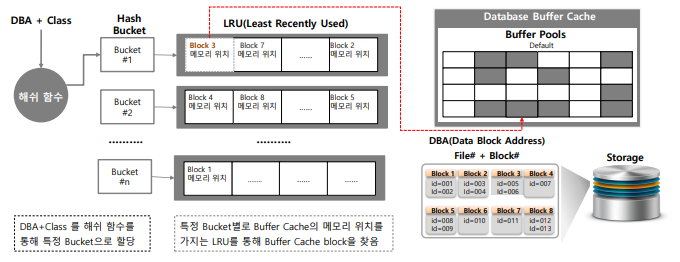
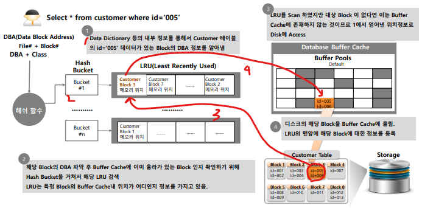
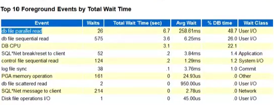
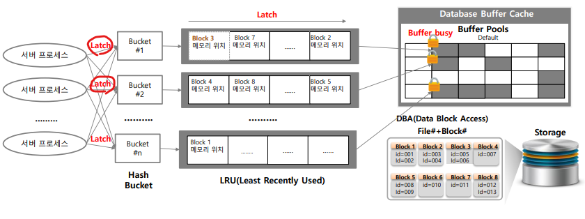

# 03_SGA와 ASMM


## 01_MemoryStructure and SGA

- **Shared Memory**

  - SGA (System Global Area)

  - 공유 메모리이다.

  - 매우 많은 Server Process가 동시에 동시에 접근한다.

  - Disk I/O를 최대한으로 줄이기 위해 Access한 데이터는 저장해 놓는다.

    

- **Non Shared Memory**

  - PGA (Program Global Area)
  - 각 서버 프로세스가 개발 메모리를 할당

- 오라클의 메모리 활용 전략
  - Disk I/O를 최대한으로 줄일 수 있는가?
  - 동시에 많은 프로세스에서 최대한 어떻게 효율적으로 자원할당을 할 것인가?
  - 시스템 안정성을 어떻게 유지할 것인가?


## 02_Oracle SGA 개요


- Database Buffer Cache

  - Disk I/O의 영향도를 줄이기 위해 데이터 파일의 데이터 블록을 메모리로 Copy

  - 사용자 => SQL => 특정 Data를 가져올시 => 다시 Storage로 내려가지 않고 값을 저장

  - 공간을 효율적으로 사용하기 위한 로직이 존재 => 즉 우선순위가 낮아지면 지우게 된다.

    

- Shared  Pool

  - SQL의 실행 계획을 공유하기 위한 메모리 공간

    

- Redo Log Buffer

  - DML을 날릴때 Buffer에 일정 사이즈로 모아서 Storage로 보내게 된다.

  - I/O를 줄이기 위한 방법

  - Redo log file에 Write되기 이전에 Memory에 먼저 Write되는 영역

    

- Large Pool

  - Parallel Qeury 메시징 또는 대용량의 메모리 할당이 필요한 경우 사용된다.

    

- Java Pool

  - Java Object에 대한 메모리 영역

    

- Stream Pool

  - Data 복제 등을 위한 Stream 사용영역


- Instance

  - Background Process와 SGA메모리 영역을 의미

  - Instance를 시작 => SGA영역을 할당, Background Process를 구동시키게 된다.

    

- Database

  - DB를 저장하는 물리적 영역
  - dbf파일, control파일, log파일 등 데이터를 저장되어있는 물리적인 공간이다.
    - 즉 file을 일컫는다.


## Buffer Cache 개요


- Storage I/O Access를 최소화 하기 위해서 한번 Access한 Block은 RAM영역에 저장
  1. Server Process가 데이터 최소 Access시  Strage에 Access
  2. 해당 Block이 Buffer Cache에 로드
  3. 해당 Block Access시 Buffer Cache에서 Access진행
  4. Storage I/O Access량 감소
- Random I/O 성능 영향을 최소화하는 중요한 역할이다.
- OLTP는 공유메모리의 활용을 얼마나 잘하느냐가 중요하다.


### Buffer Cache를 통한 데이터 Access

- OS Memory구조 참고



- Buffer Cache에 어떤 Block이 존재하는지 찾기 위해 **Hash Bucket**과 **LRU**제공
  - Hash Bucket : Hash Table
  - LRU : Least Recently Used (오랫동안 사용안한 애 지우기) - 최근에 사용한 순서
- DBA(data block address) = File#과 Block# ==> 개별 데이터 Block
  - 즉 File 넘버, Block 넘버로 되어있음
- 순서
  1. 처음에 Data Dictionary등의 내부정보를 통해서 테이블에 block의 DBA정보를 알아낸다.
  2. DBA + Class (Data주소 + redo block인지, data block인지 등을 판단하는 class)를 결합 시킨 뒤 Hash 함수를 통과시킨다.
  3. blcok별로 hash bucket을 할당 받는다.
  4. hash bucket은 Linked List구조를 갖는다.
  5. Block안에는 메모리 위치가 저장되어 있다. 따라서 메모리 위치를 기반으로 buffer pools에 메모리에 찾아가게 된다. (ex_ Block 3번)

예시



- 회색 => 최초 storage접근
- 빨강 => 최초 접근 이후 데이터 값 가져오기


### Buffer Cache Hit Ratio

- 시스템이 얼마나 Disk I/O를 줄이고 Buffer Cache를 잘 활용하고 있는지 나타내는 지표

```
Hit Ratio = (1-(Pphysical reads/Logical Reads)) * 100
```

- Logical Reads : Buffer Cache Block 엑세스 수
- Physical Reads : Disk Block 엑세스 수

**일반적으로 90% 이상의 수치 보장이 필요하다.**


### Bugger Cache Hit Ratio 통계의 함정1


- 질문
  - 수백, 수천개의 SQL 중 단 1% SQL들의 호출빈도가 **전체 SQL 호출 빈도에 대부분을 차지하게 된다면?**
    - 즉 강성 SQL (?) 빈도수가 굉장히 높아서 거의 항상 Buffer를 차지하는 애들
  - Application 전체적으로 SQL들이 Block을 많이 Access해야 되는 잘 튜닝되어 있지 않은 SQL이라면?

- 문제점

  - Accss block수는 작지만 (즉 Buffer차지는 적지만) 호출 빈도수가 매우 높은 경우 전체 Logical Reads는 **호출 횟수 x Access block 수**가 되어 크게 증가 

  - 호출 빈도수가 높으면서 Access block 수는 많은 SQL들이 Buffer chache를 지속적으로 점유 ==> Logical Reads는 크게 증가됨

    - 즉 항상  Buffer chache를 점유하는 애들이 생기게 된다

    - 그러면 Logical Reads가 증가하게 되고 결국 Ratio가 높아지게 된다.

      

  - 문제 : 

    - 이렇게 되면 Ratio는 높아서 좋아보이지만 만약 호출빈도수가 높은 것에 비해 적은 SQL의 **절대량이 1천만건이라면?**
    - 즉 **절대량이 중요**
       ==> Buffer Cache Hit Ratio가 99% 일지라도 무조건 좋은건 아닐 수 있음




- 이렇게 CPU는 22.1%를 사용하지만
- 그 위에 두 이벤트가 점유하는 시간이 매우 높게 된다.


- 


### Bugger Cache Hit Ratio 통계의 함정2

상황예시

- Buffer Cache Hit Ratio의 70%로 낮게 나오게 된다.
- 10GB ==> 40GB로 늘려야할까?
- 70%로 낮게 나오는 시간 : 새벽
  - batch 프로그램 큰거 하나가 쓰고 있는 경우다
- 즉, ratio가 떨어지는 것이 당연한 것이다. ==> 어쩔 수 없음
- 다이렉트로 바로 IO 엑세스 하는 것이 더 빠를수 있기 때문에 괜찮음

- 


**결론**

- **Hit Ratio**와 같은 성능 통계 정보는 불균일한 Load가 발생할 경우 **정확한 문제 인식을 못할 가능성이 있음**
- 따라서 절대 일량 수치 (메모리 Access량, 디스크 Access량)을 기중으로 성능 평가가 필요하다.
- Buffer Cache Hit Ratio외에 **Load Profile + Wait Event를 결합한 분석이 필요**하다.


[AWR] Report확인하는 법!! 알기


## Buffer Cache내부의 Block 유형 및 Buffer Pools 유형 


### Buffer Cashe 내 블록 유형


- Free Block
  - Unused(데이터가 아직 할당이 되지 않은 상태) 
    + Clean(Read or Load등의 작업이 끝나거나 시작하지 않은 상태)
- Pinned Block
  - 주로 Load or Read를 할때 사용
  - Select * from cust where val = 10
  - val = 10인 값을 Storage에서 퍼와서 Buffer에 올리게 된다.
  - Process가 Load하고 있거나 읽고 있는데 다른 Process가 재활용하게 되면 안된다.
    - 즉 읽고 있는데 다른 프로세스가 와서 다른 Data삽입하거나 Update시키면 안됨
  - Clean
    - 재활용이 가능한 상태 = 다른 데이터가 들어올 수 있는 상태
    - ex) Read or Load등의 작업이 끝난 상태
- Dirty Block
  - 데이터가 이미 할당된 이후 다시 데이터가 **수정**되었으나 **아직 disk상의 data file에 Write되지 못한** buffer
  - val = 4 => val = 5 로 업데이트 되면 Dirty Block 상태가 된다.
  - 재사용이 불가능하지만 =>Data File로 내려왔으면 다시 재사용 가능한 상태


### Database Buffer Pools의 유형


- Keep buffer pool

- Recycle buffer pool

- **Non Defaulg Buffer Pools**
  - DW성, 이력 통계 데이터와 같은 대용량의 데이터를 Access 해야 할 경우 큰 Block Size가 상대적으로 유리하다.
  - 따라서 Block size에 기술된 size와 다른 block크기를 가진 테이블 스페이스 생성
    - ex_ 2k, 4k, 16k, 32k => 즉 다른 크기의 Block을 생성할 수 있는 Pool이다


- Keep, Recycle을 할당 해줄바에 **그냥 Cache_size = 200M로 잡는게 더 나을 듯?**
- DB_32K_chache_size : Non Default Buffer 또한 이렇게 하지 않고 Direct IO하는게 더 나을 수 있음
  - 버퍼 캐쉬로 올라간다는 거는 Conventional Path I/O하는 경우 사용하는 것
  - DW할때 Conventional 한걸 쓰지 않는다.
  - Conventional Path I/O
    https://jungmina.com/772
    - 버퍼를 사용하는 I/O
    - 데이터가 입력, 조회 될시 항상 메모리를 통해 작업되는 방식이다.
    - 단점 : Direct보다 느리다. redo log, undo data가 많이 발생한다.
  - Direct Path I/O
    - Cache를 거치지 않고 바로 블록에 작업하는 방식
    - 정렬(Temp Segment에 읽고 쓰기), 병렬작업떄 (Parallel, Append옵션 사용), Direct옵션사용시
    - 장점 : 
      - 블록을 대량으로 읽거나 쓸 경우 좋음
      - 롤백을 하더라도 실제 블록은 그대로 두고 딕셔너리 정보만 롤백
    - 단점
      - redo를 사용하지 않아 => 장애 => 다시 입력
      - 다른 트랜잭션이 DML을 일으키지 못함 => 동시작업  불가
      - 사용량이 적은 시간대에 하는 것이 좋음


## Buffer Cache를 증가하는 것은 언제나 성능향상을 시키는가

- 어느 시점 이후로 Buffer Cache를 증가시키더라도 성능향상을 이뤄내지 않는다.


- 특정 시점 이후로 Buffer를 늘려도 Physical 이 줄어들지 않는다.
- - 



- 버퍼 캐시를 Access하는 것 비용이 소모된다.
  - 메모리의 Latch나 Lock(정확히 lock은 아님)
  - 서버 프로세스가 Bucket에서도 잡고, scan할때도 잡는다
  - 즉 내가 사용하고 있다는 것을 알리는 것
  - 블럭을 읽을때도 잡는다.
  - latch잡고 빠지는건 엄청 빠름
    - 평상시에는 문제가 되지 않음
    - 하지만 너무 많이 사용하게 되고 임계점이 되면 전체 SQL 성능을 떨어뜨릴수 있을 뿐만 아니라 시스템 안정성을 위협할 수 있음
    - 즉 악성 Query들이 Latch를 독점하게 될 수 있기 떄문
- 버퍼 캐시를 Access하는 것은 Latch를 많이 쓸 수 있는 것을 의미한다.
- 과 같은 비용이 소모된다.
- 


- 쿼리 튜닝은 시간을 가지고 튜닝 할 애들을 고르는게 아니라 많은 Block을 점유하는 애들을 기준으로 
- SQL ordered by Resds : 
- 버퍼를 늘리더라도 쿼리 튜닝이 안된 Query들이 계속 큰 버퍼를 점유하고 있는 상태가 된다면?
  - 버퍼를 늘려도 악성 Query들이 버퍼를 더 점유하게 되어 비교적 횟수가 적은 Query들이 버퍼에 또 들어가지 못하게 된다.
  - 따라서 성능개선이 되지 않을 수 있다. 

