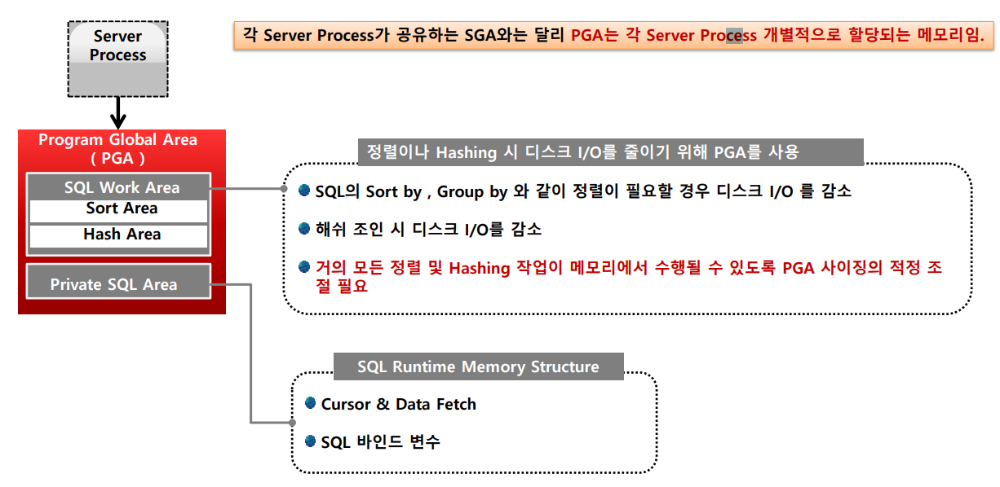
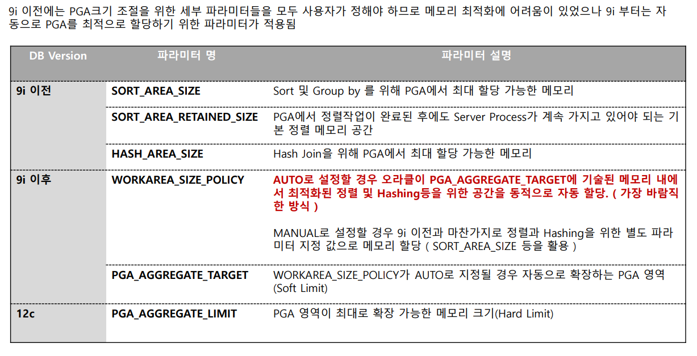
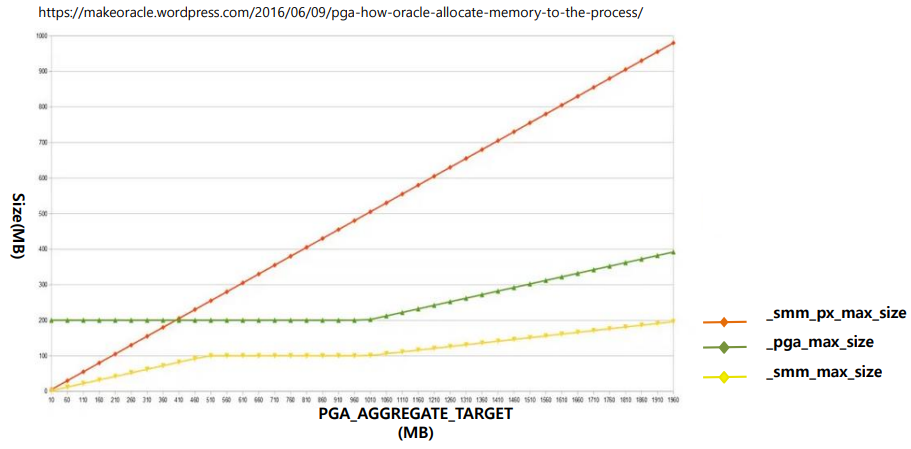

# 04_PGA


## 1. PGA (Program Global Area) 개요



**PGA를 사용되는 경우**

- 보통 정렬이나 Hasing 할 때 Disk I/O를 줄이기 위해 사용된다.
  - SQL의 Order by, Group by와 같이 정렬이 필요할 경우 Disk  I/O를 감소
    - 정렬을 하는 것 등은 사실 Hit Ratio가 높지도 않고 특정 SQL에 전용으로 사용되는 경우가 많다. 또한 재활용하기에도 힘들기 때문에 SGA와 같이 공유메모리를 사용하지 않고 개별 메모리를 사용하게 끔 진행한다.
  - 해쉬 조인 시 Disk I/O 감소
  - 거의 모든 정렬 및 Hashing 작업이 메모리에서 수행될 수 있도록 PGA 사이징의 적정 조절 필요
    - ex_ 굉장히 큰 테이블이 존재할시 이것을 정렬시키기에는 메모리를 거의 다 쓰게 될 것이다. 따라서 큰 테이블을 정렬할 시 tamparary tablespace를 이용해서 interface를 이용해서 진행 된다.

**Private SQL Area**

- Cursor & Data Fetch
- SQL 바인드 변수가 이쪽에 오게 된다.


### PGA를 활용한 SQL 정렬 메커니즘


- **정렬해야 할 대상이 작을 경우**
  - PGA에서 정렬을 완료시킨다.
  - 위와 같은 정렬을 Optimal Sorting이라 한다.

- **정렬해야할 대상이 클 경우**
  1. PGA에서 정렬 가능한 데이터만 정렬 진행
  2. Tamporary Tablespace에 1차 정렬 데이터를 내리고 PGA를 비운다.
  3. PGA 사이즈를 점차 늘리게 된다. (오라클 내부 알고리즘)
  4. 추가 데이터를 다시 PGA에서 2차 정렬
  5. Tamporary Tablespace에 2차 정렬 데이터 ==> 반복
  6. Temp Tablespace에서 최종으로 merge를 하여 정렬을 진행한다.
     - 즉! Temp Tablespace를 활용해야하므로 **정렬 속도가 느려진다.**


## PGA 할당 정책 및 파라미터 설정

### PGA 메모리 할당 방법

- **과거**

  - DBA가 Workload를 감안하여 PGA의 개별 메모리 구성요소를 직접 설정

  - 이렇게 초기 설정을 하면 나중에 변경이 너무 힘듦

    - 다양한 SQL/업무 유형에 따라 최적화된 PGA개별 메모리 구성 요소를 설정하는 것이 매우 어려움

    - ```sql
      SORT_AREA_SIZE = 10M
      SORT_AREA_RETAINED_SIZE = 5M
      HASH_AREA_SIZE = 10M
      ```

- 현재

  - ```SQL
    WORKAREA_SIZE_POLICY = AUTO -- 사이즈를 정하는 정책을 자동으로 하겠다는 뜻
    WORKAREA_SIZE_POLICY = MANUAL -- 다시 원래 쓰던걸로 돌아가겠다
    
    
    -- 전체 DB에 있는 INSTANCE에서 동적으로 각각 OLTP를 설정해준다.
    -- 4G 이상도 갈 수 있다. 4G를 감안해서 Server Process에 메모리를 할당하겠다는 것이지 4G까지로 맞춘다는 것이 아니다.
     PGA_AGGREATE_TARGET = 4G
     
     
     
    ```


### PGA 할당 정책 및 크기 설정을 위한 파라미터



- batch program 사용시 tamparary I/O를 줄이기 위해서 POLICY를 MANUAL로 바꾸는게 아닌 이상 AUTO를 사용하는 것을 권장


## PGA 할당 메커니즘 및 관련 Hidden Parameter

```sql
-- SOE_10G Schema로 SQL PLUS에서 수행하는 세션 프로세스 메모리 사용량. 
SELECT A.program
	, A.pga_used_mem
	, pga_alloc_mem
	, pga_freeable_mem
	, pga_max_mem
FROM V$PROCESS A, V$SESSION B 
WHERE A.ADDR=B.PADDR 
	AND B.SCHEMANAME='SOE_10G' 
	and B.PROGRAM LIKE 'sqlplus%';

-- one pass/multi pass 수행 SQL 조회 / 즉 OPTIMAL로 끝나지 못한 것들 조회할때 사용
SELECT sql_text
	, sum(ONEPASS_EXECUTIONS) onepass_cnt
	, sum(MULTIPASSES_EXECUTIONS) mpass_cnt 
FROM V$SQL s, V$SQL_WORKAREA wa 
	WHERE s.address = wa.address 
GROUP BY sql_text 
	HAVING sum(ONEPASS_EXECUTIONS+MULTIPASSES_EXECUTIONS)>0;

-- 현재 PGA를 Active로 사용중인 정보
SELECT TO_NUMBER(DECODE(sid, 65535, null, sid)) sid,
       operation_type operation,
       TRUNC(expected_size/1024) esize,
       TRUNC(actual_mem_used/1024) mem,
       TRUNC(max_mem_used/1024) "max mem",
       number_passes pass,
       TRUNC(TEMPSEG_SIZE/1024) tsize
  FROM V$SQL_WORKAREA_ACTIVE
 ORDER BY 1,2;
 
 
-- PGA 크기 결정 Hidden parameter 보기 / 단위 max-> byte, 나머지 => K
select a.ksppinm,b.ksppstvl,a.ksppdesc 
from x$ksppi a , x$ksppsv b
where a.indx = b.indx 
	and a.ksppinm in('_pga_max_size', '_smm_max_size', '_smm_px_max_size');


```

- **v$process**

  - program 레벨로 확인할 수 있다.

  - used, freeable, max mem을 확인할 수 있다

  - alloc_mem : 덩어리로 크게 할당이 되면서 pga 가 늘어난다.

    - 일이 끝나면 다시 메모리가 줄어든다.

    - max 같은 경우 어디까지 메모리를 늘렸었는지를 표시해준다. 
      (알고리즘 관련 영역떄문인듯?)

      

- **v$sql_workarea**

  - operation type : 실행계획에서 사용된 타입
  - TOTAL_EXECUTIONS, OPTIMAL_EXECUTIONS
    - 8/8 이라면 8번  EXECUTIONS 중에 OPTIMAL을 8번 했다는 뜻이다.
  - ESTIMATED_OPTIMAL_SIZE
    - 옵티멀로 수행할때 사용된 사이즈를 뜻한다.
    - 단위 = K 이며 1024일 경우 => 1MB라고 볼 수 있다
  - ONEPASS => OPTIMAL이 불가능 하여 TempTablespace에 간 경우
  - MULTIPASS => 한번이 아니라 여러번 TempTablespace사용해서 merge까지 해야하는 경우


SQL DEVELOPER 에서 SYS 계정은 실시간 SQL 모니터를 사용할 수 있다


### PGA 크기를 결정하는 Hidden Parameter


- SGA보다 메모리 때문에 Paging일어나고 시스템 죽는 경우가 더 많다.
  - 따라서 매커니즘에 대한 이해가 더 필요하다.
- **_pga_max_size**
  - 한 개의 서버 프로세스가 최대 사용 가능한 PGA Workarea메모리 
  - pag aggregate에 영향을 받는다.
- **_smm_max_size**
  - operation 각각 하나의 max사이즈를 뜻한다.
    - 즉 실행계획으로 나뉘고 그리고 그 하나의 operation 사이즈를 뜻함
  - Parallel operation
    - _pga_max_size의 50%를 자동으로 가져간다.
- _smm_px_max_size
  - Parallel 를 사용할 때 사용
  - PGA_AGGREGATE_TARGET의 50%가 자동 할당




- PGA_AGGREGATE_TARGET을 10M ~ 2G로 늘리면서 3개의 parameter의 추이를 본 것
-  _smm_max_size
  - 1g 이하까지는 기본적으로 200M가 설정되어있다. 따라서 20%까지 가게 된다.
  - PGA_AGGREGATE_TARGET를 10G까지 늘렸을때 구간에 따라서 %가 계속 떨어지게 된다.
  - 거기서 _smm_max_size는 _pga_max_size의 절반으로 된다.


## Parallel Query 수행 시 PGA 할당 메커니즘

```sql
### PGA AUTO 시 Parallel Query 테스트
SELECT /*+ PARALLEL(A 6) PARALLEL(B 6) AUTO_PGA */ A.SUPPLIER_ID, B.SALES_REP_ID, SUM(B.ORDER_TOTAL), COUNT(*) FROM ORDER_ITEMS A, ORDERS B WHERE A.ORDER_ID = B.ORDER_ID 
GROUP BY A.SUPPLIER_ID, B.SALES_REP_ID;
```

- Parallel 사용전
  - 319M 정도 사용
  - 2.5분 정도 사용
- Parallel 사용후
  - 1.5분 사용
  - _smm_px_max_size 에 영향을 받게 된다. Parallel이기 때문


## 수동으로 PGA 설정 시 Parallel Query 적용 유의 사항


절대 SYSTEM LEVEL에서 하면안되고 SESSION LEVEL에서 해야한다.


- 즉 수동으로 진행할때 하나가 아니라 Parallel이므로  할당 값 * 병렬 개수가 되게 되어 서버가 터질 수 있다
- 그래서 hidden parameter를 수정해서 진행하는 방법이 있는데 이부분을 찾아봐야할듯 하다


