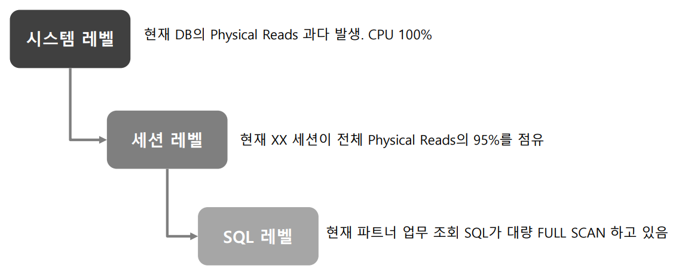

# 04_DataDictionary


## 1. DB 성능 분석을 위한 주요 구성요소 및 분석 방법론


- USER + SERVER PROCESSOR => SESSION이라고 한다.
  - SESSION에서 많은 SQL이 생긴다.
  - SESSION이 DB에 일을 시키는 주체가 되게 된다.

- 이 6개가 성능 모델 주요 구성 요소라고 한다.


### 일반적인 성능 분석 프로세스



- SYSTEM 레벨에서 먼저 모니터링 확인
- SESSION 레벨에서 어디가 문제인지 확인이 필요
- SQL 레벌에서 원인 및 문제점을 찾는 것이 필요


## 2. Data Dictionary의 이해


- 성능분석 대부분이 이 테이블을 기반으로 출발한다.

```sql
SELECT * FROM V$SYSSTAT;
SELECT * FROM V$SUSTEM_EVENT; -- STAT과 마찬가지로 NAME이 고유하다. 즉 하나만 존재

SELECT WAIT_CALSS, SUM(TOTAL_WAITS) TOTAL_WAITS 
FROM V$SYSTEM_EVENT 
GROUP BY WAIT_CLASS -- CLASS와 TOTAL WIAT를 뽑을 수 있음


```


```SQL
-- V$SQL을 사용하기도 하는데 이걸 모니터링에도 사용하고 너무 많이 써서 SQLSTATS라는 것을 만들었다.
SELECT * FROM V$SQLSTATS; -- SQL에 대한 상세한 정보가 들어있다.


```


## 시스템 Wait


##  


