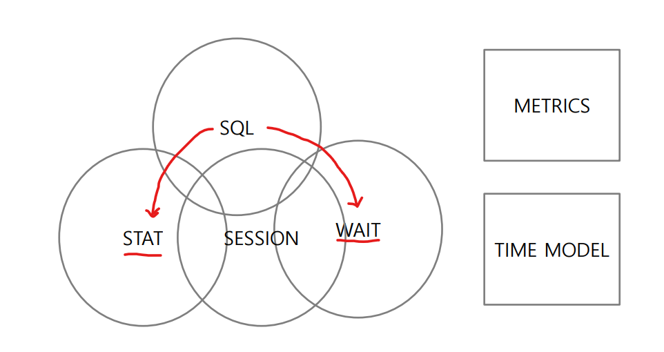
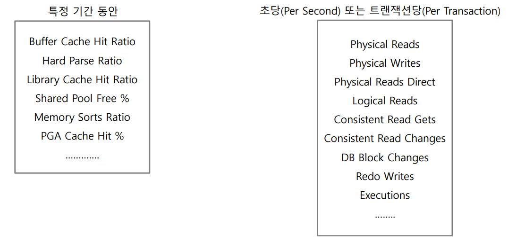
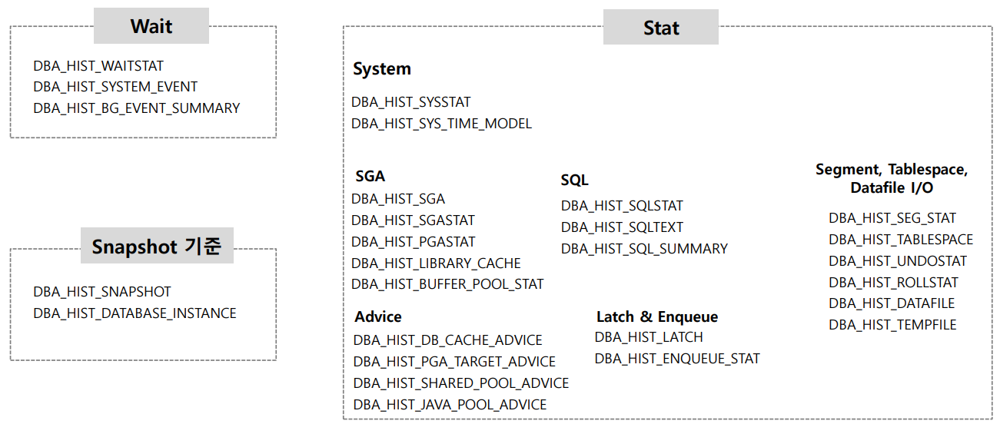

# 04_DataDictionary


## 1. DB 성능 분석을 위한 주요 구성요소 및 분석 방법론



- USER + SERVER PROCESSOR => SESSION이라고 한다.
  - SESSION에서 많은 SQL이 생긴다.
  - SESSION이 DB에 일을 시키는 주체가 되게 된다.

- 이 6개가 성능 모델 주요 구성 요소라고 한다.


### 일반적인 성능 분석 프로세스


- SYSTEM 레벨에서 먼저 모니터링 확인
- SESSION 레벨에서 어디가 문제인지 확인이 필요
- SQL 레벌에서 원인 및 문제점을 찾는 것이 필요


## 2. Data Dictionary의 이해


- 성능분석 대부분이 이 테이블을 기반으로 출발한다.

```sql
SELECT * FROM V$SYSSTAT;
SELECT * FROM V$SUSTEM_EVENT; -- STAT과 마찬가지로 NAME이 고유하다. 즉 하나만 존재

SELECT WAIT_CALSS, SUM(TOTAL_WAITS) TOTAL_WAITS 
FROM V$SYSTEM_EVENT 
GROUP BY WAIT_CLASS -- CLASS와 TOTAL WIAT를 뽑을 수 있음


```


```SQL
-- V$SQL을 사용하기도 하는데 이걸 모니터링에도 사용하고 너무 많이 써서 SQLSTATS라는 것을 만들었다.
SELECT * FROM V$SQLSTATS; -- SQL에 대한 상세한 정보가 들어있다.


```


## 시스템 Wait

```sql
-- 값은 최종값이다. 
-- 값은 계속 변할 수 있다.
-- 과거 이력을 알 수 없다 
select * from v$sysstat;


-- 최근
-- 누적 현재
V$SYSTEM_EVENT
V$SYSTEM_WAIT_CALSS

-- DELTA 현재
V$EVENTMETRIC -- 1분 단위로 기간 정보가 나오게 된다./ 그렇게 많이 사용 안함
V$WAITCLASSMETRIC

-- DELTA 최근
V$WAITCLASSMETRIC_HISTORY -- 더 과거를 보고 싶을 때

```


### 주요 STAT 메트릭



- Pysical Read : 초당 몇 block읽는지/ 한번 트랜잭션 할때 read어떻게 하냐 
- 

```sql
-- 누적 현재
V$SYSSTAT

-- DELTA 현재 / 1분동안 값
V$SYSMETRIC

-- DELTA 최근 / 
V$SYSMETRIC_HISTORY
V$SYSMETRIC_SUMMARY

```


## Session 관련 주요 Perfomance Dictionary

- V$SESSION_WIAT
  - 세션의 현재 또는 마지막 Wait Event정보
- V$SESSION_EVENT
  - 세션의 과거부터 현재까지의 모든 Wait Event 정보
- V$SESSTAT
  - 세션의 Stat 수치를 누적 현재 값으로 표현


- **세션의 현재 또는 마지막 Stat, Wait, SQL 정보를 가진다.**
  - 즉 마지막 값만 가지고 있음
- 얼마나 wait시간이 되었는지 등등

```sql

-- STAT => 누적값
-- stat은 number 값만 가지고 있어서 조인해줘야한다.
SELECT A.*, B.NAME
FROM V$SESSTAT A, V$STATNAME B
WHERE A.STATISTIC# = B.STATISTIC#

```


### V$SESSIOS과 V$ACTIVE_SESSION_HISTORY

- V$SESSION : 접속 세션의 현재 정보만 나타냄
- V$ACTIVE_SESSION_HISTORY
  - 세션의 30분 동안의 정보를 나타냄
  - 수집단위가 1초이다. => 수집이 안될 수 있음
  - 따라서 모니터링 TOOL을 V$SESSION을 계속 본다.


## V$SQL, V$SQLSTATS

- **V$SQL**

  - 한번 수행된 SQL에 대한 광범위한 정보를 가지고 있음.

  - SQL Parsing, Opimizer에 대한 정보뿐만 아니라 수행 횟수, 수행 모듈, I/O 및 메모리 사용량 등의 다양한 성능 지표 등 SQL에 대한 거의 대부분의 데이터를 수집

    

- **V$SQLSTATS**

  - V$SQL 보다 성능 지표 측면에서 보다 편리한 정보를 제공
  - 모니터링 툴에서 V$SQL을 많이 조회함에 따라서 이에 따른 영향도를 줄이기 위해 편리하게 SQL 성능 지표를 제공하기 위해서 만들어짐.


## DBA_HIST_XXX



- Repository 형태의 값들
- create snapshot이라는 걸 쳐서 새로 찍는다
