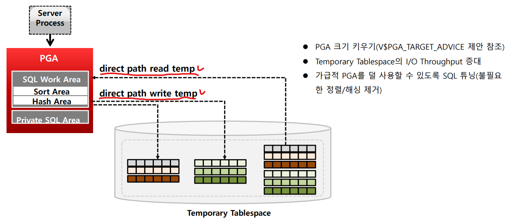
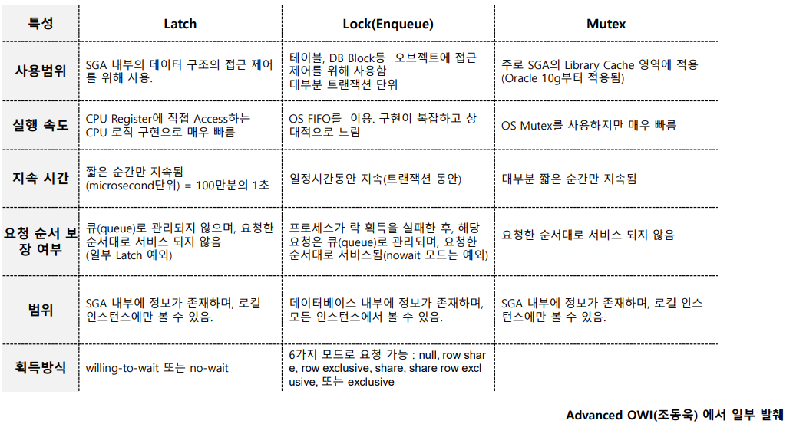

# 06_Wait_Event


### Idle Wait Event & Non Idle Wait Event

- Wait Event
  - **Idle Wait Event**
    - Timer, Message Sending, Client data waiting 등 리소스를 사용하지 않거나 클라이언트로 부터 답변을 기다려야하는 등의 Wait Event
    - DB 성능에 큰 영향을 미치지 않는 Wait Event 
      - 하지만 application 영향이 없는 것은 아니다.
  - **Non Idle Wait Event**
    - DB 내에서 Active Work 처리 과정 중에 발생하는 Wait Event
    - DB Time에 포함되어 중점적인 성능 모니터리인 요소인 wait event


### DB Time

- 정의	
  - DB Time은 User Process가 실제 일을 하면서 또는 DB에서 **waiting 되면서 사용된 총 시간**을 뜻한다.
    - Foreground 세션이 **DB call을 하여 자원을 사용한 총 시간**
    - CPU 시간, I/O 시간, Non Idle Wait Event시간 등으로 구성
      - ex_ parsing, excute, fetch 등
  - SQL을 처리하는데 있어서 어떤 자원을 사용했는지 등을 통하여 DB Time을 산출하게 된다.
  - **DB Time = CPU Time + Non Idle Wait Time** + Idle wait time
- 

- CPU Time보다 Non Idle Wait Time이 많으면?
  - CPU를 사용하는건 당연하다
  - 하지만 CPU가 다른 요소들 (Non Idle wait 등 )답을 가져오기는데 있어서 wait time이 크게 되면 비효율적으로 자원을 쓰고 있다고 할 수 있다.
  - 즉 Resource를 많이 사용하냐 안하냐는 wait time이 크냐 안크냐로 정의할 수 있음


### Wait Event Class


- USER I/O
  - storage i/o를 Access할 때 나오는 I/O
- System I/O
  - back ground
- Concurrency
  - shared memory에 block을 Access할 때 Lock을 걸어주는 Latch같은 것
- Commit
  - load buffer가 Redo Log File에 write할때 발생하는 Wait/ redo와 관련되어있음


## DB file sequential read와 DB file scattered read의 이해

- **DB file sequential read **=> 이름 때문에 헷갈릴 수 있지만 Random I/O때이다

  - Single block **Storage I/O** (random I/O)를 수행할 때 발생

    - buffer에서 읽는거는 storage i/o가 아니다

  - version up이 되면서 자주 발생하지는 않음

  - 주로 Index를 경유하여 table을 Random Access할 때 발생하며 많은 Wait time 소모 많은 Wait Time 소모
     (Index unique/range scan, Table random  I/O Access 형태)

  - 대량 발생 시 OLTP 시스템에서 성능을 저하시키는 주 원인

    - 명확하게 Random I/O가 접근하면 좋지만 Range부분에서 그렇지 않은 부분이 있을 수 있다 => Event 발생

  - CPU는 보통 buffer에 있는 값을 가져오게 된다. 하지만 이거 대비 DB file sequential read가 훨씬더 많다면 Random I/O가 많이 일어나고 있고 이러한 환경이 계속 일어나면 시스템에 큰  영향을 끼칠 수 있다.

    

- **DB file scattered read** => 

  - Multi block Storage I/O (Full Scan)을 할 때 발생하게 된다.
  - DB_FILE_MULTIBLOCK_READ_COUNT 값의 설정에 따라 block을 읽는 수가 달라지게 된다. => 한번 Access


- db file sequential read
  - buffer cache에 올라갈 때 Sequential하게 보관된다.

- DB file scattered read
  - scan한 것을 buffer에 모두 올리지 않고 일부분 만 올리게 된다.
  - 흩어지게 끔 버퍼에 올라가 있다.
  - 이유 : 
    - Sequential하게 올라가게되면 Sequential함을 지켜야하기 때문에 저장되어 있는 애들을 쫒아내 버릴 수 있다.
    - 따라서 흩어지게 하여 메모리를 더욱 효율적으로 사용할 수 있다.


### Full Scan시 Buffer Cache 활용 메커니즘


- Full Scan 후 일부 데이터만 Buffer에 올라가게 된다.

- 그리고 보통은 List의 앞부분으로 가서 Aging out이 되는데 Full Scan을 할 경우에는 뒷쪽으로 가서 Aging out이 빨리되게 된다

- **일부 데이터 buffer +  우선순위 낮은 상태 LRU List 진입**

  - 11g 부터는 비교적 작은 테이블 만 db file scattered read 발생

  - 일정 용량 이상 테이블 => **direct path read**

    - 즉 Buffer cache에 load 하지 않는다.

      

- 대량의 데이터가 Buffer Cache에 Load 되면서 기존의 pinned 된 Block 들이 Buffer Cache에서 Out을 최대한 억제하는 방향으로 관리되게 되었다.

```sql
alter system flush buffer cache; -- buffer cache 비우기

-- index =>> sequential read wait time이 늘어나게 된다.
select * from table where customid = 1000; 
```


### DB file sequential read와 DB file scattered read 개선 방안

- DB file sequential read

  - Random I/O 를 많이 소모하는 SQL 튜닝 
    (Physical I/O 뿐만 아니라 Buffer Cache를 많이 소모하는 SQL)

    - AWR : SQL ordered by Reads (Physical I/O) SQL ordered by gets (Buffer Cache)
      둘다 튜닝을 시켜줘야한다.

  - Random I/O 성능이 더 뛰어난 스토리지 기술 적용 (Strippin, SSD를 포함한 스토리지 고려)

  - Buffer Cache Size 늘리기? => V$DB_CACHE_ADVICE 에서 증가 효과가 검증된 경우
    ==> 보통은 효과가 없으나 CAHCE사이즈가 너무 낮을 경우 가능

  - **CPU 대비 발생 비율**, 

    - cpu 가 40%인데  sequential  read도 40%이다 라고 한다면 
      => OS에서 CPU usage를 얼만큼 쓰고 있는냐를 봐야한다.
      OD CPU usage가 10% 밖에 안되는데 sequential  read도 40% 이면 얘 때문에 딱히 호들갑 떨 필요 없음
    - OS가 cpu usage를 60~70%인데 cpu 20% 사용  sequential  read 50%?
      ==> 이러면 잡아줘야한다.

  - **1회 발생시 Wait time 에 주목할 것**

    - 보통은 3mm/s 를 용인할 수 있는 정도로 본다.

      

- DB file scattered read 

  - 쿼리 튜닝
  - Throughput이 뛰어난 스토리지 기술 적용
  - DB_FILE_NULTIBLOCK_READ_COUNT를 늘리는 것은 큰 도움이 되지 않음
    - 늘린다고 바로 적용이 되지 않는다.
    - 내부적으로 판단한 후로 진행
  - Hidden parameter인 _small_table_threshold, _serial_direct_read 에 따라 direct I/O 결정한다.
    - _small_table_threshold의 단위 K
      - 만약 20MB이면 20MB 이상 Table부터 direct I/O진행
    - _serial_direct_read 
      - enable direct read in serial => auto => _small_table_threshold 결정?


## direct path read와 direct path write의 이해


- 서버 프로세스가 Buffer Cache를 거치지 않고 바로 Storage에 direct read, write I/O를 수행
  - 대량의 데이터를 가지고 올때는 Buffer를 거치지 않고 Access하는 Direct I/O가 더 효율적이다. 왜냐하면 대량의 데이터를 Buffer에 넣게 되면 기존에 있던 Data들이 다 방을 빼야하기 때문

- direc path read

  - 일정 크기 이상의 테이블을 Full Scan 할 때

  - Create table As select 구문 실행 시 (select 시)

  - Parallel Query를 이용하여 Full Scan 할때

    

- direc path write

  - Insert /*+ append\*/ direct I/O
  - Create table As Select 구문시 (Create 할때)
  - Parallel DML


## direct path read temp와 direct path write temp



- 서버 프로세스가 정렬 또는 해싱 작업 등으로 PGA를 활용할 때 메모리가 부족할 경우 Temporary Tablespace에 read/write를 수행하면서 발생하는 Wait Event
  - **개선 방안**
    - **PGA 크기 키우기** => V$PGA_TARGET_ADVICE 제안 참조 
      - PGA_AGGREGATE_TARGET을 유연성 있게 적용하면 된다.
      - 하지만 절대적인 솔루션은 아니게 된다.
    - Temporary Tablespace의 I/O Throughput 증대 ==> SSD로 교체
    - 가급적 PGA를 덜 사용할 수 있도록 SQL 튜닝 ==> 정렬/ 해싱 제거


## Latch, Enqueue, Mutex의 이해


### Oracle Latch와 Lock(Enqueue)의 개요

- 모두 Lock 개념
- DBMS에서 Lock은 update를 진행할 때 Record에 


- **Lock (Enqueue)**

  - 요청한 순서를 보장

  - 즉 줄을 세우고 그것을 관리하는 관리자를 세워 순서를 보장하게끔 하는 매커니즘

  - 하지만 굉장히 느리게 된다. CPU입장에선 답답함

    

- **Latch**

  - 요청 순서와 상관없이 먼저 온 순서대로 바로 일을 처리하도록 진행

  - 요청 순서는 보장 안됨

  - 일 처리 시간이 매우 빠르게 된다.

    

- 즉 시스템 마다 관리하는 방법이 다를 수 있음


### Latch, Enqueue, Mutex 비교



- Latch

  - Mutex와 비슷한 구조를 가지고 있다.

    - 즉 OS의 Mutax를 참고하여 Oracle Kernal에 구현했음

  - **SGA 내부의 데이터 구조**의 접근 제어를 위해 사용한다.

    - SGA에서는 굉장히 많은 사용자에 대한 요청을 처리해야한다.

  - CPU Register에 직접 Access하는 CPU로직 구현 ==> 매우 빠름

  - 순서를 보장하지는 않으나 일부 Latch는 순서를 보장함

  - RAC일 경우에 SGA내부에 정보가 존재하기 때문에 로컬 인스턴스에서만 볼 수 있다.

  - (Latch경우 => exclusive하다)

  - 2가지 모드

    - willing-to-wait : 요청 실패시 다시 요청 하는 것
    - no-wait : 요청 실패시 그냥 다른 애 찾는 것

    

- Lock(Enqueue)

  - 테이블, DB Block등 Object에 접근제어를 위해 사용 => 트랜잭션 단위 
  - OS FIFO => 느림
  - 락 획득 실패 => 요청은 큐로 관리, 순서대로 서비스 된다.
    (nowait 모드 예외)
  - 6가지 모드로 요청 가능 (row level로 갈 것인지 등)
    - null
    - row share
    - row exclusive 
    - share : 여러 Process가 접근이 가능한 경우 (보통 Read일 경우)
    - share row exlusive
    - exlusive : 다른 Process가 잡았으면 다른 Process는 기다려야함 


## Cache buffer chains와 cache buffer lru chains이해 및 개선 방안


- Concurrency 때문에 발생한다.
  - 자주 Access하는 Hot Block때문에 wait event가 발생한다.


- **Buffer Cache에 특정 Block을 찾는데 비용이 많이 발생하게 된다.**
- latch : cache buffer chains
  - 특정 서버 프로세스가 Block을 Access하기 위해선 Bucket을 잡아야한다.
  - 이때 발생하는 latch가 latch : cache buffer chains 이다.

- latch : cache buffer lru chains
  - LRU에서 data를 찾을 때도 latch를 잡아야한다. (scan할때)
  - 이때 발생하는 latch가 latch : cache buffer lru chains이다.

- Hot Block
  - 많은 Server Process가 동일한 Data를 요구함
  - 이로 인해 똑같은 Hash Bucket과 LRU의 Latch의 Latch를 획득하기 위해 Server Process가 경합이 일어남 ==> **Hot Block**
  - 주로 대량 범위를 Access하는 악성 SQL들이 빈번하게 Cache Buffer를 사용하면서 발생하는 Wait Event이다. 

**HOT block 예시**


- 한번 Access하는데 24k Block을  Access진행 = 24k
- DB buffer block = 8k
  - 24k * 8k => 200M정도 된다.
  - access횟수도 많음

- **조치**
  - 대량 범위의 I/O를 빈번하게 수행하는 SQL을 튜닝해야한다.
  - Block 내부의 데이터를 hot block을 회피 할 수 있도록 재정렬해야한다.
    - Partitioning 사용


### Hash Partition을 통한 Hot block 개선

> https://zzanggoo.tistory.com/70


- Partitioning key 값에 hash 함수를 적용하여 data를 분할하는 방식
- 성능 향사의 목적으로 나온 개념이다.
  - 특정 범ㅇ위에 분포도가 몰려서 각기 size가 다르게 되는 것을 보완하며, 일정 분포를 가지 파티션을 나누고 균등한 데이터 분포도를 이용한 병렬처리로 퍼포먼스를 향상 시킬 수 있음
- 파티션 수를 2의 제곱근으로 설정해야한다.
  - 보통 32 이상부터 성능향상이 이루어졌다. (경험)
- null 값은 첫번째 파티션에 위치한다.
- 보통은 SQL 튜닝으로 해결하지만 해결이 안될 경우 이 lv까지 내려와야한다.


