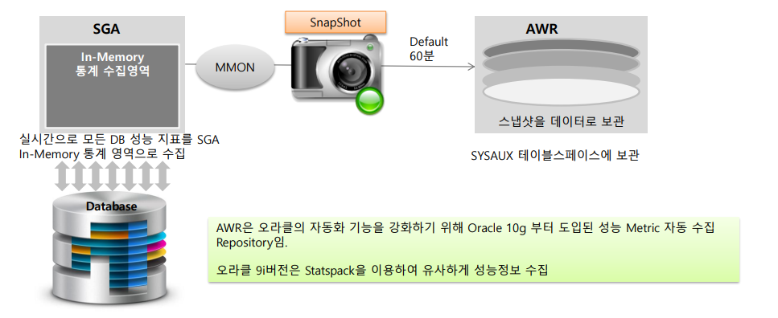
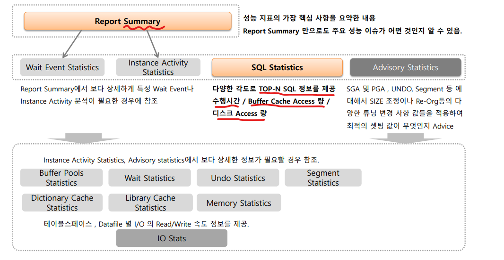
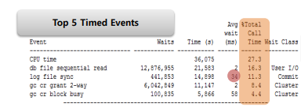
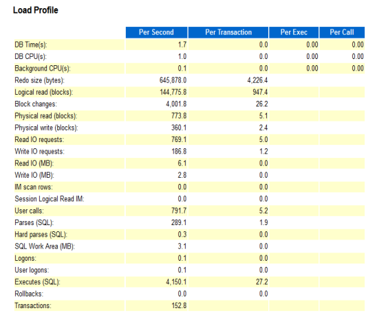

# 07_AWR


## 01_AWR (Automatic Workload Repository)



- 순서
  1. SGA In Memory 통계 수집 영역으로 수집
  2. MMON으로 SnapShot 을 찍음
  3. SYSAUX 테이블 스페이스에 보관
- 성능 정보에 대한 내장 Repository
- Default 60분마다 DB Metrics의 Snapshot을 생성하여 Default 8일 보관
- 모든 Oracle 자체 관리 기능 (Self Management)의 기보 자료가 된다.
  - ADDM, SQL Tuning Advisor, Undo Adviser, Segment Adviser


## AWR 작동


- 13시에 snap shot을 찍음
  - 그럼 DBA HIST관련된 테이블에 모두 값이 찍히게 된다.
- 이렇게 14시에도 snapshot을 찍는다.
  - 만약 13시 1천만/ 14시 1천5백만이 찍혔다면 1시간동안 500만 블록을 physical read했다는 뜻
  - 즉  1388블록 / 초 수행
  - 이렇게 추이를 만들수 있다.


## AWR 만드는 방법

- DBA 권한을 가지고 있으면 AWR을 만들 수 있음
- AWR의 Default는 html이다.

```sql
@$ORACLE_HOME/rdbms/admin/awrrpt.sql

Enter value for report_type: text -- report type을 text로 하겠다는 뜻

Enter value for num_days: -- 몇일치의 데이터를 가지고 report를 뽑을지 

Enter value for report_name: awrrpt_test_01 -- 이름 정하기


------------------

execute dbms_workload_repository.create_snapshot; -- 이렇게하면 snapshot하나가 만들어진다.
-- 시간 경과 후
execute dbms_workload_repository.create_snapshot;
-- 이렇게 2개를 찍고 비교 가능

------------------
-- 다시 작성 후
Enter value for begin_snap: 299
Enter value for end_snap: 300 -- 내가 찍었던 snapshot 활용
```


## Toad, sql developer에서 AWR

```sql

execute dbms_workload_repository.create_snapshot;
execute dbms_workload_repository.create_snapshot;
 
@$ORACLE_HOME/rdbms/admin/awrrpt.sql -- @을 치면 파일을 실행할 수 있음
Enter value for report_type: html
Enter value for num_days:
Enter value for begin_snap: 190
Enter value for end_snap: 191

dba 권한 sql developer 접속
성능 클릭 - awr - awr report viewer - 190~191 


```


## AWR Report 항목


- Report Summary로 시작을 해야한다.
  - Load Profile과 Top 10 wait event를 출발점으로 가져가는 것이 중요하다.
  
  - Load Profile
    - Logical Read : 버퍼 캐시를 Access하는 것
    
    - Physical Read : 
      - 초당 2000이라고 가정
      
      - 8k * 2k => 16M
      
        
    
  - Instance Efficiency Perventage
    - 인스턴스에 대한 효율을 말한다.
    
      
    
  - Wait Event TIme
    - wait들의 Time이 얼마나 되는지를 확인해야한다.
    
    - 그리고 이 **wait들의 비율이 DB CPU보다는 작아줘야한다.**
      - **DB CPU가 썼다는 뜻은 버퍼캐시 read 즉 Logical Read를 많이 했다는 뜻**이된다. 
      
      - 나머지는 대표적으로 IO read를 한다. (db file scattered read, db file sequential read)
      
        
  
- SQL Statistics

- Advisory Statistics
  - size를 어떻게 정해야 할지에 대해서 advise해준다.

    
  
- 위 3개 이외는 3개를 상세하게 설명하는 버전이다.





## Load Profile과 Wait Event 결합 분석 방법론


- 주의
  - wait만 보는 방향성이 생기면 안된다.
  - DB의 성능 지표인 **Load Profile과 Wait Event가 어떻게 시스템의 CPU Usage와 Wait로 연계**되어 있는지 확인하는 것이 중요
- 추천
  - Load Profile과 Wait Event를 같이 확인하는 것을 추천
  - DB와 CPU를 결합하고 어떻게 연계되었는지 확인하는 것이 필요


## Wait Event와 Load Prifile의 결합 분석


- Wait Event의 경우 CPU Time 대비하여 db file sequential read의 %가 높음
  - 문제가 있는 system인 것은 맞으나 Load Profile을 확인해봐야함
- Load Profile에서 Logical reads 초당 10786으로 높지 않고 Physical reads는 더 낮다
  - 따라서 CPU가 애초에 적게 일을 하고 있을 확률이 높음 => 거의 30%정도 밖에 일을 하지 않을 것임
  - 즉 개선은 필요하다 급한건 아니며, 시스템을 upgrade할 필요가 없음
    - **wait event의 분포도만으로 시스템에 문제가 있다고 판단해서는 안됨**
    - 반드시 Load Prifile의 메모리/디스크 Read/Write, Transaction/수행 횟수 등 지표 분석을 함께 수행하야한다.
- 중요
  - Physical read가 얼마인지 확인하는 것이 중요
    - DB가 storage I/O를 많이 따라가기 때문에 Logical보다 Physical이 중요하다


### Logical Reads와 Physical Read


- 둘 다 중요하지만 Physical Read가  Logical Read보다 더 중요하다.
- Scan Access냐 Random Access냐에 따라 수치가 부여하는 가중치가 매우 달라진다.
- 초당 4500 블록
  - 거의 Random Access라면 정상 운용 힘듦
  - 하지만 scan이 어느정도 있다면 안정성 있게 운영 가능
  
- 안정적
  - Physical Reads : 10000 block
  - Db file Sequential read : 30% (random)
  - DB file scattered read : 5% (scan)
  - 위와 같은 조건이라면 보통 1만 block은 안정적으로 운영가능한 정도임


## Wait Event와 Load Prifile의 결합 분석 예제


- Logical reads : 
  - 초당 12만 block을 읽는다.
  - 0.12M * 8K(block 단위) => 초당 1GB
-  Physical Read
  - 초당 3K block을 읽는다.
  - 3K * 8K => 초당 24MB 정도
- 질문
  - 현 시스템은 Logical I/O, Physical I/O의 사용량이 많은 시스템인가?
  - Physical read의 량은 상당수준 높은 편이다.
  - 특히 Logical Read가 매우 많음
  - 이를 감안할때 자주 수행되는 SQL이 많은 Block을 Access하여 사용됨을 알 수 있음 




- 문제 : 
  - **log file sync가 오래 걸리는 것 + Random I/O가 많은 것이 문제**
    - Random I/O시 바랫하는 DB file sequential read가 일정 수준이상 존재
    - Random I/O에 대한 보강 필요
    - Log file sync가 상당수준 이상으로 SQL 수행 성능에 영향을 미침
  - time이 34ms => 많이 느리게 나온 것
  - User I/O와 Commit을 합치면 28% 정도이므로 많은 비율을 차지 한다.
  - CPU를 사용하는 양이 60~70%정도 됐었다.
  - 사례
    - sync DR을 해서 늘어났었어음 (논외)
- 해결
  - SSD 교체
  - Random I/O를 많이 잡아먹는 SQL이 무엇인지 파악하기
    - 즉 SQL 튜닝 필요


## AWR Report - Load Profile 상세

> - load prifile만 보고 어떤 유형의 부하가 얼마만큼 가해지고 있는지 확인하는 연습이 필요하다.
> - 이를 통해서 어떤ㄴ한 유형의 Application이 주로 구동되어 있는지 알 수 있다.



- 보는 방법

  - Per Second : 초당만 봐도 충분하다.

  - Per Transaction : commit or roll back 당 지표

    - 하나의 Transaction이 얼마만큼의 부하를 일으키고 있는지 확인할 수 있음
    - 이 시스템이 OLTP인지, Batch인지, DSS형인지 등을 확인할 수 있음

    

- **중요한 부분**

  - **DB time / CPU**

    - Wait를 합하지 않고 오직 CPU를 사용한 시간 / 크게 중요하지 않음

      

  - **Physical Read**

  - **Physical write :** 

    - batch와 관련 있음

    - 초당 몇 백 MB를 write하는 경우에는 physical write가 높을 수 있다.

      

  - **Redo size**

    - redo log size의 증가 크기

    - **Redo file switch를 최대 5분정도로 본다.** 즉 5분은 넘기면 안됨

    - 예시 

      - 645K * 900초(가정) = 570MB => **약 15분** 뒤에 switch가 일어남

      - 비교적 빠른 시스템에 해당된다. 전혀 작은 경우가 아님 

        

  - **Logical Read**

    - Buffer cache read block 수

    - 예시

      - 0.14MB * 8K = 1GB

        

  - **Block changes**

    - DML로 변경된 block의 수

      

  - **Read IO Requests, Write IO Request**

    - read, write 요청 횟수

    - Physical read write와 비슷하나 1block을 요구했는지 mulit block을 요구했는지에 따라 다를 수 있음

      

  - **Read/ Write I/O :** 

    - read/ write 크기

    - Read IO Request * 8k

      

  - **User calls** 

    - client가 요청한 call 수

    - Parse, Excute 포함

      

  - **Execute**

    - SQL의 실행 횟수 

    - 보통은 User call보다 Execute가 작다. 하지만 예제에서는 높은데 PL/SQL문 때문에 그렇다.

      - 성능이 그렇게 좋지 못한 상태

    - Transaction 한번 당 27번 Execute 발생 => 높음 => 확인 필요  

      

  - **Rollback**

    - Transaction 실행 시 Rollback 횟수

    - Rollback이 많으면 system이 이상한것이다.

      

  - **Transaction** : 

    - Rollback + Commit
