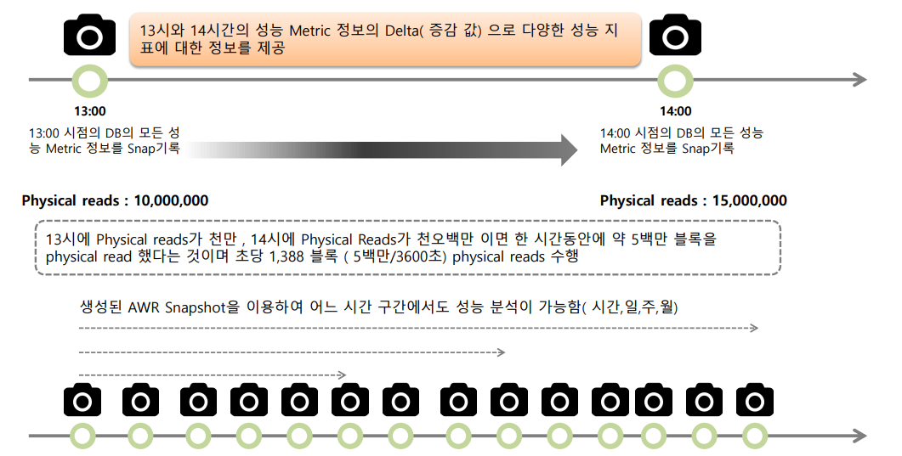
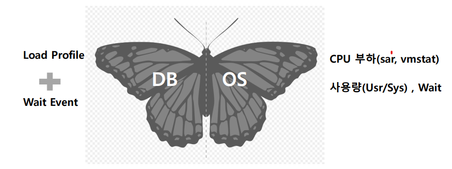

# 07_AWR


## 01_AWR (Automatic Workload Repository)


- 순서
  1. SGA In Memory 통계 수집 영역으로 수집
  2. MMON으로 SnapShot 을 찍음
  3. SYSAUX 테이블 스페이스에 보관
- 성능 정보에 대한 내장 Repository
- Default 60분마다 DB Metrics의 Snapshot을 생성하여 Default 8일 보관
- 모든 Oracle 자체 관리 기능 (Self Management)의 기보 자료가 된다.
  - ADDM, SQL Tuning Advisor, Undo Adviser, Segment Adviser


## AWR 작동



- 13시에 snap shot을 찍음
  - 그럼 DBA HIST관련된 테이블에 모두 값이 찍히게 된다.
- 이렇게 14시에도 snapshot을 찍는다.
  - 만약 13시 1천만/ 14시 1천5백만이 찍혔다면 1시간동안 500만 블록을 physical read했다는 뜻
  - 즉  1388블록 / 초 수행
  - 이렇게 추이를 만들수 있다.


## AWR 만드는 방법

- DBA 권한을 가지고 있으면 AWR을 만들 수 있음
- AWR의 Default는 html이다.

```sql
@$ORACLE_HOME/rdbms/admin/awrrpt.sql

Enter value for report_type: text -- report type을 text로 하겠다는 뜻

Enter value for num_days: -- 몇일치의 데이터를 가지고 report를 뽑을지 

Enter value for report_name: awrrpt_test_01 -- 이름 정하기


------------------

execute dbms_workload_repository.create_snapshot; -- 이렇게하면 snapshot하나가 만들어진다.
-- 시간 경과 후
execute dbms_workload_repository.create_snapshot;
-- 이렇게 2개를 찍고 비교 가능

------------------
-- 다시 작성 후
Enter value for begin_snap: 299
Enter value for end_snap: 300 -- 내가 찍었던 snapshot 활용
```


## Toad, sql developer에서 AWR

```sql

execute dbms_workload_repository.create_snapshot;
execute dbms_workload_repository.create_snapshot;
 
@$ORACLE_HOME/rdbms/admin/awrrpt.sql -- @을 치면 파일을 실행할 수 있음
Enter value for report_type: html
Enter value for num_days:
Enter value for begin_snap: 190
Enter value for end_snap: 191

dba 권한 sql developer 접속
성능 클릭 - awr - awr report viewer - 190~191 


```


## AWR Report 항목


- Report Summary로 시작을 해야한다.
  - Load Profile과 Top 10 wait event를 출발점으로 가져가는 것이 중요하다.
  - Load Profile
    - Logical Read : 버퍼 캐시를 Access하는 것
    - Physical Read : 
      - 초당 2000이라고 가정
      - 8k * 2k => 16M
  - Instance Efficiency Perventage
    - 인스턴스에 대한 효율을 말한다.
  - Wait Event TIme
    - wait들의 Time이 얼마나 되는지를 확인해야한다.
    - 그리고 이 wait들의 비율이 DB CPU보다는 작아줘야한다.
      - DB CPU가 썼다는 뜻은 버퍼캐시 read 즉 Logical Read를 많이 했다는 뜻이된다. 
      - 나머지는 대표적으로 IO read를 한다. (db file scattered read, ddb file sequential read)
      - 
-  SQL Statistics
- Advisory Statistics
  - size를 어떻게 정해야 할지에 대해서 advise해준다.

- 위 3개 이외는 3개의 상세하게 설명하는 버전이다.


## Load Profile과 Wait Event 결합 분석 방법론



- 주의
  - wait만 보는 방향성이 생기면 안된다.
  - DB의 성능 지표인 **Load Prifile과 Wait Event가 어떻게 시스템의 CPU Usage와 Wait로 연계**되어 있는지 확인하는 것이 중요
- 추천
  - Load Profile과 Wait Event를 같이 확인하는 것을 추천
  - DB와 CPU를 결합하고 어떻게 연계되었는지 확인하는 것이 필요


## Wait Event와 Load Prifile의 결합 분석


- Wait Event의 경우 CPU Time 대비하여 db file sequential read의 %가 높음
  - 문제가 있는 system인 것은 맞으나 Load Prifile을 확인해봐야함
- Load Profile에서 Logical reads 초당 10786으로 높지 않고 Physical reads는 더 낮다
  - 따라서 CPU가 애초에 적게 일을 하고 있을 확률이 높음 => 거의 30%정도 밖에 일을 하지 않을 것임
  - 즉 개선은 필요하다 급한건 아니며, 시스템을 upgrade할 필요가 없음
    - **wait event의 분포도만으로 시스템에 문제가 있다고 판단해서는 안됨**
    - 반드시 Load Prifile의 메모리/디스크 Read/Write, Transaction/수행 횟수 등 지표 분석을 함께 수행하야한다.
- 중요
  - Physical read가 얼마인지 확인하는 것이 중요
    - DB가 storage I/O를 많이 따라가기 때문에 Logical보다 Physical이 중요하다


### Logical Reads와 Physical Read


- 둘 다 중요하지만 Physical Read가  Logical Read보다 더 중요하다.
- Scan Access냐 Random Access냐에 따라 수치가 부여하는 가중치가 매우 달라진다.
- 초당 4500 블록
  - 거의 Random Access라면 정상 운용 힘듦
  - 하지만 scan이 어느정도 있다면 안정성 있게 운영 가능
    
- 안정적
  - Physical Reads : 10000 block
  - Db file Sequential read : 30% (random)
  - DB file scattered read : 5% (scan)
  - 위와 같은 조건이라면 보통 1만 block은 안정적으로 운영가능한 정도임


## Wait Event와 Load Prifile의 결합 분석 예제


