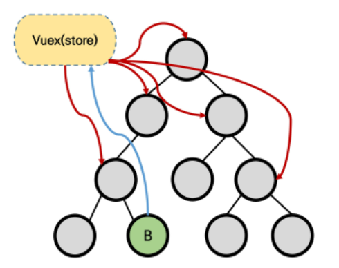
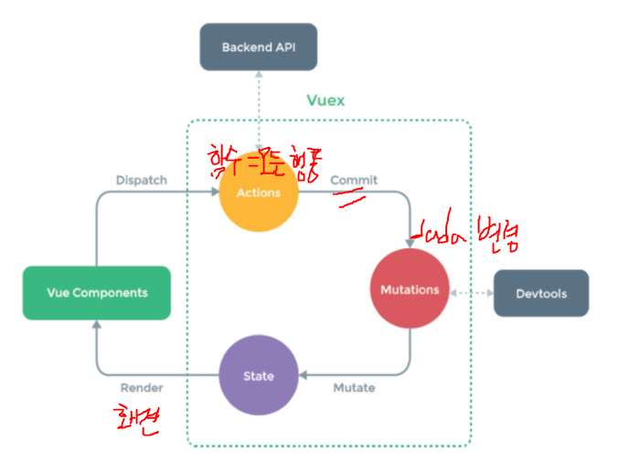
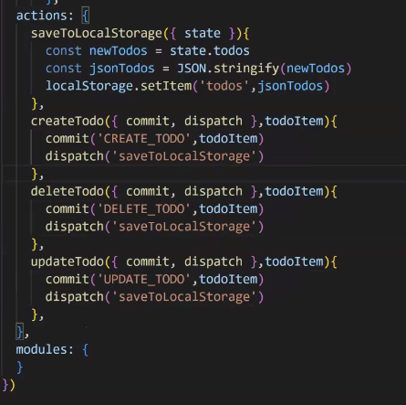
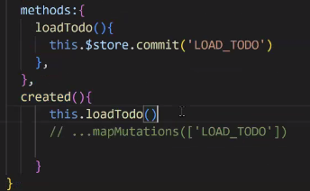

# Vuex

애플리케리션의 모든 컴포넌트를 중앙집중식 저장소(store(data)) ==> 상태관리패턴

- 규모가 큰 프로젝트에서 매우 효율적
- 중앙집중 저장소의 state만 신경쓰면 된다
  - 동일한 state를 공유하는 다른 컴포넌트들도 동기화 됨

쓰는 이유

기존 => pass props & emit event

- 독립적으로 데이터를 관리
- 장점
  - 데이터의 흐름을 직관적으로 파악가능
- 단점
  - 컴포넌트 중펍이 깊어지는 경우 동위관계의 컴포넌트로의 데이터 전달이 불편해짐

### 컨셉

- state
- Mutations
- Actions
- Getter

##### 1. State

- Single state tree를 사용

##### 2, Mutations

- state를 변경

- 핸들러 함수는 반드시 동기적이어야함

##### 3. Action

- mutations와 유사 하지만 차이가 있음

- context객체 인자를 받음
  - state를 직접 변경하지 않음 ==> Mutation이 함
  - 그 외에는 다함

- 역할 분담

##### 4. Getters

- state를 기반으로 getter( computed와 비슷 )

#### 로컬에 저장하기

3rd party없이

index

app

