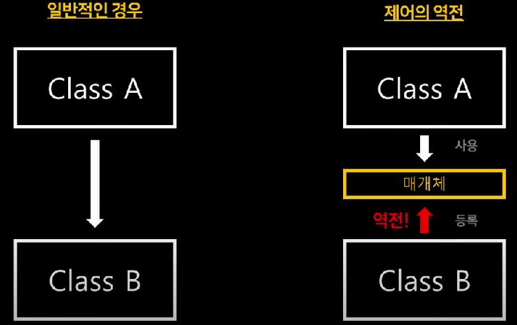
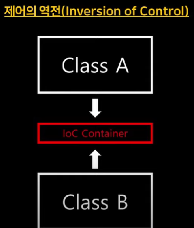

# 01_DI_and_IoC

#### DI?

> Dependency Injection : 의존성 주입

**의존성 상태**

```java
class A{
	new b = newB()
	something
}

class B{
	somthign	
}
```

- 클래스 A가 클래스 B를 사용하기 때문에 A는 B에 의존적이라고 할 수 있다.


**의존성 주입은?**

- 의존성이 있는 코드 객체를 넣어준다라는 표현이다.
- 예를 들어 A라는 class가 B라는 class를 사용할 때 (의존하고 있을 때) A class에서 B class를 직접 생성해서 사용하는 것이 아니라 외부에서 B class의 인스턴스를 생성해서 주입해주는 것이다


#### IoC란?

> Inversion of Control

- 사용자가 직접 객체를 생성하지 않고 객체의 생성 및 생명주기를 IoC컨테이너가 컨트롤하게 된다. 
- 즉, 사용자의 제어권을 다른 주체(IoC)에게 넘기는 것



- 왼쪽
  - class A 가 class B를 직접생성하여 사용하는 경우
- 오른쪽
  - class A가 매개체를 통해서 class B를 사용하는 것
  - 매개체 : IoC Container



- 역할
  - 의존성을 관리
  - 인스턴스를 생성해서 주입
  - 메모리 해제


## DI의 장점

**1) 의존성 감소**

- 변화에 강함하다 
  - 의존하고 있는 모듈의 라이프사이클을 고려하지 않아도 되기 때문이다.
- 재사용성이 더 좋아짐
- 유지보수 용이

**2) 코드양 감소**

**3) 테스트 용이**

- 자신의 원하는 객체를 상태를 직접 세팅할 수 있기 때문
- 원하는 테스트 코드를 작성하는 것이 수월하다


