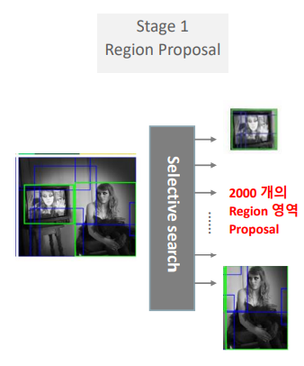
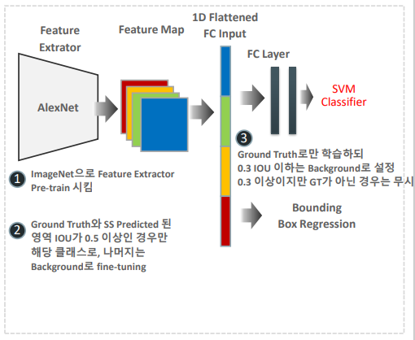

# 03_R-CNN

## Process

- ##### stage1

  - object가 있음직한 곳을 먼저 보고 이미지를 뽑아온다

- ##### stage2

  - CNN

## stage1

#### Region Proposal( Selecticve Search )

- 2000개의 object가 있을 법한 위치를 제안해준다
- 즉 2000개의 이미지를 뽑은 것이다(다양한 크기에 사진들이 포함되어 있을 것임)
- 그 2000개를 동일한 사이즈로 맞춘다
  - 모델에 들어가려면 이미지의 사이즈가 동일해야하기 때문이다
  - FC(Fully Connected) : 사이즈가 몇인지 명시가 되어있어야 한다.
- stage2 (CNN network)에 집어 넣는다

#### why  does FC layer only accepts a fixted size?

Input size determines the overall number of parameters of the Neural Network. During training, each parameter of the model specializes to "learn" some part of the signal. This implies that once you change the number of parameters, the whole model must be retrained. That's why we can't afford to let the input shape change.

## stage2

##### 특이한 점

: 보통 FC layer를 거친 다음에 softmax를 넣는다

: R-CNN에서는 SVM으로 Classification을 진행한다. 

​	SVM을 쓴 이유? 해봤더니 좋아서

: 즉 딥러닝 모델을 FC layer까지라는 뜻 => feature extraction으로만 CNN을 활용한 부분

##### CNN Detection

- 2000개의 이미지에 대해서 학습을 시키게 되는 것이다
  - 각각의 2000개의 이미지를 하나하나 크기를 동일하게 맞춘뒤에 conv Net에 집어넣게 되는것
  - 즉 Conv Net가 2000번 일하게 되는 것이다.

- 그리고 Bounding box reg로 feature map을 뽑아낸다

#### Process stage2

##### 1.  ImageNet으로 Feature Extractor Pre-train 시킨다

- 1000개의 class로 되어 있는 ImageNet 학습시킴
- 만약 PascalVOC라면 20개의 class로 학습을 시키게 될 것이다

##### 2. Pre-train 된 모델에다가 fine-tuning을 시킨다.

- GT(실제 박스위치) 와 SS predicted(예측 박스위치)의 겹치는 IOU가 0.5 이상인 경우?
  - 해당 클래스로 넘어간다.
- 겹치지 않아??
  - 그럼 background라고 fine-tuning을 시킨다.

##### 3. GT(실제값)으로만 학습을 시킨다

- 이렇게 뽑힌 Feature Map을 1차원으로 만들어준다
  - 이유
  - Requiring a fully connected layer to only accept one dimensional (a vector) makes for a consistent interface between layers. Strict inputs makes the the code more straightforward. Otherwise a fully interconnected layer might have to accept arbitrary inputs (e.g., n-dimensional).

- 이것을 또 SVM으로 학습을 시켜준다. (GT값으로만)
  - 0.3 IOU이하는 background로 설정  (별로 안겹치는거 배경으로 할 것임)
  - 0.3이상이지만 GT가 아닌 경우는 무시 ==> 학습대상에서 빼버린다는 뜻이다
    - 어느정도 겹치기는 하는데 실제값이 아니라면(정답이 아닌 것) 학습을 하지 않겠다!
    - 즉 NMS같이 겹쳐있는 다른 값들을 없앤다는 뜻이다.
  - 2000개 모든 것을 학습하는 것이 아닌 ==> 정답 위치에 있는 애들만 학습할 것임

### Bounding box Regression

- ##### Bounding box Regression란?

  - Predicted box와 ground truth box와의 차이를 줄여주 것

  - 이유: Selective search를 통해 찾은 박스 위치는 정확하지 않기 때문

    

- ##### 목표

  - Predicted box ~=  ground truth box

##### Predicted가 정답이려면 어떤 모양을 가지고 있어야 하나? 

1. Predicted의 중심값과 GT의 중심값이 가까울 수록 좋아야 한다. 
2. 너비의 값이 똑같아야 한다. (최대한 같아야 한다.)
   - 즉 d(P)값을 구해서 수정 시킨 g의 값이 정답이 되게 만들어야 한다는 뜻이다.
   - d(P)값을 학습시켜준다.
   - 손실 함수에 넣어준다
3. 높이의 값도 똑같아야 한다. (최대한 같아야 한다.)
   - 지수함수에 넣어주고 p값을 곱해준다.

##### 타겟 값 t

- t값이 최대한 작도록 만들어 주는 것이 목표다
- tx, xy
  - 뺐을 떄 큰 값이 나올때가 있기 때문에 pw로 나눠주는 것이다
- tw, th
  - 로그 값을 넣어준다.
  - g값이랑 p값이 같으면 ==>   g/p = 1
  - 그럼 log(1) = 0

##### 손실함수(box regression)

이 수식도 왜 이렇게 나왔는지 살펴보기

### 장단점

##### 장점

- 높은 Dtection 정확도 (과거보다)

##### 단점

- 너무 느린 Detection시간과 복잡한 아키텍처 및 학습 프로세스
  - 2000개씩 생성된 region이미지를 CNN feature map 생성
  - 각기 따로 노는 구성 요소들
    - Selective search, CNN Feature extractor, SVM과 Bounding box regression으로 구성되어 복잡함
  - 한장에 50초 소요

##### 의의

- object detection 성능 입증
- Region Proposal 기반 성능 입증
- 수행시간을 줄이는 방향으로 연구방향이 흘러감 (복잡 ==> 단순)

